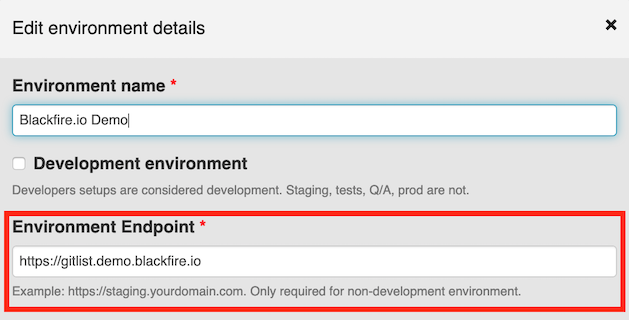
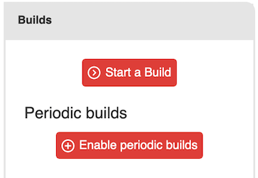
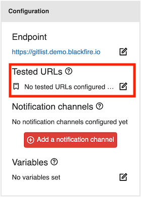
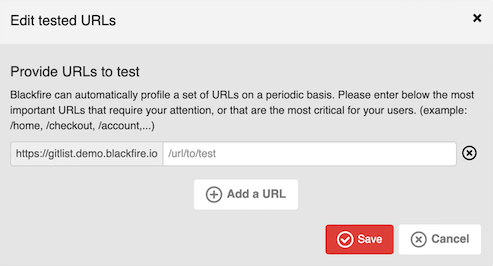

Configuring Periodic Builds [level: Production]
===============================================

.. _trigger-scheduled:

Periodic Builds constitute a **unique Synthetic Monitoring technique**.

They allow you to simulate regularly a given set of actions or path that an end-user
would take on your site. Each scenario step triggering back-end code execution
(PHP or Python) automatically generates a :doc:`profile
</profiling-cookbooks/understanding-call-graphs>` of that code. 
Each profile is being tested against your :doc:`custom assertions
</testing-cookbooks/assertions>` as well as Blackfire 
:doc:`recommendations </testing-cookbooks/recommendations>`.

Getting Started with Periodic Builds
------------------------------------

Only publicly accessible websites can be targeted by Blackfire to run scheduled
scenarios. As such you need to properly **configure your environment by setting
an accessible endpoint**.

This can be done in the *Settings* tab of your environment.

.. note::

    If your environment is configured as a development environment, you may need
    to use our SDK.

    Please note that, for now, only the :ref:`PHP SDK <php-sdk-builds>` enables
    you to trigger builds.

There are 2 ways to configure periodic builds:

* :ref:`By configuring the URLs to be tested in your Environment Dashboard
  <build-periodic-configured-urls>`;

* :ref:`By defining scenarios in your .blackfire.yaml file
  <build-periodic-scenarios>`.

You then need to enable the periodic builds:

**Builds can be run in the following intervals (only one can be chosen):**

* Every 24 hours;

* Every 12 hours;

* Every 6 hours;

* Every hour.

**You may specify advanced settings such as:**

* Disable SSL certificates verification;

* Forcing the IP address, in case the name is not declared in public DNS;

* HTTP Username and Password.

.. _build-periodic-configured-urls:

Configuring URLs to be Tested
-----------------------------

This is the simplest way to start periodic builds.

In your Environment Dashboard, scroll down until you see the
``Configuration`` panel, and click on the edit icon to add URLs to test:

:doc:`The tests defined in your .blackfire.yaml </testing-cookbooks/tests>` file will
be run for each configured URL.

If no tests are defined, Blackfire will only evaluate recommendations.
However, **these recommendations will not make your build fail**.

.. note::

    In this mode, you are only able to test URLs using HTTP ``GET`` method.

.. _build-periodic-scenarios:

Defining Scenarios
------------------

The most comprehensive way to run builds is to :doc:`define your scenarios in
your .blackfire.yaml file </builds-cookbooks/scenarios>`.

Writing scenarios gives you total control over the *test browser* behavior, to
use other HTTP methods than GET, to click on buttons, and to check elements in
resulted pages (JSON and HTML are supported).

.. sidebar:: Blackfire Player under the hood

    :doc:`Blackfire Player </builds-cookbooks/player>` is used under the hood
    by Blackfire build system. As such, you may :ref:`use any instruction
    supported by Blackfire Player <crawling-an-http-application>` in your
    scenarios, including expectations and :ref:`Blackfire assertions
    <writing-blackfire-assertions>`.

.. _builds-comparison-periodic:

Builds Comparison
-----------------

When using builds, it is possible to compare one build to another, with the
help of :ref:`percent() and diff() functions in your assertions
<assertions-comparisons>`.

The comparison is always made between the current build and a *reference build*.
As for periodic builds, the *reference build* is **the last successful build in
the same environment**.
