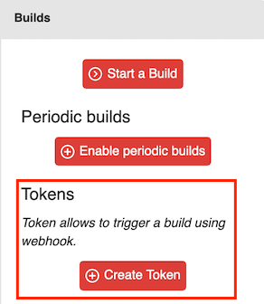

Starting a Build using a Webhook [level: Production]
====================================================

.. _build-webhook:

Starting a build with a webhook offers the most flexible way of triggering
Blackfire scenarios based on third-party tool events (e.g. CI/CD systems,
Cloud providers...). Thereby, you can add performance tests at any point of
your tool-chain.

For instance, you can:

* Configure your tooling to trigger a new build after each deployment to
  the staging and/or production servers. It enables you to check your
  production configuration and your code's behavior on production machines,
  and validate the deployment.

* Configure your continuous integration tooling to automatically test any branch
  you deployed on your testing environment (e.g. with a pull-request from
  GitHub). You can then decide if the code is ready to be merged.

.. _build-webhook-tokens:

Build Tokens
------------

Build Tokens allows to trigger builds using a webhook in a secure way.
It is possible to generate several Build Tokens for different purposes and to
enable/disable them.

You can create Build Tokens from your Environment Builds dashboard.
In the left panel, click on the ``Create Token`` button:

Then give the Token a name. Note that you can also enable/disable it with the
help of the ``Enabled`` checkbox.

.. image:: ../images/builds/token-create-name.png

.. _build-webhook-trigger:

Triggering a Build With Blackfire Build-Trigger CLI Command
-----------------------------------------------------------

``blackfire`` CLI command is being installed along with the agent and
provides ``build-trigger`` sub-command.

.. code-block:: bash

    blackfire build-trigger <ENDPOINT> --env=<ENV-UUID> --token=<TOKEN-VALUE>

Replace ``<ENDPOINT>`` with the endpoint you want to use (overrides the default
endpoint you set in your environment settings), ``<TOKEN-VALUE>``
by your generated token value, and ``<ENV-UUID>`` by your environment UUID.

The command supports the following options:

========================= =======================
``--env``                 Your Blackfire environment UUID or name (can be part of the name if it is not ambiguous)
``--token``               Your Build Token generated value
``--title``               The title of your build
``--http-username``       The username for HTTP Basic authentication
``--http-password``       The password for HTTP Basic authentication
``--ip``                  The IP for forcing DNS, if your endpoint is not in a public DNS
``--ssl-no-verify``       Disable SSL certificates verification (this is insecure)
``--external-id``         A unique identifier for the build; commonly, a unique reference from a 3rd party service (e.g. the *full* Git commit hash related to the build)
``--external-parent-id``  The unique identifier of the parent build, to compare the current build with (e.g. the reference *full* Git commit hash)
``--external-url``        A URL related to the build, like a Pull Request, or a link to your CI/CD system
========================= =======================

Triggering a Build With cURL
----------------------------

You can trigger a build using a ``curl`` request:

.. code-block:: bash

    curl -X POST https://blackfire.io/api/v2/builds/env/<ENV-UUID>/webhook \
        --user "<TOKEN-VALUE>" \
        -d "endpoint=<ENDPOINT>" \
        -d "title=Build title"

Replace ``<ENV-UUID>`` with your environment UUID, ``<TOKEN-VALUE>``
by your generated token value, and ``<ENDPOINT>``.

The webhook endpoint accepts the following request parameters:

======================= =======================
``user``                Your Build Token generated value
``endpoint``            The endpoint to profile
``title``               The title of your build
``http_username``       The username for HTTP Basic authentication
``http_password``       The password for HTTP Basic authentication
``ip``                  The IP for forcing DNS, if your endpoint is not in a public DNS
``ssl_no_verify``       Disable SSL certificates verification (this is insecure)
``external_id``         A unique identifier for the build; commonly, a unique reference from a 3rd party service (e.g. the Git commit sha1 related to the build)
``external_parent_id``  The unique identifier of the parent build, to compare the current build with (e.g. the reference Git commit sha1)
``external_url``        A URL related to the build, like a Pull Request, or a link to your CI/CD system
======================= =======================

.. tip::

    You can seamlessly generate your ``curl`` command using a form by
    clicking on the Token you want to use in your Builds dashboard.
    For your convenience, you can even trigger a build from there.

.. _builds-comparison-webhook:

Builds Comparison
-----------------

When using builds, it is possible to compare one build to another. This is
useful when you want to validate a code merge (e.g. a pull-request) by
triggering a build webhook.

Builds comparison enables you to use :ref:`percent() and diff() functions in
your assertions <assertions-comparisons>`.

The comparison is always made between the current build and a *reference build*.

* If the build is triggered **with Blackfire CLI**, the *reference build* is
  identified with the value passed to the ``--external-parent-id`` option, in
  the ``blackfire build-trigger`` command.

  Note that ``--external-id`` option must be set.

  .. code-block:: bash

      blackfire build-trigger \
          <ENDPOINT> \
          --env=<ENV-UUID> \
          --token=<TOKEN-VALUE>
          --title="Build PR 1234" \
          --external-id=<some_unique_id_for_the_build> \
          --external-parent-id=<some_unique_id_for_the_reference_build>

* If the build is triggered with ``cURL``, the *reference build* is
  identified with the value passed to the ``external_parent_id`` POST parameter.

  Note that ``external_id`` parameter must be set.

  .. code-block:: bash

      curl -X POST https://blackfire.io/api/v2/builds/env/<ENV-UUID>/webhook \
          --user "<TOKEN-VALUE>" \
          -d "<ENDPOINT>" \
          -d "title=Build PR 1234" \
          -d "external_id=<some_unique_id_for_the_current_build>"
          -d "external_parent_id=<some_unique_id_for_the_reference_build>"
