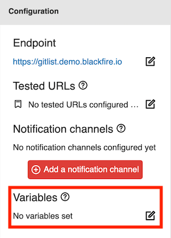
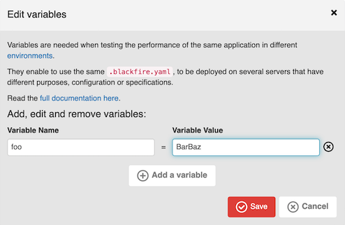

Writing Scenarios [level: Production]
=====================================

Blackfire scenarios provide a powerful way to test your application
**regularly**, like when you deploy your code on a staging environment or in
production, or when you create a pull-request to add a new feature or fix a
bug. The idea is to assess the performance of your code and to check its
behavior.

Scenarios are run within :doc:`builds, periodic or externally triggered
</builds-cookbooks/index>`.

Once scenarios are completed, a :ref:`Build Report <build-report>` is generated.

Scenarios
---------

Like :doc:`Blackfire tests </testing-cookbooks/tests>`, scenarios are defined
in the ``.blackfire.yaml`` file:

.. code-block:: text

    scenarios: |
        #!blackfire-player

        scenario
            name 'Visitor'

            visit url('/pricing')
                name 'Pricing page'

            visit url('/docs/introduction')
                name 'Documentation'

        scenario
            name 'Authentication'

            set user_login "my_login"
            set user_password "my_password"

            visit url('/login')
                name 'Login page'

            submit button('Log in')
                name 'Submit log in form'
                param _username user_login
                param _password user_password

            follow
                name 'Login redirection'
                expect current_url() == endpoint ~ '/'
                expect body() matches '/Welcome ' ~ user_login ~ '/'

The scenarios are run by the :doc:`Blackfire Player
</builds-cookbooks/player>`. It provides a nice DSL to crawl HTTP services,
assert responses, and extract data from HTML/XML/JSON responses.

.. note:: **Test files validator**

    Validate your ``.blackfire.yaml`` file or test files ending with ``.bkf`` via
    the Blackfire :route:`online validator <validate-blackfire-yml>`.

- :ref:`Crawling an HTTP application <crawling-an-http-application>`
   - :ref:`Making Requests <making-requests>`
      - :ref:`Visiting a Page with 'visit' <visiting-a-page-with-visit>`
      - :ref:`Clicking on a Link with 'click' <clicking-on-a-link-with-click>`
      - :ref:`Submitting Forms with 'submit' <submitting-forms-with-submit>`
      - :ref:`Following Redirections <following-redirections>`
      - :ref:`Embedding Scenarios with 'include' <embedding-scenarios-with-include>`
   - :ref:`Configuring the Request <configuring-the-request>`
      - :ref:`Setting a Header with 'header' <setting-a-header-with-header>`
      - :ref:`Setting a User and Password with 'auth' <setting-a-user-and-password-with-auth>`
      - :ref:`Waiting after sending the request with 'wait' <waiting-after-sending-the-request-with-wait>`
      - :ref:`Sending a JSON Body with 'json' <sending-a-json-body-with-json>`
      - :ref:`Setting Options for all Steps <setting-options-for-all-steps>`
- :ref:`Writing Expectations <writing-expectations>`
- :ref:`Using Variables <using-variables>`
- :ref:`Writing Blackfire Assertions <writing-blackfire-assertions>`
- :ref:`Scraping Values <scraping-values>`

.. note::

    Don't forget the ``|`` (pipe) at the end of the ``scenarios: |`` line to start a multiline string.

    Please also note that the Player script must start with ``#!blackfire-player``

.. note::

    If you trigger a build with a webhook URL, please ensure it is not
    an outdated version.

    If the URL contains ``/api/v1/build/``, upgrade your webhook URL by
    generating a new one on the environment build's tab.

When a build is triggered, it generates a report and notifications are sent.

Variables
---------

You may use **variables within your automated scenarios** like for :ref:`any
Blackfire Player scenario <using-variables>`. To inject values for these
variables, define their key/value pairs in the Variables edition panel,
available in your environment dashboard:

.. _build-report:

Build Report
------------

Build reports contain the result of all assertions written in the scenarios or in
the :doc:`Tests </testing-cookbooks/tests>` section of the ``.blackfire.yaml`` file.

They are available from an :doc:`environment's </reference-guide/environments>` **Builds** section.

Build Reports have an overall **status** (pass or fail). The availability
of a new report and its status can be sent as a notification to users with a wide
variety of :doc:`Notification Channels</builds-cookbooks/notification-channels>`.

Builds reports have a retention policy of 13 months. Their profiles are subject
to the retention policy of your plan.

Other Ways to Automate Scenarios
--------------------------------

You can write your HTTP scenarios by using the following integrations:

* :doc:`Blackfire Player </integrations/blackfire-player>`;
* :doc:`The PHP SDK </php/integrations/sdk>`;
* :ref:`Goutte <goutte-builds>`;
* :ref:`Guzzle <guzzle-builds>`.

You can also write scenarios "manually" via :doc:`PHPunit
</php/integrations/phpunit>` for libraries or CLI commands and automatically
benefit from the builds and notification channels of your continuous integration
platform.
