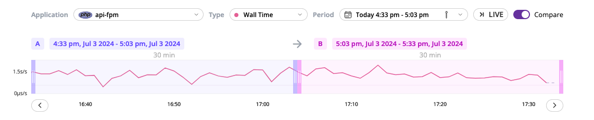
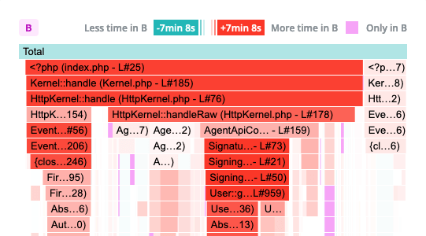
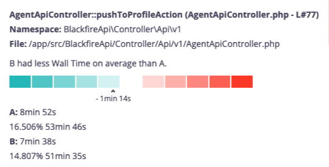

Comparing Continuous Profiling Timeframes
==========================================

.. include-twig:: `youtube-iframe`
    :title: comparing timeframes
    :src: https://www.youtube-nocookie.com/embed/DASuCTt9vHg?rel=0&showinfo=0&modestbranding=1&autoplay=0
    :width: 700px
    :height: 394px

Blackfire Continuous Profiler dashboard allows comparing two timeframes to better
understand application dynamics in various contexts.

You could compare two versions of the application, before and after a deployment,
or rush hours with quiet times for instance.

Enabling comparison mode
------------------------

A toggle on the top right corner of the continuous profiling dashboard enables
the comparison mode.

Once comparison enabled, you can select two timeframes referred to as ``A`` and
``B``. Those times can overlap.

Understanding continuous profiling visual comparison
----------------------------------------------------

The flamegraph provides a visual representation of how timeframe ``B`` compares
to ``A`` for the selected dimension using shades of colors. The stronger the
color, the higher resource variation.

Shades of green indicates timeframe ``B`` is consuming less resources than ``A``
for the selected dimension. Shades of red indicate the opposite.

A scale and contextual information are displayed when hovering a span. This ensures
accessibility for all users and allow colorblind users to benefit from this feature.

