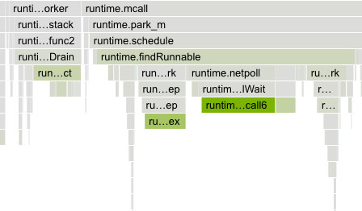
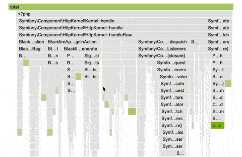

Blackfire Continuous Profiling Dashboard [level: Production]
============================================================

.. include-twig:: `youtube-iframe`
    :title: the continuous profiling dashboard
    :src: https://www.youtube-nocookie.com/embed/-B-9peEP--c?rel=0&showinfo=0&modestbranding=1&autoplay=0
    :width: 700px
    :height: 394px

Color-coded node dimensions
----------------------------

The continuous profiling dashboard employs a color-coded system to represent
each dimension, ensuring consistency across different runtimes.

The intensity of a node's background color is directly proportional to the
resources it consumes. As resource consumption increases, so does the vibrancy
of the background color. This visual representation pinpoints application areas
that may require optimization.

The contrast between the dimension color and the greyscale of regular nodes has
been designed to ensure accessibility for all users and allow colorblind users
to benefit from this feature.

Flame graph
------------

The flame graph is a hierarchical visualization of the contribution of the
different function calls to the selected dimensions.

Flame graphs are effective in identifying performance issues and understanding
the behavior of software during execution.

.. image:: ../images/continuous-profiling/flame-graph.png
    :align: center
    :alt: Continuous profiling flame graph

Rectangles in a flame graph are called frames. Each frame represents a function,
arranged vertically (y-axis) to show the sequence of method calls.

The width of a frame relates to its resource usage. It helps pinpoint the most
resource-intensive function calls.

Horizontally (x-axis), methods are sorted by name, not the order in which they
run.

Hovering a frame displays in-depth information on it.

.. image:: ../images/continuous-profiling/flame-graph-hover.png
    :width: 400px
    :align: center
    :alt: Hovering the continuous profiling flame graph displays in-depth information

Double-clicking on a frame narrows down the flame graph to the callers and callee
nodes of that frame.

Table view
-----------

The table view displays a list of all the frames sorted by their resource
consumption, for the selected dimension and timeframe. By default, the table is
sorted by ``exclusive`` resource consumption, which is the total value of the frame,
minus the combined total values of its direct children.

.. image:: ../images/continuous-profiling/table-view.png
    :align: center
    :alt: Continuous profiling table view
