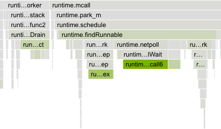
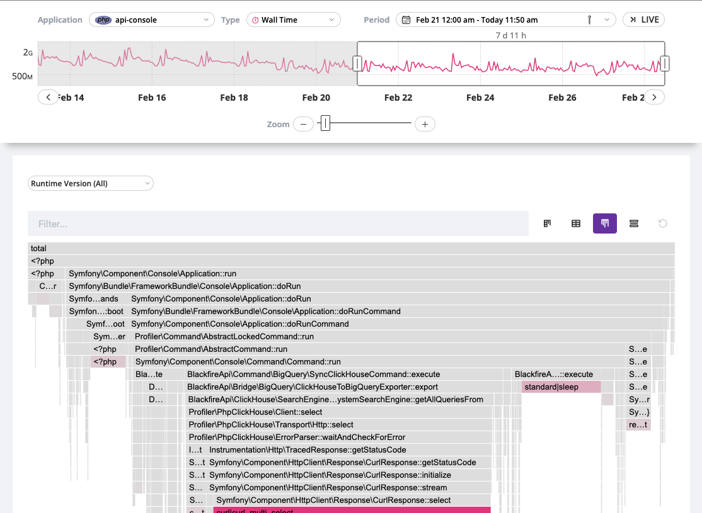
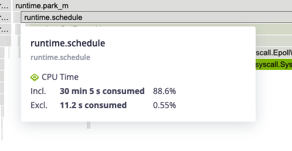
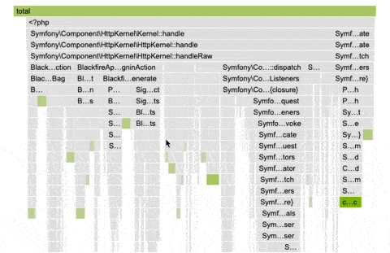
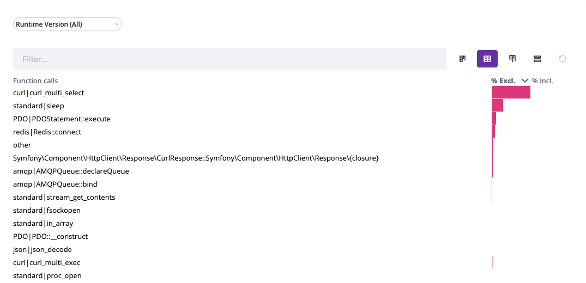

Continuous Profiling Cookbooks [level: Production]
==================================================

Continuous profiling is a multi-dimensional performance optimization technique
where web applications are monitored and profiled in real-time. Lightweight and
scalable, it's tailored for holistic application oversight.

Continuous profiling collects performance data continuously, enabling developers
to gain deep insights into their application's behavior, identify bottlenecks,
and optimize code for better performance and resource utilization. This proactive
approach allows for quicker identification and resolution of performance issues,
ensuring the smooth running of software in live environments.

Continuous profiling on Blackfire
---------------------------------

The continuous profiling dashboard is available directly under the
``Continuous Profiling`` tab of your environments.

It lets you visualize the profiling data of a specific application and is
composed of several views: flame graph, table view, as well as a split view
combining the flame graph and table views.

Each view helps make sense of the profiling data for the selected dimension and
time frame. The available dimensions vary with the runtime profiled.

Color-coded node dimensions
----------------------------

The continuous profiling dashboard employs a color-coded system to represent
each dimension, ensuring consistency across different runtimes.

The intensity of a node's background color is directly proportional to the
resources it consumes. As resource consumption increases, so does the vibrancy
of the background color. This visual representation pinpoints application areas
that may require optimization.

The contrast between the dimension color and the greyscale of regular nodes has
been designed to ensure accessibility for all users and allow colorblind users
to benefit from this feature.

Flame graph
------------

The flame graph is a hierarchical visualization of the contribution of the
different function calls to the selected dimensions.

Flame graphs are effective in identifying performance issues and understanding
the behavior of software during execution.

Rectangles in a flame graph are called frames. Each frame represents a function,
arranged vertically (y-axis) to show the sequence of method calls.

The width of a frame relates to its resource usage. It helps pinpoint the most
resource-intensive function calls.

Horizontally (x-axis), methods are sorted by name, not the order in which they
run.

Hovering a frame displays in-depth information on it.

Double-clicking on a frame narrows down the flame graph to the callers and callee
nodes of that frame.

Table view
-----------

The table view displays a list of all the frames sorted by their resource
consumption, for the selected dimension and timeframe. By default, the table is
sorted by ``exclusive`` resource consumption, which is the total value of the frame,
minus the combined total values of its direct children.

Read More on Continuous Profiling
---------------------------------

.. toctree::
    :maxdepth: 2
    :titlesonly:

    Deterministic vs probabilistic profiling <understanding>
    PHP configuration <php>
    Python configuration <python>
    Node.js configuration <nodejs>
    Go configuration <go>