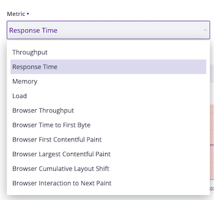

Front-end Alerting
==================

Blackfire supports alerting on front-end performance metrics in addition to the
back-end ones.

This allows you to monitor the full user experience and get notified when your
web performance degrades, no matter where the issue lies.

You can define alert conditions on metrics such as:

- Browser Throughput
- Browser Time to First Byte
- Browser First Contentful Paint
- Browser Largest Contentful Paint
- Browser Cumulative Layout Shift
- Browser Interaction to Next Paint

These metrics are available in the same alerting interface where you configure
thresholds for back-end metrics like Response Time, Throughput, Memory, and Load.

This integration enables true 360° Observability, catching issues whether they
stem from the server or the browser.

.. note::

    Learn how to configure alerts in the :doc:`back-end alerting doc page </monitoring-cookbooks/alerting>`.
