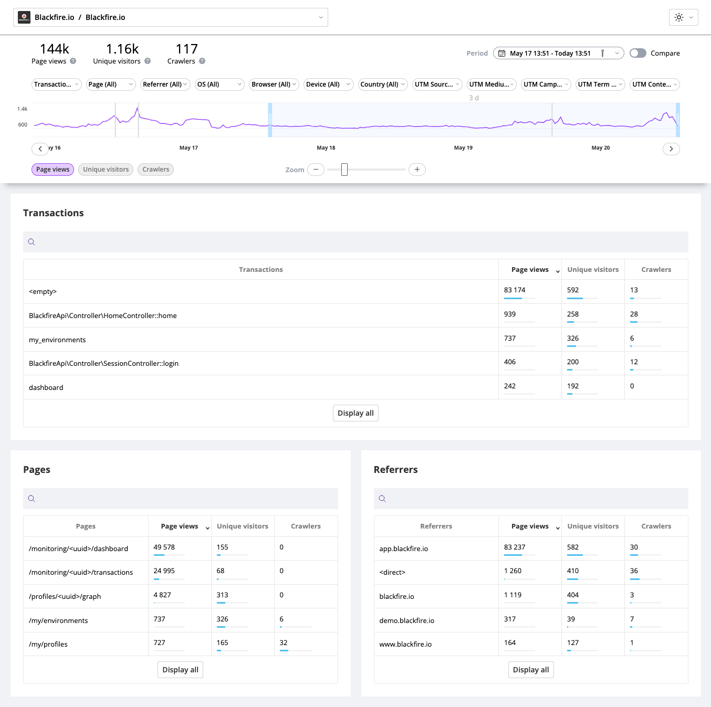
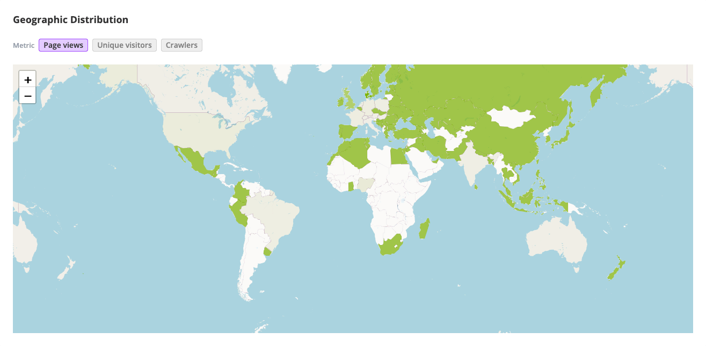
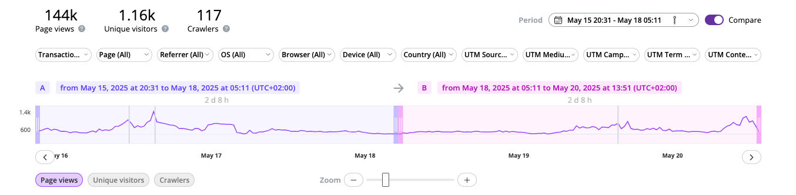
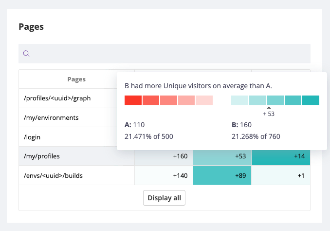

Analytics [level: Production]
=============================

.. include-twig:: `youtube-iframe`
    :title: Analytics
    :src: https://www.youtube-nocookie.com/embed/AWoVXnEA_kM?rel=0&showinfo=0&modestbranding=1&autoplay=0
    :width: 700px
    :height: 394px

Blackfire Analytics gives you a complete picture of how users interact with your
application, from top-performing pages to high-traffic transactions, popular
browsers, and UTM campaign effectiveness.

This feature helps you make smarter product decisions and prioritize your
improvements based on real user behavior and traffic patterns.

.. include:: _we-dot-not-track-users.rst

Metrics & Dimensions
--------------------

Blackfire Analytics provides the **Page views**, **Unique Visitors**, and
**Crawler** traffic information for the following:

- Transactions
- Pages
- Referrers
- UTM: Media, Sources, Campaigns, Contents, Terms
- Browsers
- Browser Versions
- Devices
- OS
- Countries

Geographic Distribution
-----------------------

The Geographic Distribution map gives you a visual breakdown of the traffic
across the world. This helps you quickly identify where your users are coming
from.

Timeframe Comparison
--------------------

Blackfire Analytics dashboard allows comparing two timeframes to better
understand the traffic dynamics in various contexts.

Enabling comparison mode
~~~~~~~~~~~~~~~~~~~~~~~~

A toggle on the top right corner of the analytics dashboard enables the
comparison mode.

Once comparison enabled, you can select two timeframes referred to as ``A`` and
``B``. Those times can overlap.

Understanding analytics visual comparison
~~~~~~~~~~~~~~~~~~~~~~~~~~~~~~~~~~~~~~~~~

The different tables provides a visual representation of how timeframe ``B``
compares to ``A`` for the selected dimension using shades of colors. The stronger
the color, the higher traffic variation.

A scale and contextual information are displayed when hovering a span. This
ensures accessibility for all users and allow colorblind users to benefit from
this feature.

