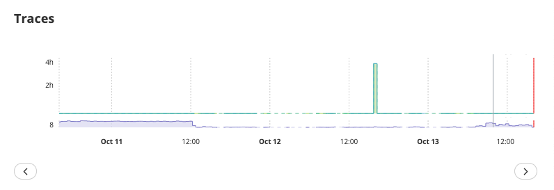

Browsing Browser Traces
=======================

Browser Monitoring now lets you **explore individual traces** to investigate
specific user sessions.

Accessing Trace Details
-----------------------

Click **Browse Trace** in the **Browser Overview** section to open a detailed
trace view.

Each trace represents a user visit, including page loads, navigation events, and
fetched resources.

You can:

- Move between traces using the Previous/Next buttons.
- View session details such as platform, browser version, country, screen size, and timestamp.
- Inspect each fetched resource (span) to understand how it was loaded.

- Hover over a span to see technical details such as:
    - Resource type and URL
    - Transfer size and compression rate
    - DNS lookup, TCP handshake, and wait times
    - Download duration

Depending on the trace, some or all of these breakdowns may be available.

Visitor Journey
---------------

For Single-Page Applications (SPA) or multi-page flows, the trace view also
provides a Visitor Journey timeline.

This shows the sequence of user interactions and navigation events during the
session, allowing you to correlate specific performance behaviors with the exact
user journey.
