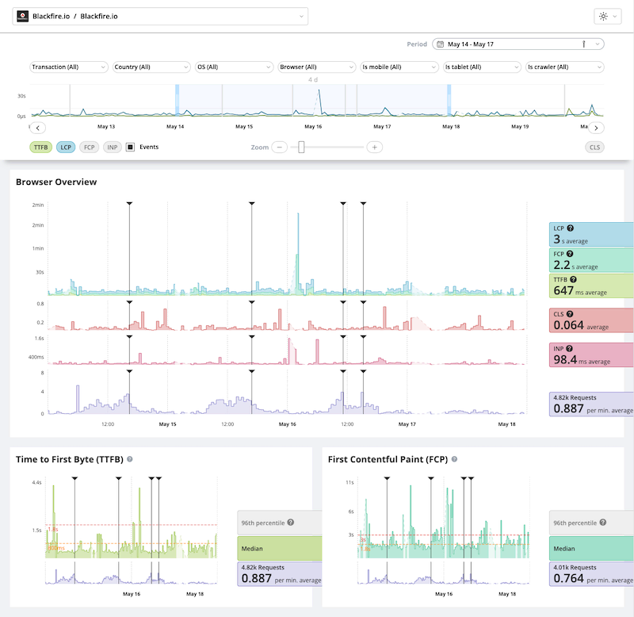

Browser Monitoring  [level: Production]
=======================================

.. include-twig:: `youtube-iframe`
    :title: Browser Monitoring
    :src: https://www.youtube-nocookie.com/embed/haPjWc2rZXU?rel=0&showinfo=0&modestbranding=1&autoplay=0
    :width: 700px
    :height: 394px

Browser Monitoring empower you understand how your users truly experience your
site. It helps you track real-world performance directly from users' browsers.

You can spot slowdowns, fix frontend issues, and deliver faster, more reliable
experiences across every device and region.

.. include:: _we-dot-not-track-users.rst

Key Performance Metrics
-----------------------

Browser Monitoring captures critical Web Vitals and other browser-level metrics that represent the user experience across three main axes: load performance, interactivity, and visual stability.

Time to First Byte (TTFB)
~~~~~~~~~~~~~~~~~~~~~~~~~

Time to First Byte represents the time it takes for the user's browser to
receive the first byte of the response from your server.

TTFB is crucial to identifying network latency and backend responsiveness
issues. It's the first meaningful milestone in every page load and directly
affects all subsequent metrics.

.. note::
    High TTFB can indicate slow server responses, DNS issues, or inefficient
    middleware logic.

First Contentful Paint (FCP)
~~~~~~~~~~~~~~~~~~~~~~~~~~~~

First Contentful Paint marks the moment when the browser renders the first
piece of DOM content (text, image, canvas, etc.). FCP signals to users that the
page is loading. Fast FCP builds confidence that the site is responsive and
working as expected.

.. note::
    Optimize FCP by deferring non-critical resources and improving
    render-blocking asset delivery.

Largest Contentful Paint (LCP)
~~~~~~~~~~~~~~~~~~~~~~~~~~~~~~

What it measures:Largest Contentful Paint measures the render time of the largest
visible content element.

A fast LCP is a strong signal that the page's main content is available to the user.

.. note::
    Improve LCP with faster server response times, better resource prioritization,
    and caching strategies.

Cumulative Layout Shift (CLS)
~~~~~~~~~~~~~~~~~~~~~~~~~~~~~

Cumulative Layout Shift quantifies how much visible content shifts unexpectedly
during the page's lifecycle.

Low CLS ensures that users don't accidentally click the wrong button or lose
their place while reading.

.. note::
    Set size attributes for images and videos, avoid inserting content above
    existing content.

Interaction to Next Paint (INP)
~~~~~~~~~~~~~~~~~~~~~~~~~~~~~~~

IInteraction to Next Paint INP observes all interactions (clicks, key presses,
taps...) and reports a single latency value below which most interactions fall.

Low INP means a consistently responsive experience, critical for interactive apps or SPAs.

.. note::
    INP is experimental but gives a more comprehensive view of interactivity
    than legacy metrics like FID (First Input Delay).

How Front-End Metrics Interrelate
---------------------------------

These metrics collectively map the user's journey from initiating a page load to
interacting with fully rendered content:

- **TTFB**: Measures the time from the user's request to the first byte received
  from the server. It reflects backend performance and network latency.
- **FCP**: Captures the time when the first piece of content is rendered,
  indicating that the page is loading.
- **LCP**: Marks the point when the main content is fully visible, signifying
  that the page is useful.
- **CLS**: Assesses visual stability by measuring unexpected layout shifts during
  loading.
- **INP**: Evaluates responsiveness by measuring the delay between user
  interactions and the next visual update.

By analyzing these metrics together, developers can identify performance
bottlenecks and areas for improvement throughout the user's experience.

Top Transactions
----------------

The Top Transactions section gives you a detailed breakdown of frontend
performance across your most frequent user interactions and page views.

It helps you pinpoint slow or unstable transactions and understand how each one
contributes to the overall user experience.

Hovering a transaction display call-to-actions (CTAs) allowing to quickly
inspect it into Blackfire's other features.

Top Resources Breakdown
-----------------------

A Top Resources table summarizes key metrics across fetched assets:

- Number of requests
- Average duration
- Transferred size
- Cache hit rate
- Compression ratio

Use this view to identify slow or heavy front-end resources affecting load time
and user experience.

Geographic Distribution
-----------------------

The Geographic Distribution map gives you a visual breakdown of frontend
performance across the world.

This view helps you quickly identify where your users are experiencing slower
load times, layout shifts, or poor responsiveness.

It aims at empowering you to take targeted action to improve their experience.

