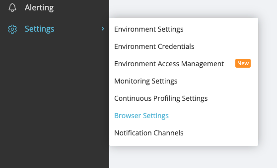
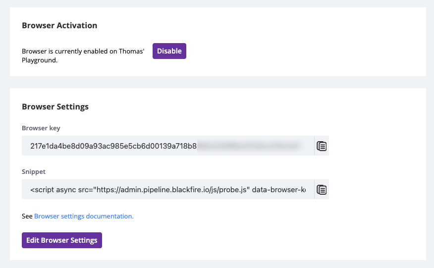

Configuring Front-End Observability
===================================

Enabling at the Organization Level
----------------------------------

The :doc:`Organization Browser Monitoring usage <front-end-usage>` settings page
lists the environments you has access to.

You can manage the settings of the environments you administrate.

.. image:: ../images/front-end/browser-activation.png

Enabling at the Environment Level
---------------------------------

Similarly, and at the environments level, the Environment's Browser Monitoring
Settings allows Environment Admins to control those features for that environment.

Controlling the Browser Key
---------------------------

Browser Monitoring and Analytics require defining a Browser Key in your
application HTML code.

The :doc:`latest version </up-and-running/update>` of the PHP and Python probes
can automatically inject the tracking snippet when the feature is enabled,no
manual setup needed.

If you prefer manual control, you can also inject the snippet yourself by
placing it in your frontend code:

.. note::

    **Performance tip**: The script file (``probe.js``) is the same for all
    users and applications. It can be safely cached at the edge
    (:doc:`CDN or reverse proxy </integrations/proxies/index>`) to reduce
    load-times and minimize network overhead.

    The Browser Key is unique to your Blackfire :doc:`Environment </reference-guide/environments>`

Browser Monitoring & Analytics Sample Rate
------------------------------------------

You can control the sample rate by click the "Edit Browser Settings" button.

The Sample Rate represents the percentage of your front-end requests which you
would like Blackfire to monitor.

Controlling the Sample Rate allows you to control the trade-off between cost and
comprehensive data.

You can increase your Browser Monitoring & Analytics monthly quota or purchase
top-ups via your :doc:`Organization Billing Settings </up-and-running/billing>`
page.
