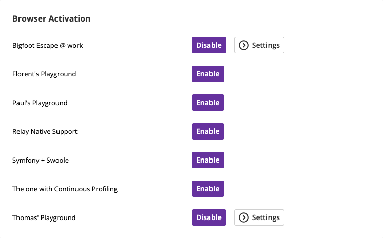

Configuring Front-End Observability
===================================

Enabling at the Organization Level
----------------------------------

The :doc:`Organization Browser Monitoring usage <front-end-usage>` settings page
lists the environments you has access to.

You can manage the settings of the environments you administrate.

Enabling at the Environment Level
---------------------------------

Similarly, and at the environments level, the Environment's Browser Monitoring
Settings allows Environment Admins to control those features for that environment.

Controlling the Browser Key
---------------------------

Browser Monitoring and Analytics require defining a Browser Key in your
application HTML code.

The :doc:`latest version </up-and-running/update>` of the PHP and Python probes
can automatically inject the tracking snippet when the feature is enabled, no
manual setup needed.

.. image:: ../images/front-end/browser-settings.png

Adding the Tracking Snippet Manually
------------------------------------

If you prefer manual control, you can also inject the snippet yourself by
placing it in your frontend code:

.. include-twig:: `frontend_credentials`

.. note::

    **Performance tip**: The script file (``probe.js``) is the same for all
    users and applications. It can be safely cached at the edge
    (:doc:`CDN or reverse proxy </integrations/proxies/index>`) to reduce
    load-times and minimize network overhead.

    The Browser Key is unique to your Blackfire :doc:`Environment </reference-guide/environments>`

Naming Transactions
-------------------

A transaction is a group of requests which have been traced by Blackfire, and
for which a name has been defined, either automatically or manually.

It may correspond to a controller, a specific action, or a view, depending on
whatever is relevant to your application or framework.

Linking Front-end and Back-end
~~~~~~~~~~~~~~~~~~~~~~~~~~~~~~

When you name a front-end transaction, Blackfire will automatically correlate it
with a back-end transaction if they share the same name.

This lets you:

- Navigate seamlessly between front-end and back-end profiles
- Understand full-stack performance for a given feature
- Pinpoint if slowness is browser-side or server-side

No extra config needed, just consistent naming.

Naming HTTP Transactions Programmatically
~~~~~~~~~~~~~~~~~~~~~~~~~~~~~~~~~~~~~~~~~

To name transactions programmatically, manually inject the JS tracking code and
add a ``data-transaction-name`` attribute.

.. include-twig:: `frontend_credentials_with_transaction_name`

Browser Monitoring & Analytics Sample Rate
------------------------------------------

You can control the sample rate by click the "Edit Browser Settings" button.

The Sample Rate represents the percentage of your front-end requests which you
would like Blackfire to monitor.

Controlling the Sample Rate allows you to control the trade-off between cost and
comprehensive data.

You can increase your Browser Monitoring & Analytics monthly quota or purchase
top-ups via your :doc:`Organization Billing Settings </up-and-running/billing>`
page.
