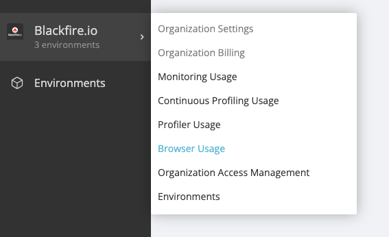
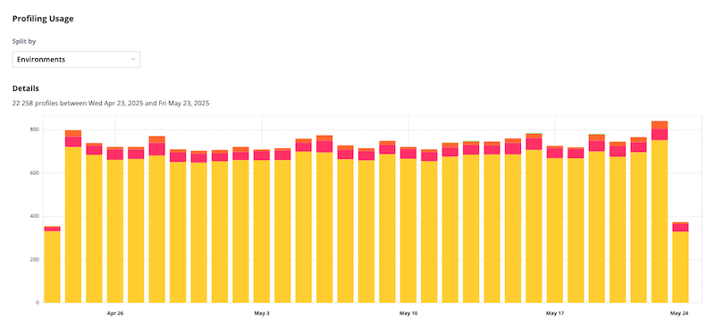

Browser Monitoring & Analytics Usage
====================================

.. include-twig:: `youtube-iframe`
    :title: Usage & Traffic Spike
    :src: https://www.youtube-nocookie.com/embed/P_tEGpibqHQ?rel=0&showinfo=0&modestbranding=1&autoplay=0
    :width: 700px
    :height: 394px

Detailed information on the Browser Monitoring & Analytics traces consumption
can be found under the Organization Usage menu:

This view shows the number of browser traces consumed in environments you
have access to.

The traces used in the organization's other environments are gathered within
the "Other environments" entry.

Traffic Spike Prevention
------------------------

Blackfire Browser Monitoring and Analytics's traffic spike prevention system
protects your monthly browser quota from sudden traffic surges.

It continuously tracks your browser traces collection rate. At any time, an
ingestion rate exceeding 15 times your monthly quota allowance is identified as
an abnormal traffic spike.

Blackfire monitoring and analytics are then automatically paused for 15 minutes.
Subsequently, those features resume automatically, ensuring you continue to
receive insights without significant disruption.
