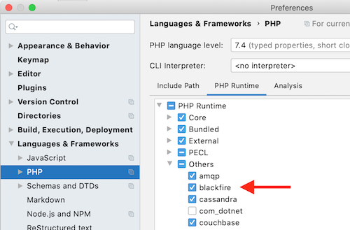

PHPStorm [language: PHP]
========================

As of 2020.1, PHPStorm provides stubs for ``\BlackfireProbe`` internal class,
which is :ref:`provided by the Blackfire extension
<php-blackfireprobe-internal-class>`.
These stubs give you **code completion on all available methods of
\BlackfireProbe class**.

Configuration
-------------

Blackfire stubs are not enabled by default in PHPStorm. To activate them, you
need to:

1. Go to PHPStorm settings;

2. Go to *Language and Frameworks*, then *PHP*;

3. Click on *PHP Runtime* tab;

4. Unfold *Others*, and check **blackfire** in the list;

5. Validate your change by clicking *OK*.

