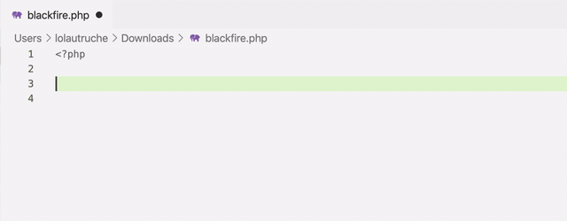
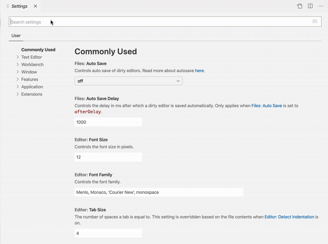

Visual Studio Code [language: PHP]
==================================

The `PHP Intelephense extension <https://marketplace.visualstudio
.com/items?itemName=bmewburn.vscode-intelephense-client>`_ for Visual Studio
Code provides stubs for ``\BlackfireProbe`` internal class, from
:ref:`the Blackfire extension <php-blackfireprobe-internal-class>`.
These stubs give you **code completion on all available methods of
\BlackfireProbe class**.

Configuration
-------------

Blackfire stubs are not enabled by default in Intelephense. To activate them,
you need to:

1. Go to VSCode settings;

2. Look for *Intelephense stubs*;

3. At the end of the stubs list, click on **Add Item** button;

4. Add ``blackfire`` and validate.

