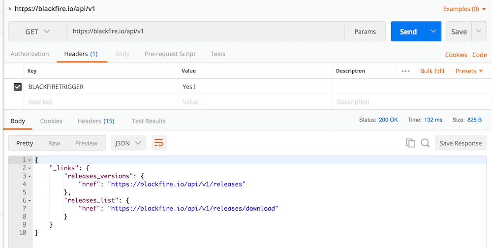

Postman
=======

`Postman <https://www.getpostman.com/>`_ is a well-known application
providing developers tools to ease API development.

While there is no native Blackfire integration in Postman,
it is simple to profile requests using the Blackfire PHP SDK
via an arbitrary HTTP header that triggers profiling.

The principle is simple: update the API front controller to enable profiling
if a specific header is part of the HTTP request.

First, install the blackfire PHP SDK:

.. code-block:: bash

    composer require blackfire/php-sdk

.. note::
    :class: doc-cta

    If you're not familiar with the SDK, please read the
    :doc:`dedicated SDK documentation </php/integrations/sdk>`.

Then update your front controller to activate the Blackfire Probe when the header ``BLACKFIRETRIGGER`` is present:

.. code-block:: php

    require __DIR__.'/../vendor/autoload.php';

    // If the header is set
    if (isset($_SERVER['HTTP_BLACKFIRETRIGGER'])) {
        // let's create a client
        $blackfire = new \Blackfire\Client();
        // then start the probe
        $probe = $blackfire->createProbe();

        // When runtime shuts down, let's finish the profiling session
        register_shutdown_function(function () use ($blackfire, $probe) {
            // See the PHP SDK documentation for using the $profile object
            $profile = $blackfire->endProbe($probe);
        });
    }

Now, anytime Postman calls the front-controller with the ``BLACKFIRETRIGGER`` header, a profile is created.

.. caution::

    Be careful in choosing a random and not guessable HTTP header name to avoid
    DoS vulnerabilities.

    For testing APIs in production, consider using the :doc:`Blackfire Player
    </builds-cookbooks/player>`
