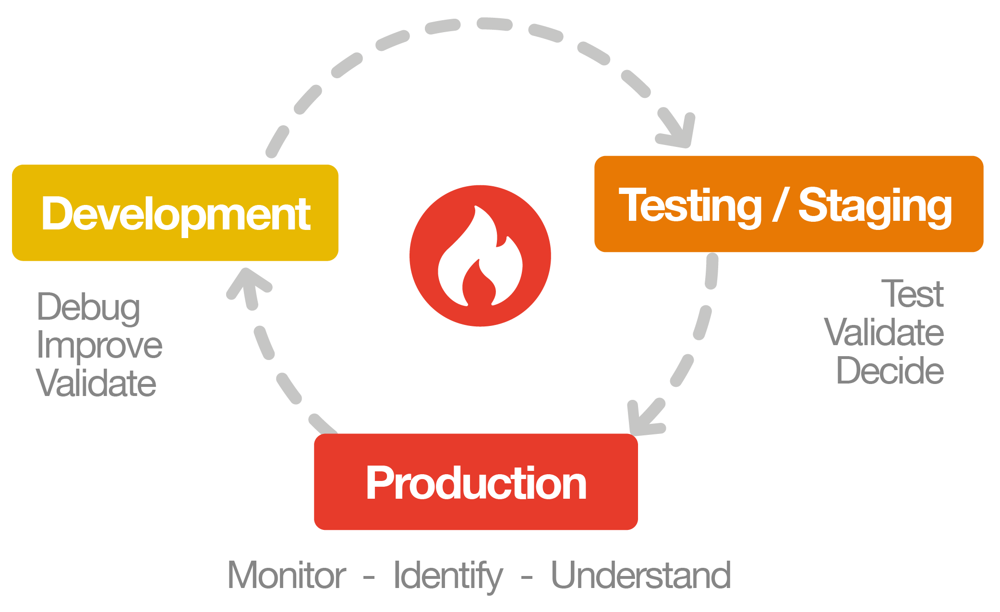

What is Blackfire?
==================

Welcome to **Blackfire**, your *Code Performance Observability Solution*.

Blackfire helps to improve web applications' performance at each step of its
lifecycle: from development to test, staging and production.

It offers a unique blend of monitoring, often called APM, and profiling features.

Across all of your sites and testing pipelines, get actionable reports and
insights, which help you fix issues.

Blackfire supports PHP and Python monitoring and profiling. It also supports Go
profiling.

.. include-twig:: `youtube-iframe`
    :title: introduction-to-blackfire
    :src: https://www.youtube-nocookie.com/embed/bS4dzuzkir0?rel=0&showinfo=0&modestbranding=1&autoplay=0
    :width: 700px
    :height: 394px

Monitoring
----------

Monitoring a web application is about collecting performance metrics on live
traffic, usually in production, sometimes in staging.

It is a key feature to **detect when something is going wrong** in your application,
and give you high-level pointers to **understand which transaction is consuming
most of the server resources**. Blackfire also breaks down that information into
time spent within the application, and time spent within external services (eg
HTTP, SQL, Queues, etc.).

To avoid impacting your end-users the metric collection techniques ensure a very
light, or even non-existing overhead. It also means that the depth of metrics
is limited. This is where our profiler shines.

Profiling
---------

Profiling is collecting deep performance metrics while the code is running, and
have full details and context on the code's behavior to **find the root cause of
performance bottlenecks**.

A profile includes information on the number of calls per function, caller-callee
relationships, wall-time, I/O time, CPU time, memory, network, HTTP calls and
SQL queries. Two visualization options, the call-graph and the timeline, let you
view the code's behavior as a relational graph, or across time.

A key advantage of Blackfire's profiler technology is that **it can run safely in
production**, with **no impact for end-users** when profiling HTTP requests. By
default, profiles run on synthetic requests, generating no overhead on real
traffic.

Blackfire also offers more advanced profiling techniques, which you can discover
in this documentation (real end-user requests, crons, scripts, and more).

Testing
-------

Beyond traditional monitoring, and profiling techniques, Blackfire offers unique
features to let you integrate :doc:`performance testing </builds-cookbooks/scenarios>`
anywhere in your QA practices. :doc:`Integrate </integrations/index>` with
CI/CD, unit tests, tests upon deployment, or run Synthetic User Monitoring.

Write :doc:`assertions </testing-cookbooks/assertions>` to verify that your code
behaves as expected, and that it respects your performance budget.

Benefit from default assertions, our fully documented **recommendations**, to
have Blackfire warn you with no further effort from you when it detects
something wrong in the performance, quality or security of your code.

A Unique Blend of Features
--------------------------

Blackfire is the only tool to offer natively integrated monitoring, advanced
profiling and testing features. Thanks to that blend, get actionable insights and
reports so that you can fix issues rather than spend time finding them.

To better understand how Blackfire works, check our doc on
:doc:`the Blackfire stack </reference-guide/faq>`.

What's Next?
------------

1. :doc:`Install </up-and-running/installation>` Blackfire in production and
   :doc:`activate Monitoring </monitoring-cookbooks/configuration>`;

2. Install the stack your personal computer;

3. Learn more about how to profile HTTP requests via a :doc:`browser
   </profiling-cookbooks/profiling-http-via-browser>` or the :doc:`CLI
   </profiling-cookbooks/profiling-http-via-cli>` (Web Pages, Web Services,
   API calls) and how to :doc:`profile CLI commands</profiling-cookbooks/profiling-cli>`.

If you have never used a profiler before, learn more about :doc:`how to
understand call graphs </profiling-cookbooks/understanding-call-graphs>`, :doc:`how to
read a timeline </profiling-cookbooks/understanding-timelines>`, and :doc:`how to
interpret time </reference-guide/time>`.

Then, learn how to write :doc:`tests </testing-cookbooks/tests>` and :doc:`scenarios
</builds-cookbooks/scenarios>`.

Finally, learn how to integrate Blackfire with many :doc:`third-party services
and libraries </integrations/index>`.
