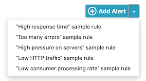
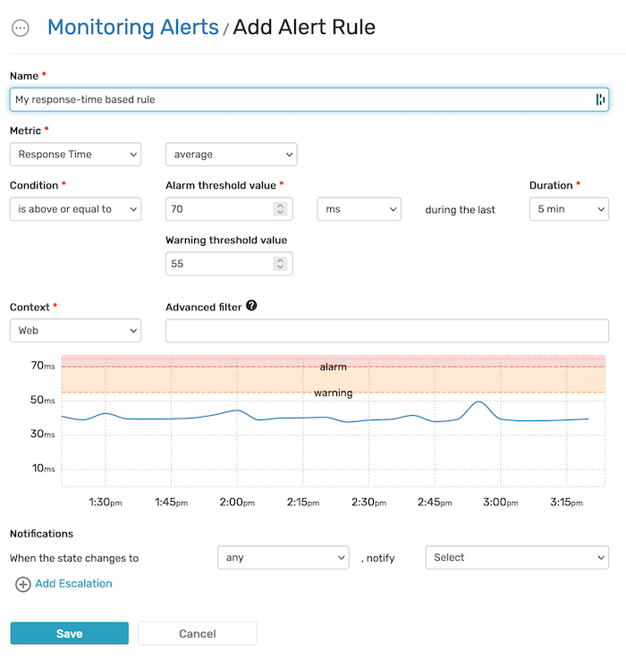
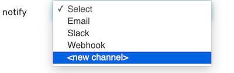
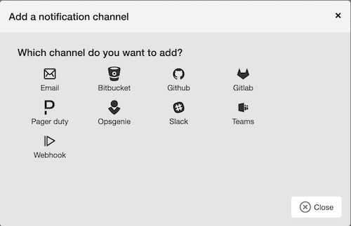
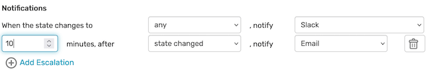
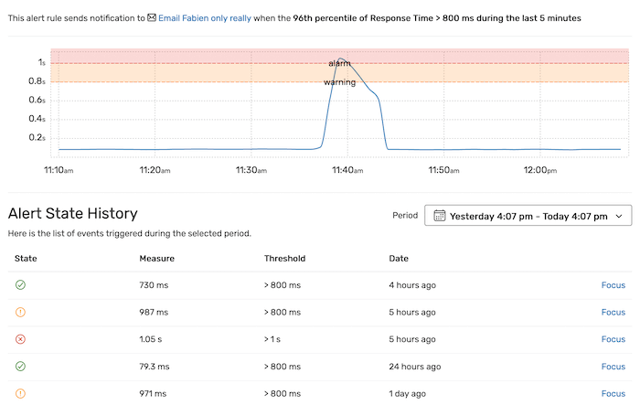

Creating an Alert Rule
======================

Alerting lets you receive :ref:`notifications <monitoring-alerting-notification-channel>`
whenever Blackfire detects abnormal behavior in an application, according to
your criteria and business logic.
It may be for instance when the response time is too slow, or when an application
faces an unusually large error rate.

Blackfire's engine lets you configure advanced rules, while conveniently offering
templates that will get you up and running in minutes.

From the Alerting dashboard, you may create a new rule by clicking on the
"Add Alert" button.

You may also click on the arrow next to the button and choose one of the
provided templates.

An Alert Rule consists of the following elements:

- A name;
- :ref:`A metric <monitoring-alerting-metric>`;
- :ref:`A threshold <monitoring-alerting-condition>`;
- :ref:`A context <monitoring-alerting-context>`;
- :ref:`One or several notification channels <monitoring-alerting-notification-channel>`.

.. _monitoring-alerting-metric:

Defining the Base Metric
------------------------

The Metric defines which kind of value the alert rule is to be based on.
It consists in a **Metric type** (Throughput, Response Time, Memory, and Load),
and a **Value type** (average, minimum, maximum, sum, 50th percentile, or
96th percentile).

.. note::

    Throughput (i.e. traffic) doesn't have a value type.

.. _monitoring-alerting-condition:

Defining the Threshold
----------------------

The **Condition** defines the thresholds of your alert rule. It consists in a
condition type, a threshold value and a duration.

The **Condition type** defines how the metric should cross the threshold value to
trigger an alarm or a warning (e.g., "is above", "is below or equal", or
"is different than").

The **Threshold value** is the absolute value in a given unit you define for the alert.
You may define an *Alarm* and a *Warning* thresholds.

.. note::

    **The Alarm threshold always has precedence**.

    Consider a rule with a warning threshold set at 80ms and an
    alarm threshold set at 100ms. This rule is expected to trigger when the
    average response time is above this threshold.
    If the average response time reaches 120ms, **only the alarm would trigger**

The **Duration** defines how long the Condition needs to be met before triggering
the alert.

.. _monitoring-alerting-context:

The Context and Advanced Filtering
----------------------------------

The **Context** may be *Web* (HTTP traffic) or *CLI* (:doc:`Consumers,
Cronjobs... </monitoring-cookbooks/consumers-monitoring>`).

The **Advanced Filter** allows you to refine your rule using an expression.
The expression may use comparison and logic operators along with the following
variables:

- ``transaction``: :doc:`The transaction name </monitoring-cookbooks/naming-transactions>`;

- ``code``: The HTTP response code;

- ``method``: The HTTP method;

- ``http_host``: The HTTP host;

- ``hostname``: The name of the server (aka ``hostname``) which handled the request.

**Advanced filter examples:**

- ``transaction != "health_check"``

- ``code in 200..399``

- ``method == "GET"``

- ``http_host == "www.my-company.com"``

- ``hostname in ["front-1", "front-2"]``

- ``transaction == "health_check" or host == "127.0.0.1"``

.. note::

    The expression used in the advanced filter is based on `Symfony Expression
    Language <https://symfony.com/doc/current/components/expression_language/syntax.html>`_.
    For the full syntax reference, you may refer to `its documentation
    <https://symfony.com/doc/current/components/expression_language/syntax.html>`_.

.. _monitoring-alerting-notification-channel:

Defining a Notification Channel
-------------------------------

The *Notification Channel* is the service that the Alert Rule uses to inform you
whenever an alert triggers.

It may be any :doc:`supported channel </integrations/notifiers/index>`, including:

- Email;

- :doc:`Slack </integrations/notifiers/slack>`;

- :doc:`Pager Duty </integrations/notifiers/pager-duty>`;

- :doc:`Opsgenie </integrations/notifiers/opsgenie>`.

You may create a new notification channel directly from the selection menu.

**Escalation**
""""""""""""""

In addition to the main notification channel, you may add one or several
escalations, if the alert state has or hasn't changed after a period of time you
define.

The escalation may use the same notification channel or a different one.

Viewing the Alert State History
-------------------------------

From the list of the defined Monitoring Alert Rules, it is possible to
visualize the alert state for each rule by clicking the *Show* link.

The Alert State History shows the list of events triggered during a period you
can select.

Clicking on a *Focus* link centers the timeline on the selected event.

