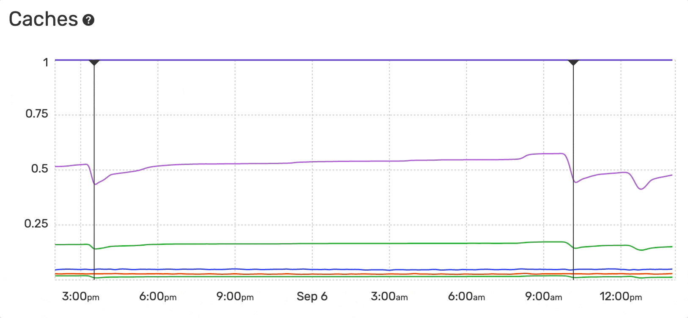

Cache Monitoring [language: PHP]
================================

The Monitoring Dashboard provides an overview of the caches usage and hit-rate
evolution over time for PHP applications:

- APCu Hit Rate
- APCu Usage
- OPcache Hit Rate
- OPcache Usage
- OPcache Interned Strings Buffer Usage
- PCRE Usage
- RealPath Usage

The hit rate is the number of cache hits divided by the total number of memory
requests over a given time interval.

The cache usage is the percentage of a specific cache memory currently allocated.

OPcache
-------

`OPcache <https://www.php.net/manual/en/book.opcache.php>`_ is a PHP extension
that improves application performance by storing precompiled script,
`opcodes <https://en.wikipedia.org/wiki/Opcode>`_, in shared memory. It removes
the need to load, parse and compile PHP files on every request.

The `opcache.memory_consumption
<https://www.php.net/manual/en/opcache.configuration.php#ini.opcache.memory-consumption>`_
ini setting defines the size of the shared memory storage used by this cache.

OPcache Interned Strings Buffer
-------------------------------

Interned strings are a memory optimization added in PHP 5.4. PHP stores
immutable strings (a ``char *``) into a special buffer to be able to reuse its
pointer for all occurrences of the same string.

Blackfire recommends that the interned strings buffer does not represent more
than 85% of the allocated memory.

This setting can be adjusted using the `opcache.interned_strings_buffer
<https://www.php.net/manual/en/opcache.configuration.php#ini.opcache.interned-strings-buffer>`_.

OPcache Accelerated Files
-------------------------

The `opcache.max_accelerated_files
<https://www.php.net/manual/en/opcache.configuration.php#ini.opcache.max-accelerated-files>`_
ini setting configures the maximum number of files that can be cached. Complex
applications involve a lot of different PHP files, so it's recommended to
increase the default value of ``opcache.max_accelerated_files`` in production.

APCu Shared Memory
------------------

APCu (APC User Cache) provides a simple API to cache and retrieve data in PHP
applications. This data is stored in shared memory segments that can be
configured using these settings:

- `apc.shm_size <https://www.php.net/manual/en/apc.configuration.php#ini.apc.shm-size>`_
  configures the size of each shared memory segment;

- `apc.shm_segments <https://www.php.net/manual/en/apc.configuration.php#ini.apc.shm-segments>`_
  configures the total number of segments created for APCu.

RealPath Cache
--------------

The `realpath() <https://www.php.net/manual/en/function.realpath.php>`_ function
returns the absolute path for any given relative file path. This conversion takes
a non-negligible time because it performs some filesystem calls. That's why PHP
caches the results of ``realpath()`` calls and their associated
`stat() <https://www.php.net/manual/en/function.stat.php>`_ calls. The
`realpath_cache_size <https://www.php.net/manual/en/ini.core.php#ini.realpath-cache-size>`_
ini setting defines the size of this cache.

PCRE Cache
----------

The `PCRE PHP <https://www.php.net/manual/en/intro.pcre.php>`_ extension
maintains a global per-thread cache of compiled regular expressions.
