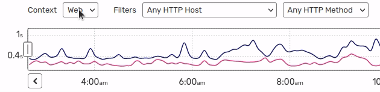

Consumers Monitoring
====================

Consumers and CLI commands can be monitored.

Displaying CLI Monitoring Data
------------------------------

The consumers and CLI command monitoring data can be displayed toggling the Web/CLI dropdown.

Enabling CLI Monitoring
-----------------------

Instrumentation of CLI commands and consumers needs to be manually triggered:

**PHP Application**

.. code-block:: php

    // As of Blackfire PHP Probe 1.78.0
    \BlackfireProbe::startTransaction('My CLI command');

    // code

    \BlackfireProbe::stopTransaction();

**Python Application**

.. code-block:: python

    from blackfire import apm

    # As of Blackfire Python Probe 1.6.1
    apm.start_transaction()
    apm.set_transaction_name('My CLI command')

    # code

    apm.stop_transaction()

CLI transactions should be manually named either before, during, or after the
Instrumentation.

Integrations
------------

Blackfire supports a number of native integrations with third-party tools.
Please check their dedicated documentation:

* :doc:`Symfony Messenger </php/integrations/symfony/messenger>`

* :doc:`Symfony CLI commands </php/integrations/symfony/cli-commands-monitoring>`

* :doc:`Laravel Artisan </php/integrations/laravel/artisan>`

* :doc:`Laravel Horizon and queue services </php/integrations/laravel/horizon>`
