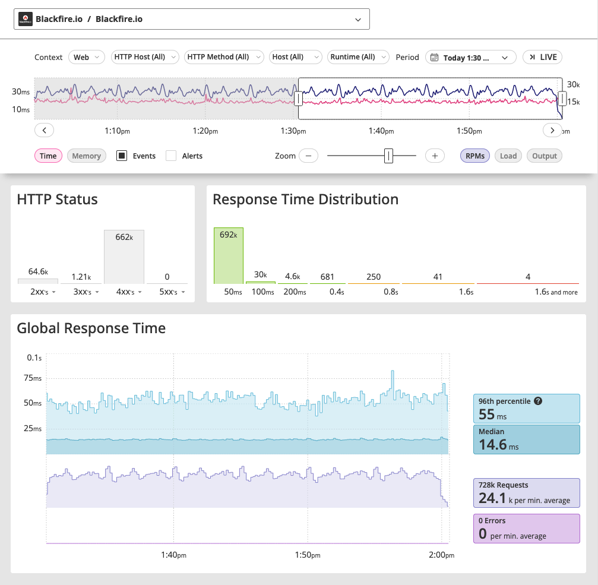
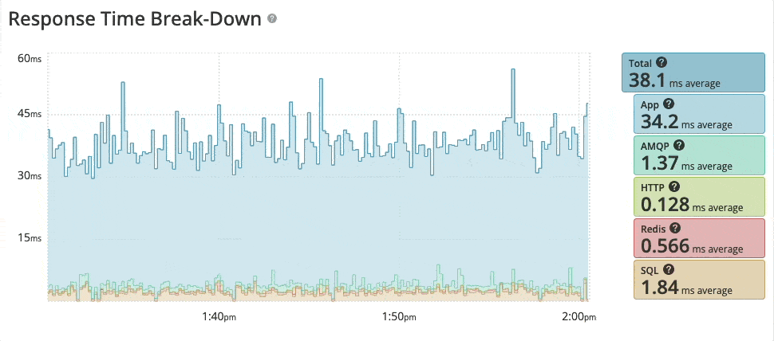

Blackfire Monitoring Dashboard [level: Production]
==================================================

Blackfire monitoring takes a holistic approach to continuous observability,
providing a bird's-eye view of the health of your applications enabling you to
identify and drill down on performance issues.

Not only can you discover what issues occurred but **when and where** they
happened as well.

The interactive dashboard lies at the heart of Blackfire monitoring. It allows
you to filter monitoring data based on HTTP host, HTTP method, host, and runtime.

The monitoring dashboard offers a range of insightful performance metrics, such
as response time, memory usage, requests per minute (RPM), load, and output,
providing a comprehensive understanding of your application's health.

Response time analysis
----------------------

One of Blackfire monitoring's most valuable features is its ability to break down
the response time per layer of service.

This granular look into your application's response time helps you locate any
inefficiencies or bottlenecks in specific layers, allowing you to prioritize your
optimization strategies effectively.

The performance issues you are trying to understand and solve might not
originate within your code, but within the services you rely on. It's also maybe
due to how your applications handle those services.
