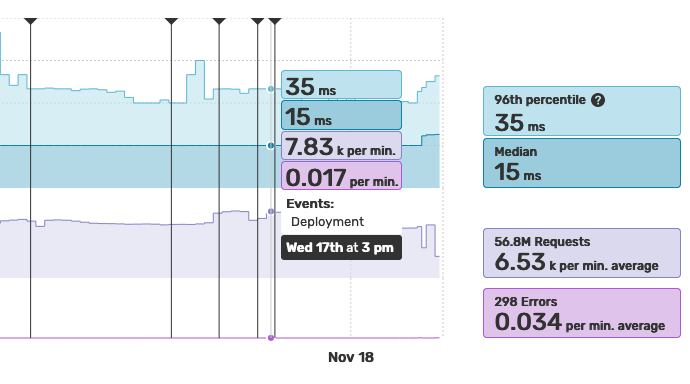

Mark Events in the Monitoring Timeline
======================================

You may want to visualize specific events in your Monitoring timeline to check
the impact of an action, like a deployment.

It is possible to mark events in the Monitoring timeline using the following curl
command:

.. include-twig:: `apm_event_credentials`

.. note::

    The ``name`` parameter can be up to 64 characters long.

    The ``timestamp`` parameter is optional (default to current datetime) and must
    be a valid unix timestamp.
