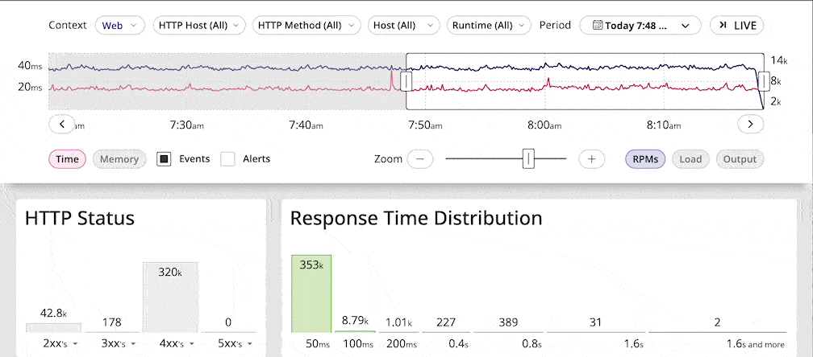
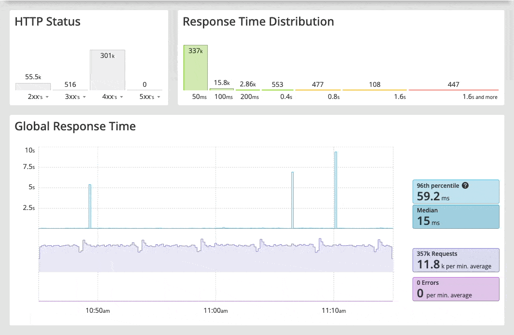
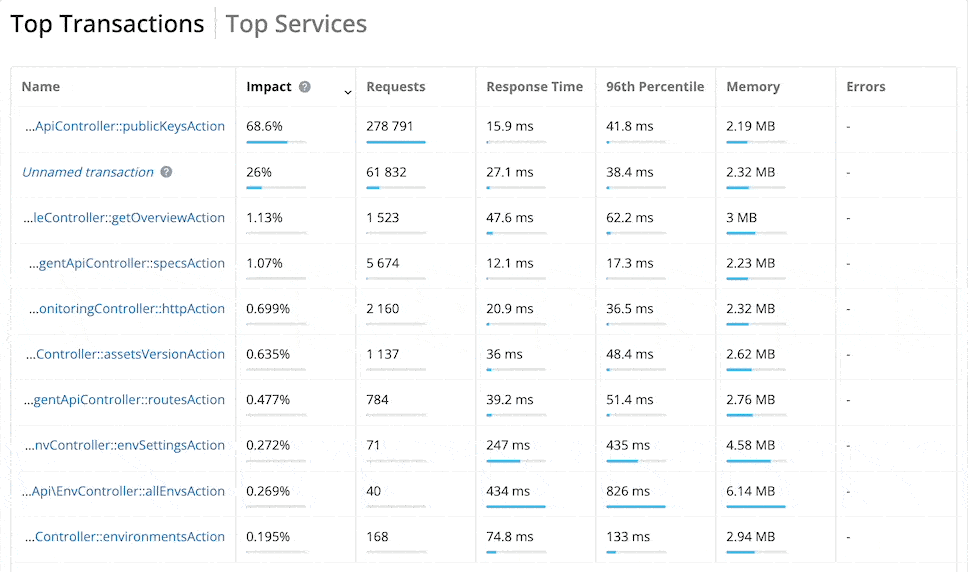
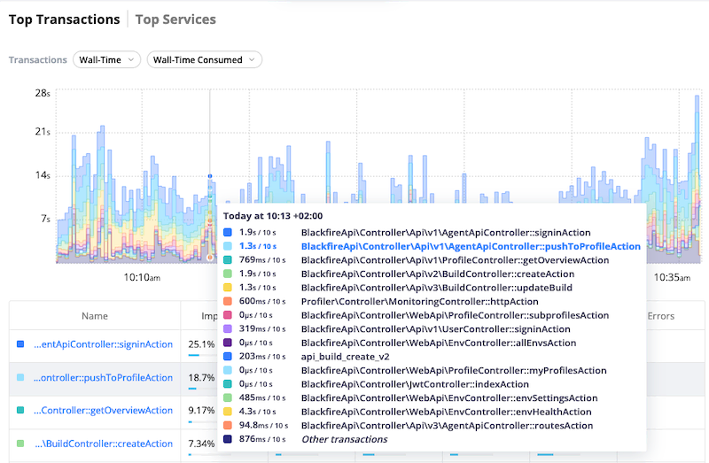

Filtering Transactions
=======================

You can filter HTTP Monitoring data by HTTP Host, HTTP method, Host, and Runtime.
You can use those filters individually or combined:

Each filter allows you to pick only some terms, or everything but some terms.

You can concomitantly filter monitoring data by HTTP status or response time by
clicking the respective graph. To reset the filter, click the graph again:

Top Transactions
----------------

The Monitoring Dashboard displays the list of top transactions for the selected
timeframe. This list is primarily sorted by impact, representing the percentage
of time spent processing one transaction versus all the other ones.

A best practice is to optimize high impact transactions first.

You can also sort the top transactions list by number of requests, response-time,
96th percentile, memory, and errors.

To display the monitoring data related to a transaction, click the transaction name.

The :ref:`Top Services<top_services>` tabs displays the most impactful
:term:`spans ` for the whole environment.

Transaction Breakdown
----------------------

The transaction breakdown graph displays the evolution of the most impactful
transactions over time, for the selected timeframe and dimension. It provides 
convenient contextualized information, helping you understand your application's
dynamics.
