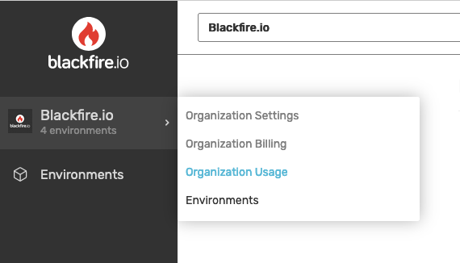
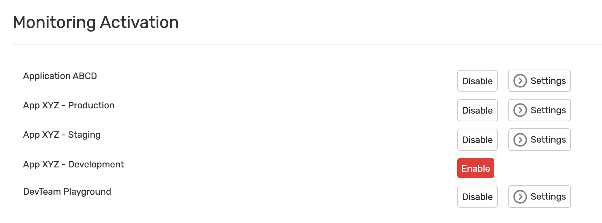
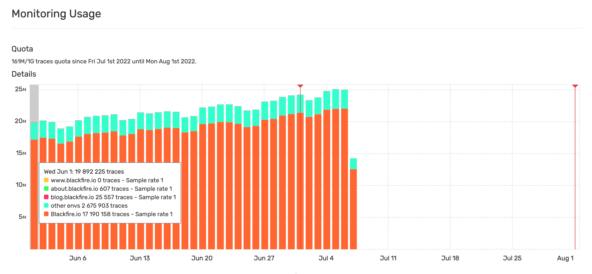

Monitoring Usage
=================

Detailed information on the Monitoring traces consumption can be found under the
Organization Usage menu:

.. _monitoring-activation:

Monitoring Activation
----------------------

This view lists the environments you has access to.

You can manage the settings of the environments you administrate.

Monitoring Usage
-----------------

This view shows the number of monitoring traces consumed in environments you
have access to.

The traces used in the organization's other environments are gathered within
the "Other environments" entry.

