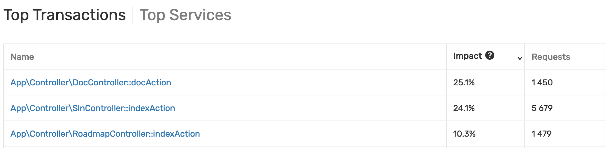
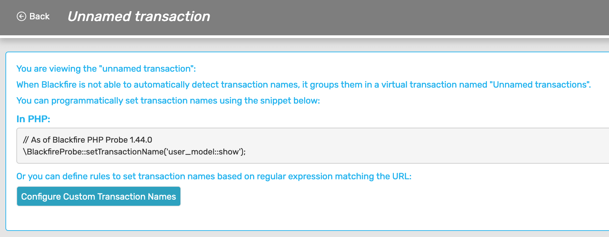
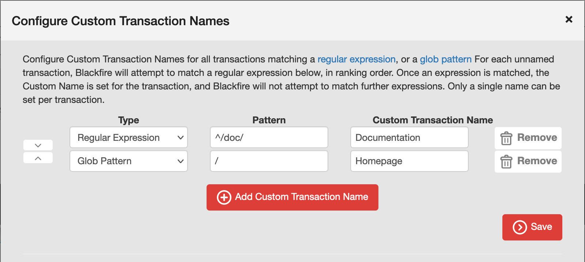
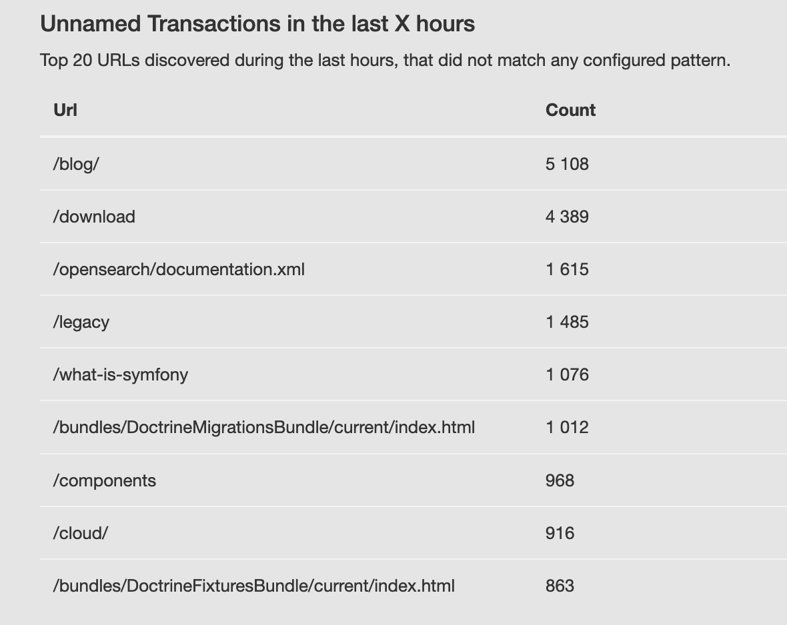

Naming Transactions
===================

From a Monitoring perspective, **a transaction is a group of server-side requests
which have been traced by Blackfire**, and for which a name has been defined,
according to the supported frameworks.

It may correspond to a controller, a specific action, or a view, depending on
whatever is relevant to your application or framework.

Blackfire Monitoring supports all kinds of PHP and Python applications, and
provides extended support for various frameworks, such as Symfony, Laravel, Magento,
Django, or FastAPI.

The transactions list is designed to ease focusing on code parts that have the
highest resource consumption impact.

.. _monitoring_unnamed_transactions:

Unnamed Transactions
--------------------

When Blackfire is not able to automatically name transactions, it groups
them separately as **Unnamed transactions**.

You may inspect the traces within it to name the transactions manually.

.. _monitoring_naming_transactions_programmatically:

Naming HTTP Transactions Programmatically
~~~~~~~~~~~~~~~~~~~~~~~~~~~~~~~~~~~~~~~~~

We recommend naming unnamed transaction programmatically using the snippet below:

**PHP Application**

.. code-block:: php

    // As of Blackfire PHP Probe 1.44.0
    \BlackfireProbe::setTransactionName('user_model::show');

**Python Application**

.. code-block:: python

    from blackfire import apm

    # As of Blackfire Python Probe 1.5.5
    apm.set_transaction_name('user_model.show');

.. _monitoring_naming_transactions_from_ui:

Naming HTTP Transactions Using the UI
~~~~~~~~~~~~~~~~~~~~~~~~~~~~~~~~~~~~~

You may also configure custom transactions from the user interface (UI).

.. caution::

    Manually named transactions using the UI cannot be :ref:`profiled automatically
    <monitoring_automatic_profiling>` nor be targeted by the :ref:`profile next request
    <monitoring_profile_next_request>` CTA.

    Transactions need to be :ref:`named programmatically
    <monitoring_naming_transactions_programmatically>` for automatic profiling
    and *Profile next request* to work.

Click on the **Configure Custom Transaction Names** button from your monitoring
settings or from the *Unnamed transaction* view to configure custom transactions
names:

A panel appears, allowing you to configure the transaction names based on the
URI pattern. The pattern can be defined either using a
`regular expression <https://en.wikipedia.org/wiki/Regular_expression>`_ or
using a `glob pattern <https://en.wikipedia.org/wiki/Glob_(programming)>`_.

For each pattern, you need to define a single name that is to be assigned to the
corresponding transaction.

To help you identify the URIs that need to be recognized as transactions,
a list of the latest URLs, which did not correspond to any transaction, is
provided.

Naming CLI Transactions
-----------------------

Monitoring for CLI commands and consumers needs to be manually triggered:

**PHP Application**

.. code-block:: php

    // As of Blackfire PHP Probe 1.78.0
    \BlackfireProbe::startTransaction('my_transaction_name');

    // ...

    \BlackfireProbe::stopTransaction();

**Python Application**

.. code-block:: python

    from blackfire import apm

    # As of Blackfire Python Probe 1.6.1
    apm.start_transaction();

    # CLI transactions should be manually named
    apm.set_transaction_name('user_model.show');

    # ...

    apm.stop_transaction();
