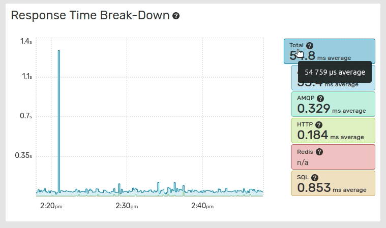

Services Monitoring
===================

Services Monitoring is the monitoring of services used by an application (such
as HTTP, SQL, MongoDB, AMQP, Redis, Memcached,...).

The Services data points are based on the Extended Traces. The number of calls
to a service is an estimate based on the :ref:`Sample Rate
<monitoring_sample_rate>` and the :ref:`Extended Sample Rate
<monitoring_extended_sample_rate>`. Low values for those rates may prevent the
services from being detected and their spans computed.

Increasing the Sample Rate and the Extended Sample Rate enable to collect more
data points and gain additional observability on key services.

Response Time Break-Down Graph
------------------------------

The Response Time Break-Down graph displays the break-down of the global
application response time across the application response time, and each service.
The values are stacked on the graph.

.. note::

    The values displayed in the Response Time Break-Down graph are averaged values
    while the Global Response Time graph displays medians and the 96th percentile. 

The average values are calculated over the total number of traces, including
traces with 0 response times for this service.

Clicking on the entries label toggles their visibility and resets the graph scale.

.. _top_services:

Top Services
------------

The Top Services tab displays the most impactful :term:`spans `
for the whole environment.

The impact represents the percentage of time spent processing a call versus all
the other ones. The services with the highest impact may be optimized first.

You can sort the list of top spans by Impact, % of traces, number of calls,
average duration, 96th percentile, or average % of execution time, and filter it
by type.

Monitoring Data for a Service Call
----------------------------------

Clicking on the name of a service call in the Top Services list displays
Monitoring data for this very service call.

The view displays the 96th percentile and the median response times, as well as
the number of requests over time.

It lists all transactions containing the call.
