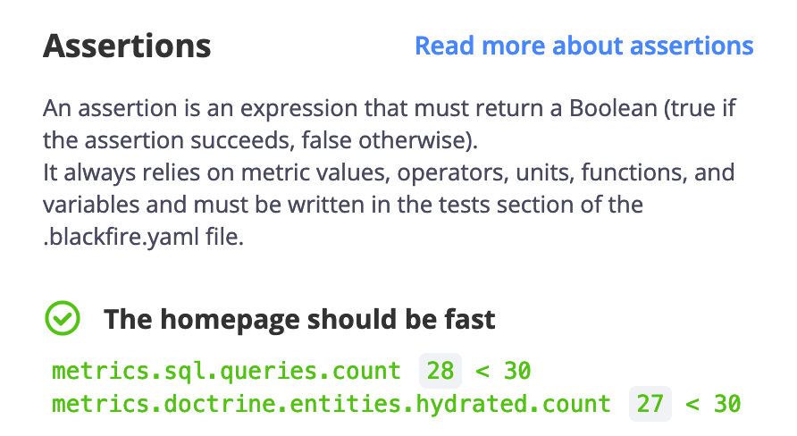

Assertions
==========

Blackfire profiles contain `an "assertions" tab <https://app.blackfire.io/profiles/e99d2386-c3c0-45d3-9c77-33135e726eac/graph?settings%5Bdimension%5D=wt&settings%5Bdisplay%5D=landscape&settings%5BtabPane%5D=assertions&selected=&callname=main()&constraintDoc=>`_
displaying the results of all the performance tests matching the profiled
request or CLI command.

You can have as many assertions as you need. They are automatically evaluated,
ensuring you can enforce performance expectations in the long run.

It is good practice to write tests on the cause of performance, not its
consequences. Tests on time or memory consumption can be volatile,
leading to false negatives.

Basing the tests on reliable metrics such as the number of SQL queries made,
entities hydrated, or the number of calls to greedy functions can be an efficient
and reliable approach to ensure long-term performance improvement.

.. note::

    Get started with testing your application with
    :doc:`our documentation </testing-cookbooks/index>` and
    `a series of blog posts <https://blog.blackfire.io/getting-started-with-the-blackfire-test-suite-part-1-of-series.html>`_

