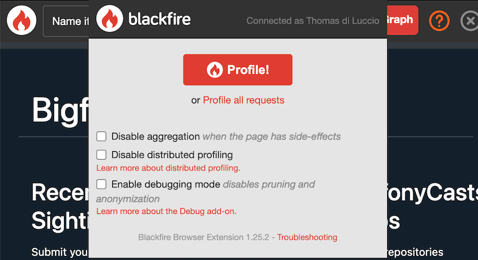
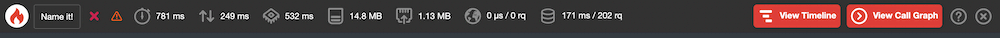
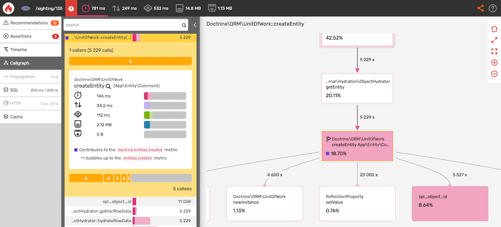
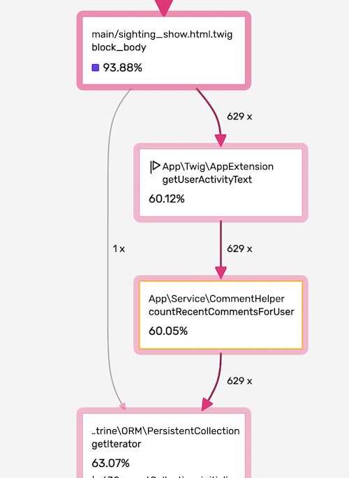

Chapter 4 - Your First Profile
==============================

Time to get our hands dirty! In this chapter, we are going to profile a real
application and use Blackfire's web interface to understand its behavior and
find some code optimizations.

.. note::

    This chapter and the next do not require any language-dependent
    installation. The example code and application is hosted on a demo server,
    so that you can walk through the next steps without taking care of it.

The project we are going to work on is a *blog-like* demo project inspired from
the  Bigfoot/Sasquatch enthusiasts community, as illustrated on the dedicated
`Wikipedia page <https://en.wikipedia.org/wiki/Bigfoot/>`_.

.. note::

    Finding Bigfoot was written in PHP with Symfony by Ryan Weaver and
    SymfonyCasts team for their Blackfire.io screencast:  `Revealing Performance
    Secrets with Profiling <https://symfonycasts.com/screencast/blackfire>`_.
    The source code is  is available at
    `https://github.com/platformsh-templates/bigfoot-workshop
    <https://github.com/platformsh-templates/bigfoot-workshop>`_.

For the purpose of this tutorial, we have created a special publicly profilable
version of the Finding Bigfoot demo server at `https://www.book.b7e.io/
<https://www.book.b7e.io/>`_.

Our goal is to find bottlenecks in the Finding Bigfoot source code and, if we
find any, propose changes to optimize its performance.

Step 1: Gathering Data
----------------------

The first step in our quest is to **gather data about the behavior of the
current codebase** by using the Blackfire profiler. To do that, we will
generate profiles for Finding Bigfoot's home page (``/``) and each of the tabs
on the home page: "A Sighting" (``/sighting/135``), "About" ``/about``, and
"Login" (``/login``).

Before we do this, you will need to :route:`create an account on Blackfire.io
<signup>` if you don't have one yet. It takes less than a minute if you already
have a GitHub, Google or Platform.sh account.

To trigger some Finding Bigfoot profiles, first install the Blackfire browser
extension: for :doc:`Firefox </integrations/browsers/firefox>` or for
:doc:`Google Chrome </integrations/browsers/chrome>`.

We are now ready to start our first profiling session!

To profile the Finding Bigfoot homepage, go to `https://www.book.b7e.io/
<https://www.book.b7e.io/>`_, and trigger a profile by clicking on the
Blackfire Extension icon:

By clicking the profile button, you have asked Blackfire to begin profiling the
page currently displayed in the browser. You should see a black toolbar at the
top of the browser window with a nice progress bar:

.. note::

    If anything does not work as described in this tutorial, do not hesitate to
    :route:`contact us <contact-us>`.

As you can see, it takes way more time to profile the page than it took to
display it initially. This is because Blackfire triggers several page reloads
behind the scenes to get a larger sample size, aggregate the results, and
present more accurate information. Relying on only a single profile is not
ideal, as we discussed in the previous chapter.

At the end of the profiling process, the toolbar displays a summary of the
profile:

This summary provides some basic information (your numbers may vary slightly,
but should be similar), from left to right:

* *122 ms*: the time it took for PHP to generate the Finding Bigfoot homepage;
* *32.2 ms*: the I/O time;
* *89.5 ms*: the CPU time;
* *5.54 MB*: the amount of memory consumed by PHP.

For now, we are only going to focus on main time and memory. We will discuss
I/O and CPU in later chapters.

.. sidebar:: Front-end vs Back-end Profiling

    Blackfire only profiles the PHP code executed on the server side or
    back-end. It does not profile the front-end (JavaScript execution, DOM
    rendering, ...).

Hooray! You've just generated your first profile.

.. sidebar:: Security: Profiling Authorization

    Isn't that a major security issue? This would be a concern any other time,
    but we have specially configured the security on this server to allow
    anyone to run a profile, for the purpose of this tutorial. Rest assured,
    this would never be the case on your own servers. Blackfire's
    authentication and authorization mechanism is out of the scope of this
    chapter, but we will cover it later on in this series.

It took around 120 ms for the server to generate the HTTP response.
Is this good? Can we do better? When analyzing the performance of a project
for the very first time, the slowest requests are the ones to optimize first.
Now that we have our first profile, the baseline, let's profile another page
and see if its performance is different from the homepage.

Let's profile one sighting page,
`https://www.book.b7e.io/sighting/135 <https://www.book.b7e.io/sighting/135>`_.
Load this page in your browser and use the browser extension to
trigger a profile.

These numbers are quite different compared to the homepage. This page took
*781ms* to render (vs *122ms*), and consumed around *14.8MB* of memory (vs
*5.54MB*). It looks like this page can be optimized!

Step 2: Analyzing Profiles
--------------------------

The Blackfire summary toolbar is a good way to find which pages need to be
optimized first, but then we need to dive deeper to better understand what's
going on. Click on the "View Call Graph" button now. You should be redirected to
the detailed profile on Blackfire.io.

Your profile should be similar to this one:

.. raw:: html

    <iframe class="profile" frameborder="0" allowfullscreen src="https://blackfire.io/profiles/b0f5a1b0-a57c-4e7b-af12-b261baf0222f/embed"></iframe>

Now it's time to learn how to use the Blackfire interface to detect performance
issues.

The table on the left side of the screen displays a list of the main functions
and methods that were executed. Clicking on a function name reveals the
**resources consumed by this function**, like time, memory, network, ...

By default, **the most time-consuming function calls are listed first**. These
functions are almost always where you want to look first. In our case,
``Doctrine\ORM\UnitOfWork::createEntity() (createEntity(App\Entity\Comment))``
comes first. It takes a significant amount of time to execute: almost 19% of the
total time for 5229 calls.

``Doctrine\ORM\UnitOfWork::createEntity()`` is a function defined in Doctrine, a
third-party library used by Symfony to interact with databases. Therefore, it
cannot be easily optimized; but we can try to lower the number of times it is
called.

The next step is to understand which parts of userland code trigger these
calls. Click on the ``Doctrine\ORM\UnitOfWork::createEntity()`` link to reveal
this function's details, then click on the magnifying glass. The call graph will
now be redrawn and centered on this specific node:

The **call graph** displays the executed code as a visual diagram where each
**node** corresponds to a function or method call. The **edges** of the graph
show the execution flow.

Now that we are focused on the ``PDOStatement::execute()`` node, drag the graph
up with your mouse until you find the
``App\Twig\AppExtension::getUserActivityText()`` and
``App\Service\CommentHelper::countRecentCommentsForUser()`` nodes. These are the
first calls defined in userland PHP and the ones which we are most
interested in:

Step 3: Optimizing the Code
---------------------------

The ``App\Service\CommentHelper::countRecentCommentsForUser`` method is called
*629 times* and accounts for *60% of the total execution time*, that's a lot. It
is being called by ``App\Twig\AppExtension::getUserActivityText()``
whose implementation reads as follows:

.. code-block:: php

    public function getUserActivityText(User $user): string
    {
        $commentCount = $this->commentHelper->countRecentCommentsForUser($user);

        if ($commentCount > 50) {
            return 'bigfoot fanatic';
        }

        if ($commentCount > 30) {
            return 'believer';
        }

        if ($commentCount > 20) {
            return 'hobbyist';
        }

        return 'skeptic';
    }

We are retrieving the number of recent comments a user left to display a
specific label. It may be interesting to carry on the investigation by checking
the implementation of ``countRecentCommentsForUser()``:

.. code-block:: php

    public function countRecentCommentsForUser(User $user): int
    {
        $comments = $user->getComments();
        $commentCount = 0;
        $recentDate = new \DateTimeImmutable('-3 months');
        foreach ($comments as $comment) {
            if ($comment->getCreatedAt() > $recentDate) {
                $commentCount++;
            }
        }

        return $commentCount;
    }

Apparently, we are getting and hydrating all the comments a user made only to
count the most recent ones iterating over them. This is quite an unefficient way
of achieving our goal.

To refactor this, we can add a method in the ``CommentRepository`` class,
which is used to interact with the database with Doctrine. This method will
directly return the count of recent comments for a given user:

.. code-block:: php
    :emphasize-lines: 4, 10

    public function countForUser(User $user, \DateTimeImmutable $sinceDate): int
    {
        return (int) $this->createQueryBuilder('comment')
            ->select('COUNT(comment.id)')
            ->andWhere('comment.owner = :user')
            ->andWhere('comment.createdAt >= :sinceDate')
            ->setParameter('user', $user)
            ->setParameter('sinceDate', $sinceDate)
            ->getQuery()
            ->getSingleScalarResult();
    }

We can now simply update our ``countRecentCommentsForUser`` method to use our
new method:

.. code-block:: php
    :emphasize-lines: 6,19-20

    <?php

    namespace App\Service;

    use App\Entity\User;
    use App\Repository\CommentRepository;

    class CommentHelper
    {
        public function __construct(
            private CommentRepository $commentRepository
        ) { }

        public function countRecentCommentsForUser(User $user): int
        {
            return $this->commentRepository
                ->countForUser($user, new \DateTimeImmutable('-3 months'));
        }
    }

And that's it. In less than 5 minutes, in a codebase we knew nothing about
before, we've already found a performance bottleneck and written a patch.

Blackfire provided us the tools necessary to understand the code's actual
behavior and showed us front and center exactly where to look to improve its
performance.

We call that the "Blackfire effect", and `lots of people are experiencing
<https://twitter.com/blackfireio/likes>`_ it on their projects:

.. raw:: html

    <blockquote class="twitter-tweet" data-lang="en">
Woot! Thanks to <a href="https://twitter.com/blackfireio">@blackfireio</a>, <a href="https://twitter.com/michaelthieulin">@michaelthieulin</a> and I optimized one of the backoffice pages of <a href="https://twitter.com/dayuse_fr">@dayuse_fr</a>. The page was taking 18 seconds to load due to a misconfiguration of our <a href="https://twitter.com/MongoDB">@MongoDB</a> indexes on a 15M documents collection. Now, the pages loads within 200 ms. <a href="https://t.co/KmX4yYxTd6">pic.twitter.com/KmX4yYxTd6</a>
&mdash; Hugo Hamon (@hhamon) <a href="https://twitter.com/hhamon/status/1014181560843677699">July 3, 2018</a></blockquote>
    <blockquote class="twitter-tweet" data-lang="en">
Used <a href="https://twitter.com/blackfireio">@blackfireio</a> seriously for the first time yesterday. Went from 1min 39s to 2.98s on some heavy data processing code... It transformed our workflow in amazing ways.  Thanks!
&mdash; belisar (@belisar) <a href="https://twitter.com/belisar/status/977426857153966080">March 24, 2018</a></blockquote>
    <blockquote class="twitter-tweet" data-lang="en">
I think I found a way to improve performance by 15% in <a href="https://twitter.com/phpunit">@phpunit</a> using <a href="https://twitter.com/blackfireio">@blackfireio</a>. Our unit tests take 17 seconds normally and with the changes it shaves off a few seconds. When running a code coverage report with xdebug on it shaves off several minutes. I will submit a PR soon.
&mdash; Jonathan H. Wage (@jwage) <a href="https://twitter.com/jwage/status/963425638215536640">February 13, 2018</a></blockquote>
    <blockquote class="twitter-tweet" data-lang="en">
Optimizing colinodell/json5 with <a href="https://twitter.com/blackfireio">@blackfireio</a><a href="https://t.co/nwFI5d9AHN">https://t.co/nwFI5d9AHN</a>  <a href="https://twitter.com/hashtag/php?src=hash&amp;ref_src=twsrc%5Etfw">#php</a> <a href="https://twitter.com/hashtag/performance?src=hash&amp;ref_src=twsrc%5Etfw">#performance</a>
&mdash; 👨‍💻 Colin O&#39;Dell (@colinodell) <a href="https://twitter.com/colinodell/status/952587286914445312">January 14, 2018</a></blockquote>
    <blockquote class="twitter-tweet" data-lang="en">
With <a href="https://twitter.com/hashtag/Symfony?src=hash&amp;ref_src=twsrc%5Etfw">#Symfony</a> 3.4/4.0, enabling param `container.dumper.inline_class_loader` can boost your dev env perf by 50% and your prod by +2%. For free as usual :) /cc <a href="https://twitter.com/blackfireio">@blackfireio</a> <a href="https://t.co/vvPoZlTZEb">pic.twitter.com/vvPoZlTZEb</a>
&mdash; Nicolas Grekas (@nicolasgrekas) <a href="https://twitter.com/nicolasgrekas/status/929032213815005184">November 10, 2017</a></blockquote>
    <blockquote class="twitter-tweet" data-lang="en">
Reduced core page load by a further 30% today using <a href="https://twitter.com/blackfireio">@blackfireio</a> timelines view. Killer feature in a killer tool
&mdash; Peter Ward (@petewardreiss) <a href="https://twitter.com/petewardreiss/status/928076877805342720">November 8, 2017</a></blockquote>
    

Conclusion
----------

This is great, but we're not done yet. The complete process of performance
optimization includes checking the impact of your code changes. First by
running the unit tests to confirm that nothing is broken. Then, always compare
the data between the current version of the code and the patched version to
validate that the fix actually solves the problem and doesn't introduce
regressions in other parts of the code.

**Performance comparisons** are a key feature of Blackfire; one that we will
look at in depth in the next chapter.
