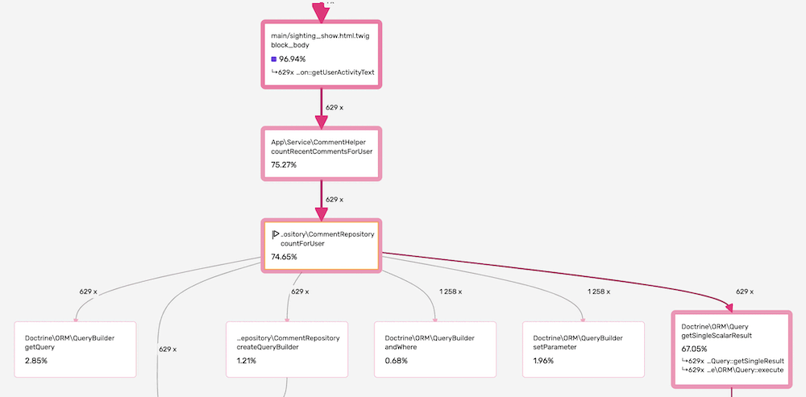
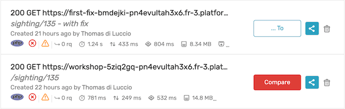
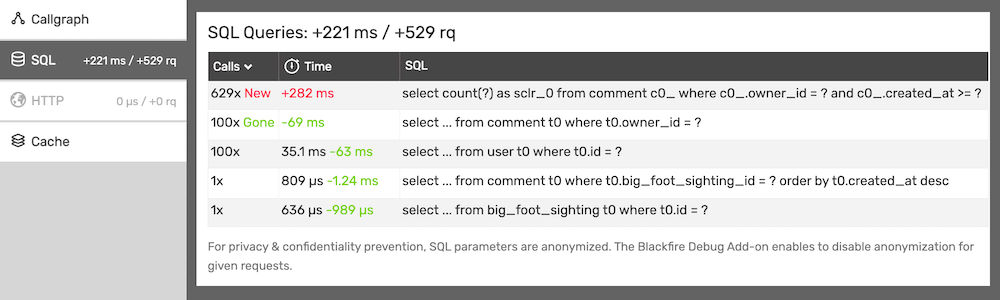
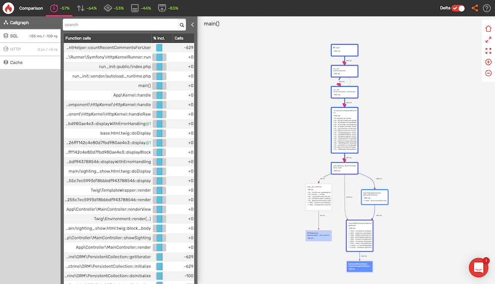
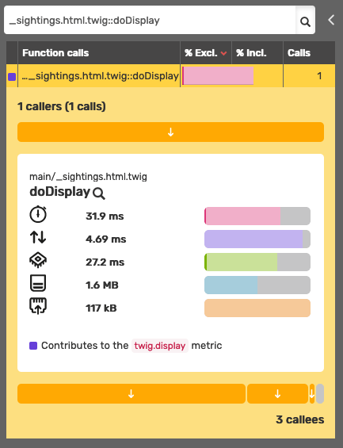
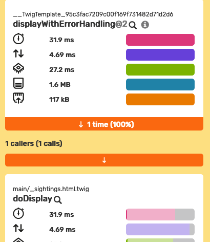
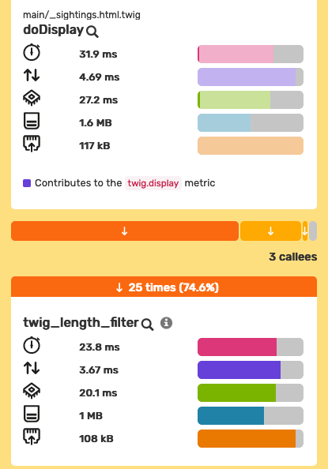

Chapter 5 - Validating Performance Optimizations
================================================

In the previous chapter, we learned how to profile an HTTP request directly
from a browser. We learned how to find bottlenecks and how to read a call graph
to find the code consuming most of the resources. We then wrote a patch hoping
that it would improve the situation.

Now we need to validate that the fix has a positive and significant enough
impact on performance. To do this, we are going to use **profile comparisons**,
a unique Blackfire feature.

Step 4: Comparing Profiles (Code Changes)
-----------------------------------------

We, as humans, are very bad at understanding how a computer works and how code
is executed. It is impossible to know which implementation of an algorithm is
going to be the fastest without a deep understanding of operating systems and
your programming language implementation. Moreover, a patch improving one part
of the code could potentially have a negative impact on another part of the
application, making the overall speed actually worse.

Instead of guessing, we need hard numbers. Take a profile using the browser
extension again on `<https://fix1.book.b7e.io/sighting/135>`_,
where we applied our 2 patches from the previous chapter:

- Implement a new ``countForUser`` method in the ``CommentRepository`` class:

.. code-block:: diff

    diff --git a/src/Repository/CommentRepository.php b/src/Repository/CommentRepository.php
    --- a/src/Repository/CommentRepository.php
    +++ b/src/Repository/CommentRepository.php
    @@ -5,6 +5,7 @@ namespace App\Repository;

        use App\Entity\Comment;
        use Doctrine\Bundle\DoctrineBundle\Repository\ServiceEntityRepository;
        use Doctrine\Common\Persistence\ManagerRegistry;
    +   use App\Entity\User;

    +   public function countForUser(User $user, \DateTimeImmutable $sinceDate): int
    +   {
    +       return (int) $this->createQueryBuilder('comment')
    +          ->select('COUNT(comment.id)')
    +          ->andWhere('comment.owner = :user')
    +          ->andWhere('comment.createdAt >= :sinceDate')
    +          ->setParameter('user', $user)
    +          ->setParameter('sinceDate', $sinceDate)
    +          ->getQuery()
    +          ->getSingleScalarResult();
    +    }

- Refactor the ``countRecentCommentsForUser`` method
  in the ``CommentHelper`` class:

.. code-block:: diff

    diff --git a/src/Service/CommentHelper.php b/src/Service/CommentHelper.php
    index c806c1a..97a7aef 100644
    --- a/src/Service/CommentHelper.php
    +++ b/src/Service/CommentHelper.php
    @@ -79,6 +79,12 @@ namespace App\Service;

        use App\Entity\User;
        +use App\Repository\CommentRepository;

         class CommentHelper
         {
    +        private $commentRepository;
    +
    +        public function __construct(CommentRepository $commentRepository)
    +        {
    +            $this->commentRepository = $commentRepository;
    +        }

            public function countRecentCommentsForUser(User $user): int
            {
    -            $comments = $user->getComments();
    -            $commentCount = 0;
    -            $recentDate = new \DateTimeImmutable('-3 months');
    -            foreach ($comments as $comment) {
    -                if ($comment->getCreatedAt() > $recentDate) {
    -                    $commentCount++;
    -                }
    -            }

    -            return $commentCount;
    +            return $this->commentRepository
    +                ->countForUser($user, new \DateTimeImmutable('-3 months'));
            }
        }

Without the patch, the profile summary looked like this:

And here is the new one with the patch:

The wall time went down from *781ms* to ... *1.24s*, which may comes at a
surprise. Was is really a bad idea? If profiling other sighting pages show
nice improvements, we are a clear degradation of performance for
``/sighting/135``.

Let's try to understand, then fix, this side-effect.

The call graph tells us that even if ``App\Repository\CommentRepository::countForUser()``
is still called 629 times, it is retrieving directly scalar values from the DB
without the need of hydrating full entities:

We have just done a "manual comparison": we compared numbers and we looked for
expected changes in the call graph. But there is a better way with Blackfire:
profiles comparison.

Click on the Blackfire logo to view your Blackfire :route:`"Dashboard"
<dashboard>`:

Click first on the "Compare" button on the second listed profile (the
``countForUser`` profile without the patch) and then click on "Compare" again
on the first listed profile (the ``countForUser`` profile after applying the
patch). Blackfire now `displays the comparison of the two profiles
<https://blackfire.io/profiles/compare/7d871d37-318e-49c0-988c-a3b2575a79f6/graph>`_.
The web interface looks very similar to the profile one but the call
graph is now a visual representation of the comparison: faster nodes in blue,
slower nodes in red:

.. raw:: html

    <iframe class="profile" frameborder="0" allowfullscreen src="https://blackfire.io/profiles/compare/2fcd3e72-961f-4406-bf49-70b40ca23dc6/embed"></iframe>

The summary indicates that there is a 58% time deterioration between the two
profiles. Even with clear improvements for the Peak Memory (*-43%*) and Network
(*-73*) usage, the graph is mostly made of slower red nodes.

Comparing SQL queries might give us more information:

The cardinality is interesting. 629 calls to the ``countForUser`` method caused
only 100 ``SELECT`` queries when we now have 629 ``SELECT count``. The third
query on the list teach us that there are 100 users in the database.

This means we were protected by Doctrine internal `caching mechanism <https://www.doctrine-project.org/projects/doctrine-orm/en/2.13/reference/caching.html>`_
Data has been retrieved and the entities hydrated only once, then stored for a
possible later use.

Let's then add a simple caching strategy:

.. code-block:: diff

    diff --git a/src/Twig/AppExtension.php b/src/Twig/AppExtension.php
    index 2cd5e63..ab9c696 100644
    --- a/src/Twig/AppExtension.php
    +++ b/src/Twig/AppExtension.php
    @@ -4,6 +4,8 @@ namespace App\Twig;

    use App\Entity\User;
    use App\Service\CommentHelper;
    +use Symfony\Contracts\Cache\CacheInterface;
    +use Symfony\Component\Cache\CacheItem;
    use Twig\Extension\AbstractExtension;
    use Twig\TwigFilter;
    use Twig\TwigFunction;
    @@ -11,10 +13,12 @@ use Twig\TwigFunction;
    class AppExtension extends AbstractExtension
    {
        private $commentHelper;
    +    private $cache;

    -    public function __construct(CommentHelper $commentHelper)
    +    public function __construct(CommentHelper $commentHelper, CacheInterface $cache)
        {
            $this->commentHelper = $commentHelper;
    +        $this->cache = $cache;
        }

        public function getFilters(): array
    @@ -25,6 +29,17 @@ class AppExtension extends AbstractExtension
        }

        public function getUserActivityText(User $user): string
    +    {
    +        $key = sprintf('user_activity_text_%s', $user->getId());
    +
    +        return $this->cache->get($key, function (CacheItem $item) use ($user) {
    +            $item->expiresAfter(3600);
    +
    +            return $this->calculateUserActivityText($user);
    +        });
    +    }
    +
    +    private function calculateUserActivityText(User $user): string
        {
            $commentCount = $this->commentHelper->countRecentCommentsForUser($user);

Let's trigger a profile using the browser extension on `<https://fix1withcache.book.b7e.io/sighting/135>`_,
which contain the simple caching mechanism on top of the first fix:

The figures seem more in line with our expectations. Let's compare with the
initial profile to have precise information on the outcome:

.. raw:: html

    <iframe class="profile" frameborder="0" allowfullscreen src="https://blackfire.io/profiles/compare/cb75fb61-5d5f-44dc-ae57-4e38e4d323ff/embed"></iframe>

The summary indicates that there is a 57% time improvement between the two
profiles, with our two rather simple patches, which is not too bad.

Having a look at the numbers on the left and the colors on the comparison graph,
we can conclude that there is now no performance regression elsewhere:

Step 4 (alternative): Comparing Profiles (Different Pages)
----------------------------------------------------------

In the previous chapter, we used the homepage and the project page profile
summaries to select the page we should optimize first. Then we looked at a
profile of the project page to find optimizations.

Instead of doing this manually, we could have used the Blackfire's comparison
feature to highlight performance differences:

.. raw:: html

    <iframe class="profile" frameborder="0" allowfullscreen src="https://blackfire.io/profiles/compare/e5a694e8-ab82-4765-9e3b-dd4951dc8a92/embed"></iframe>

Not surprisingly, the comparison shows that the biggest slow down comes from
the ``Doctrine\ORM\UnitOfWork::createEntity`` calls.

.. tip::

    You can also compare two random profiles, but if there are too many
    differences in the code, the results will not be useful nor easy to
    understand. Doing comparisons on requests using the same PHP libraries
    and/or the same framework gives better results.

Profiling Other Dimensions
--------------------------

Blackfire provides detailed data on many dimensions: wall time, CPU time, I/O
time, memory, and network. Focusing on the wall time only, like we did on
Finding Bigfoot, is just a first step.

A function consuming a lot of memory or getting a lot of data from the network
has a direct impact on performance as well. The wall time already includes the
impact of memory consumption or the impact of the amount of data retrieved from
the network... but depending on the machine specifications or the network
topology, the impact may vary widely.

Data retrieved over a network is an excellent example. On your local
development machine, all project components are probably installed locally, so
loading big payloads probably won't have a significant impact on performance as
latency is very low in this situation. On production servers, where data can be
hosted on a different server or even on a different network, latency and
network speed can have a much bigger impact on the overall performance of your
application. That's one of the reasons why you should optimize all dimensions,
not just the wall time.

**Always check all dimensions when looking for performance issues.**

Profiling Again
---------------

57% improvement on the Fiding Bigfoot sighting page is impressive, but can we do
better? Profiling is a never-ending process. Whenever you fix a bug or add a
new feature, you need to check the performance impact of that change.

Take 10 minutes now to look again at the `homepage profile
<https://blackfire.io/profiles/75e2956e-cae6-4062-98c3-c6dcdbde1371/graph>`_
again and try to find some more function calls that could be optimized.

Done? Did you find something? I did!

25 calls to ``PDOStatement::execute()`` represents 6.68% of the wall time,
almost 18% of the I/O Wait time and over 92% of the Network .

Optimizing a function call can be done in two ways: optimizing some of the
functions called by this method or reducing the number of calls to this method.

Browsing the call graph, we can see ``PDOStatement::execute()`` is related to
a Twig file ``_sightings.html.twig``. Use the search field on the left to find the
``_sightings.html.twig::doDisplay`` call then click on the function name to
reveal the detailed panel:

Besides the main dimension numbers, we learn that this method has "1 caller"
and calls "3 callees".

A **caller** is a function that called our method, a
parent node in the call graph. Again, click on each caller:

What about the callees? A **callee** is a function called by our method, a child
node in the call graph. Click on each callee arrow to review them all:

The main callee is ``twig_length_filter``, and it comes from Twig, which we
probably cannot optimize. From
`Twig documentation <https://twig.symfony.com/doc/3.x/filters/length.html>`_,
we learn that the ``...|length`` filter returns the number of items of a sequence
or mapping, or the length of a string.

Let's step back to reflect on the situation. Within a Twig template, counting a
variable with ``twig_length_filter`` ultimately cause the execution of 25 SQL
queries and the hydratation of 25 more entities.

Let's check the code of the ``_sightings.html.twig`` Twig file to fully
understand this specific issue now we know exactly where to look for that
bottleneck.

.. code-block:: twig

    
    <tr>
        ...
        <td>
            <a class="text-white table-content text-center" href="{{ path('app_sighting_show', {id: sighting.id}) }}">{{ sighting.comments|length }}</a>
        </td>
    </tr>
    

We are indeed iterating over the list of ``BigFootSighting`` entities and are
trying to display the number of comments one sighting has.

It's a common issue called the  *N+1 problem*, that occurs when managing 1-n
relationships with an ORM. The related ``Comment`` entities are not fetched
with the ``BigFootSighting`` one and are loaded only the first time they are
accessed. This is the default (aka ``LAZY``) behavior for associations in
Doctrine.

.. note::

    The `Joining Across a Relationship & The N + 1 Problem
    <https://symfonycasts.com/screencast/doctrine-relations/join-n-plus-one#the-n-1-problem>`_
    screencast provides a detailed explanation of the N+1 problem.

In our case, we are fetching, and hydrating, them all only to count them. This
sounds familiar, isn't it?

This case could be solved in different ways. One way would be to change the type
of association the ``BigFootSighting`` entity has with the ``Comment`` one. Doctrine
has `an EXTRA_LAZY association <https://www.doctrine-project.org/projects/doctrine-orm/en/2.13/tutorials/extra-lazy-associations.html>`_
type which allows counting the collection without having to fully load its members.

Let's refactor the ``BigFootSignthing`` Entity accordingly:

.. code-block:: diff

    diff --git a/src/Entity/BigFootSighting.php
    index 42836f9..cd0aeba 100644
    --- a/src/Entity/BigFootSighting.php
    +++ b/src/Entity/BigFootSighting.php
    @@ -55,7 +55,7 @@ class BigFootSighting
             private $createdAt;

            /**
    -        * @ORM\OneToMany(targetEntity="App\Entity\Comment", mappedBy="bigFootSighting")
    +        * @ORM\OneToMany(targetEntity="App\Entity\Comment", mappedBy="bigFootSighting", fetch="EXTRA_LAZY")
             * @ORM\OrderBy({"createdAt"="DESC"})
             */
             private $comments;

By now, you know the story by heart. Go to
`https://fix2.book.b7e.io/ <https://fix2.book.b7e.io/>`_, generate a profile with
the browser extension, and `compare it
<https://blackfire.io/profiles/compare/ca1d3984-c480-4749-a02d-450ce06ea930/graph>`_
with the previous profile we made after the first fix:

.. raw:: html

    <iframe class="profile" frameborder="0" allowfullscreen src="https://blackfire.io/profiles/compare/ca1d3984-c480-4749-a02d-450ce06ea930/embed"></iframe>

.. tip::

    To find profiles on Blackfire's dashboard, look for the URL starting with
    ``fix1``, ``fix1withcache`` and ``fix2``. Blackfire also lets you **name your profiles**
    to find them more easily. You can name a profile directly from the summary
    toolbar, the dashboard, or the profile page.

These two patches improve the performance of the Finding Bigfoot homepage by *44%*
(from *122ms* to *68.3ms*) and the sighting pages by *57%* (from *781ms* to *339ms*).

Day-to-Day Profiling Methodology
--------------------------------

To sum up, finding and fixing performance bottlenecks always uses the same
profiling methodology:

* Profile key pages;

* Select the slowest ones;

* Compare and analyze profiles to spot differences and bottlenecks (on all
  dimensions);

* Find the biggest bottlenecks;

* Try to fix the issue or improve the overall performance;

* Check that tests are not broken;

* Generate a profile of the updated version of the code;

* Compare the new profile with the first one;

* Take a moment to celebrate your achievement;

* Rinse and repeat.

Conclusion
----------

You might think that optimizing an application like we've just done is enough
and that Blackfire is not needed anymore. And you would be wrong. This is just
the beginning of our journey. Performance management is a day-to-day activity.
Whenever you fix a bug or add a new feature in your application, you should
check that you have not introduced a performance regression.

The next chapter will guide you through the installation of Blackfire on your
environment to let you profile your very own projects.
