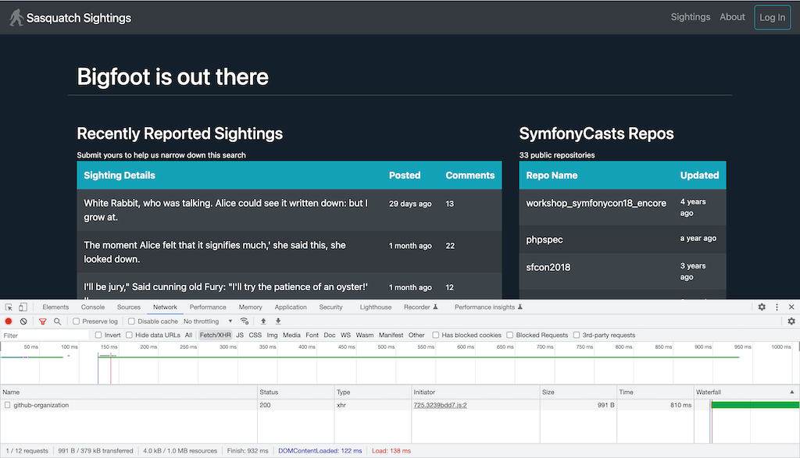
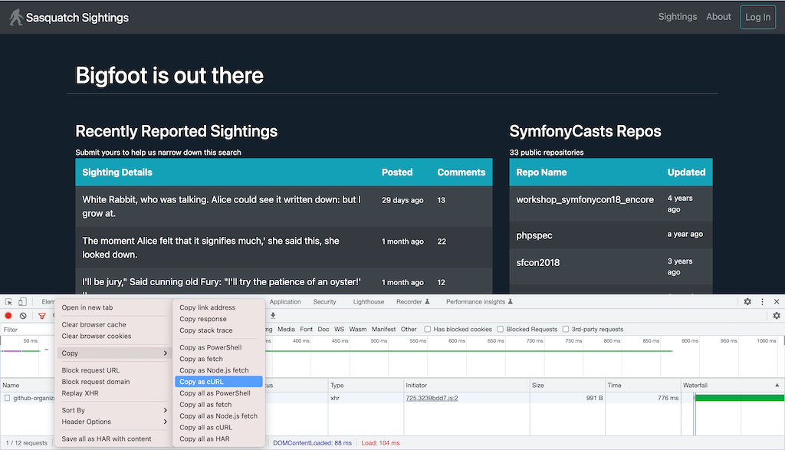

Chapter 8 - Profiling all the Things
====================================

Ready to take it to the next level? Profiling HTTP GET requests is pretty cool,
but you can use Blackfire to profile so much more: AJAX requests, form
submissions, POST, PUT, and DELETE requests... you can even use Blackfire to
profile CLI scripts.

Using the Blackfire Browser Extension
-------------------------------------

The browser extension's big red "Profile!" button is rather straight-forward to
use.

Now click below it: "Profile all Requests". With a simple Start/Stop action,
Blackfire will profile all requests which will be generated while you browse
your website.

The icing on the cake: when we say "all requests", that means no matter what
domain they are on! For instance, if an Ajax request in your application hits
another domain where you installed Blackfire as well, that request will also be
profiled!

Using the Blackfire CLI
-----------------------

Profiling complex requests or CLI scripts can also be done using the
``blackfire`` command line tool, which was installed along with the Blackfire
agent in a previous chapter. Confirm that everything works fine by running the
following command:

.. code-block:: bash
    :zerocopy:

    blackfire client:config --dump

You should see the current configuration with your ``client-id`` and
``client-token`` (if not, run ``blackfire client:config`` and use :route:`your
personal client <my_settings>` credentials).

Profiling HTTP Requests from the CLI
------------------------------------

Let's profile the Finding Bigfoot homepage, but this time from the command line:

.. code-block:: bash
    :zerocopy:

    blackfire curl https://www.book.b7e.io

This command does the exact same thing as the browser extension, but from the
command line: first you see a progress bar, followed by a profile summary and a
link to the full profile:

.. code-block:: text

    Profiling: [########################################] 100%
    Blackfire cURL completed
    Graph                 https://blackfire.io/profiles/a5030337-0f45-4b71-a3e1-c690003f3904/graph
    Timeline              https://blackfire.io/profiles/a5030337-0f45-4b71-a3e1-c690003f3904/graph?settings%5Bdimension%5D=timeline
    1 failing, 3 successful testshttps://blackfire.io/profiles/a5030337-0f45-4b71-a3e1-c690003f3904/graph?settings%5BtabPane%5D=assertions
    7 recommendations     https://blackfire.io/profiles/a5030337-0f45-4b71-a3e1-c690003f3904/graph?settings%5BtabPane%5D=recommendations

    I/O Wait     20.6ms
    CPU Time     78.3ms
    Memory       5.26MB
    Wall Time    98.9ms
    Network         n/a     n/a     n/a
    SQL           7.1ms    27rq

.. tip::

    Under the hood, ``blackfire curl`` uses cURL to issue HTTP requests to your
    servers and, therefore, supports all cURL features, making it very powerful.
    You must have cURL installed in order for this to work.

    You can also use ``wget`` or any other tools able to make HTTP requests, but
    the process is more manual as :ref:`described later in this chapter
    <using-wget-or-httpie>`.

Now, let's profile the AJAX request used to list the SymfonyCasts GitHub
repositories in the Bigfoot Homepage

Go to ``https://fix2.book.b7e.io/`` in Google Chrome, open the "Network"
tab of the Browser's Developer Tools (*View > Developer > Developer Tools*):

Look for the AJAX request sent by the browser by using the *Fetch/XHR* filter (see
the image above), right-click on the page name and select *Copy as cURL*
from the *Copy* submenu:

Using the browser to get the exact URL to profile is very convenient. Now, in
your console, enter ``blackfire --samples=1`` and paste the copied URL, as
illustrated below:

.. code-block:: bash
    :zerocopy:

    blackfire --samples=1 curl 'https://fix2.book.b7e.io/api/github-organization' \
        -H 'Origin: https://fix2.book.b7e.io' \
        -H 'Accept-Encoding: gzip, deflate' \
        -H 'Accept-Language: en-US,en;q=0.8,fr;q=0.6' \
        -H 'Upgrade-Insecure-Requests: 1' \
        -H 'User-Agent: Mozilla/5.0 (Macintosh; Intel Mac OS X 10_10_5) AppleWebKit/537.36 (KHTML, like Gecko) Chrome/46.0.2490.86 Safari/537.36' \
        -H 'Content-Type: application/x-www-form-urlencoded' \
        -H 'Accept: text/html,application/xhtml+xml,application/xml;q=0.9,image/webp,*/*;q=0.8' \
        -H 'Cache-Control: max-age=0' -H 'Referer: https://fix2.book.b7e.io' \
        -H 'Connection: keep-alive' -H 'DNT: 1' --data 'query=loader' --compressed

.. note::

    Using ``--samples=1`` avoids running several iterations. It is good
    practice when profiling API endpoints, that could be rate-limited.

    ``--samples=1`` the default value when profiling non-GET or non-HEAD HTTP
    requests.

The generated profile should look something like this:

.. raw:: html

    <iframe class="profile" frameborder="0" allowfullscreen src="https://blackfire.io/profiles/6cdc5247-7de1-4024-ae19-e77f834cd3d7/embed"></iframe>

The ``curl_multi_select`` function is called 19 times and accounts for almost
95% of the total time! Could we refactor the code to make fetch data more
efficiently? It depends... who knows? Probably? We are using Blackfire now, so
we know. **Stop guessing and measure**. Make an informed decision.

That's the typical workflow for non-GET HTTP requests like POST requests or
Ajax requests. As an exercise, generate a profile for the POST requests sent
when logging in from `<https://fix2.book.b7e.io/login>`_.

**Profiling HTTP APIs** is no different from profiling regular HTTP web
requests, but a tool like `httpie <https://github.com/jkbrzt/httpie>`_ might
simplify commands a lot. :ref:`Read how you can use httpie with Blackfire
<using-wget-or-httpie>`.

.. sidebar:: Generate JSON representation of Profiles and Comparisons

    The Blackfire command line tool ``--json`` option outputs a JSON
    representation of profiles and comparisons. It allows for simple automation
    tools to be developed on top of Blackfire.

Profiling CLI Commands
----------------------

The Blackfire command line tool can be used to profiles CLI scripts via the
``run`` command:

.. code-block:: bash

    blackfire run php -r 'echo "Hello World!";'

The output looks like before:

.. code-block:: text

    Hello World!

    Blackfire Run completed
    Profile URL: https://blackfire.io/profiles/01e44337-ae51-465b-95ce-fb5fff3f73b7/graph

    Wall Time     399µs
    CPU Time      395µs
    I/O Time        4µs
    Memory       66.9KB
    Network         n/a

The call graph for this profile is not that interesting but notice that "Hello
World!" is displayed only once. By default, Blackfire only runs the code once
for command line scripts. You can change this behavior using the ``--samples``
option:

.. code-block:: php

    blackfire --samples=5 run php -r 'echo "Hello World!";'

To make profiling from the command line more exciting, let's run `PHP Mess
detector <https://phpmd.org/>`_ on Twig. PHP Mess Detector is a nice static
analysis tool that tries to find potential problems in your code by using the
raw metrics measured by PHP Depend.

`Download the latest version of phpmd
<https://phpmd.org/static/latest/phpmd.phar>`_
as a phar, and execute it on the Twig source code like this:

.. code-block:: bash

    blackfire run php phpmd.phar /path/to/Twig/lib/ text cleancode

    Blackfire run completed
    Graph                 https://blackfire.io/profiles/61cb30d1-c025-4f96-8a66-ffd2766e47ce/graph
    Timeline              https://blackfire.io/profiles/61cb30d1-c025-4f96-8a66-ffd2766e47ce/graph?settings%5Bdimension%5D=timeline
    No tests!             Create some now https://blackfire.io/docs/testing-cookbooks/tests
    12 recommendations    https://blackfire.io/profiles/61cb30d1-c025-4f96-8a66-ffd2766e47ce/graph?settings%5BtabPane%5D=recommendations

    Wall Time     17.6s
    I/O Wait     57.4ms
    CPU Time      17.5s
    Memory       78.4MB
    Network         n/a     n/a     n/a
    SQL             n/a     n/a

.. tip::

    ``blackfire run`` supports any methods of running PHP scripts, from the
    standard ``php script.php``, to using phars and executable scripts via a
    shebang (i.e. ``#!/usr/bin/env php``).

If you run the command again, the code is going to run a lot faster, around 9
seconds, as phpmd uses a cache by default, stored under ``~/.pdepend``. This
second run is our baseline.

Can we do better than 9 seconds? You've probably already spotted three
potential issues: the ``unserialize()`` function is called 4,500+ times, and
these calls account for more than two-thirds of the inclusive time. As
``unserialize()`` is a built-in PHP function, its exclusive time cannot be
optimized. What about its children? The ``ASTNode::__wakeup()`` method is
called 825,000+ times and the special "Garbage Collection" node takes 20% of
the total time.

.. tip::

    Blackfire is the only PHP profiler that gives detailed information about
    PHP garbage collector behavior.

As we cannot modify the ``.phar`` file easily, clone the phpmd repository and
run Composer to install its dependencies:

.. code-block:: bash

    git clone https://github.com/phpmd/phpmd.git
    cd phpmd
    git checkout -b 2.2.1 2.2.1
    composer install

By default, the ``src/bin/phpmd`` script uses an in-memory cache, so switch to
the file cache strategy used by the phar file by editing the
``pdepend.xml.dist`` configuration file:

.. code-block:: diff

    diff --git a/pdepend.xml.dist b/pdepend.xml.dist
    index 5d02cd2..384e827 100644
    --- a/pdepend.xml.dist
    +++ b/pdepend.xml.dist
    @@ -5,7 +5,7 @@
         xsi:schemaLocation="http://symfony.com/schema/dic/services http://symfony.com/schema/dic/services/services-1.0.xsd">
         <config>
             <cache>
    -            <driver>memory</driver>
    +            <driver>file</driver>
             </cache>
         </config>

Time to create a profile, after having primed the cache:

.. code-block:: bash

    # prime the cache
    php src/bin/phpmd /path/to/Twig/lib/ text cleancode

    # create a profile
    blackfire run php src/bin/phpmd /path/to/Twig/lib/ text cleancode

    Blackfire Run completed
    Profile URL: https://blackfire.io/profiles/f2ac6fc7-5c81-415d-97a6-49249a88abe6/graph

    Wall Time     9.27s
    CPU Time      8.86s
    I/O Time      412ms
    Memory         40MB
    Network         n/a

Adding a cache to ``FileCacheDriver::restoreFile()``, the ``unserialize()``
parent, avoids the unserialization of the same content over and over again:

.. code-block:: diff

    index dedde40..3ae43d9 100644
    --- a/src/main/php/PDepend/Util/Cache/Driver/FileCacheDriver.php
    +++ b/src/main/php/PDepend/Util/Cache/Driver/FileCacheDriver.php
    @@ -180,11 +180,17 @@ class FileCacheDriver implements CacheDriver
          */
         public function restore($key, $hash = null)
         {
    +        static $cache = array();
    +
    +        if (array_key_exists($key.'__'.$hash, $cache)) {
    +            return $cache[$key.'__'.$hash];
    +        }
    +
             $file = $this->getCacheFile($key);
             if (file_exists($file)) {
    -            return $this->restoreFile($file, $hash);
    +            return $cache[$key.'__'.$hash] = $this->restoreFile($file, $hash);
             }
    -        return null;
    +        return $cache[$key.'__'.$hash] = null;
         }

         /**

After applying the patch, generate a new profile:

.. code-block:: bash

    blackfire run php src/bin/phpmd /path/to/Twig/lib/ text cleancode

    Blackfire Run completed
    Profile URL: https://blackfire.io/profiles/a41fd400-a3b6-492f-996f-38e2638f5327/graph

    Wall Time      3.8s
    CPU  Time     3.42s
    I/O  Time     383ms
    Memory         68MB
    Network         n/a

Go to your Blackfire dashboard and compare the two profiles. You can see that
**the trade-off for having a faster code is a significant memory consumption
increase**. On the call graph, check that the main source of performance gains
indeed comes from the drastic reduction of the number of ``unseralize()`` calls.

The other possible optimization comes from the special "Garbage Collection"
node, which aggregates the resources consumed by PHP garbage collector. The
garbage collection runs were not able to free up any memory (memory is 0 in the
node details), so disabling it (via ``-d zend.enable_gc=0`` on the CLI or
``gc_disable()`` in the PHP code) should be safe and should make our code even
faster:

.. code-block:: bash

    blackfire run php -d zend.enable_gc=0 src/bin/phpmd /path/to/Twig/lib/ text cleancode

    Blackfire Run completed
    Profile URL: https://blackfire.io/profiles/342ef846-1de2-465c-bdf6-ef71bfb494c3/graph

    Wall Time     2.54s
    CPU  Time     2.19s
    I/O  Time     346ms
    Memory       68.1MB
    Network         n/a

Indeed, this makes our code much faster without any memory consumption increase:

.. raw:: html

    <!-- https://blackfire.io/profiles/compare/a4c105b0-0f60-4ef5-aa97-6e651a285e5c/embed?callname=PDepend%5CSource%5CAST%5CASTNode%3A%3A__wakeup&selected=PDepend%5CSource%5CAST%5CASTNode%3A%3A__wakeup&settings%5Bdimension%5D=wt&settings%5Bdisplay%5D=focused&settings%5BtabPane%5D=nodes -->
    <iframe class="profile" frameborder="0" allowfullscreen src="https://goo.gl/KhofcH"></iframe>

.. note::

    If you want to learn more about how garbage collecting works in PHP, please
    read `Anthony Ferrara's very detailed blog post
    <https://blog.ircmaxell.com/2014/12/what-about-garbage.html>`_.

You might be thinking that adding some cache is the only fix that can optimize
an application, but that's just because we have chosen our examples for their
simplicity and the small code changes needed to make them faster.

In modern web applications, the common fixes are the reduction of the number of
SQL queries and the number of external HTTP requests (API calls). Avoiding
running the same code more than once is always a good idea anyway, and Blackfire
lets you spot those occurrences. The inclusion of SQL queries and HTTP requests
in your profiles will be discussed in a coming chapter.

.. sidebar:: Profiling consumers and daemons

    Profiling consumers and daemons is a totally different story as they run
    for a very long period of time. Auto-instrumentation, as done by Blackfire
    by default, cannot work in these cases. This is a topic for a future
    chapter, as we first need to learn about manually instrumenting your code.

.. _how-does-blackfire-work:

How does Blackfire work?
------------------------

Nobody likes using "magic" tools, at least not developers. At first, you
probably thought Blackfire was magic because of some unasked and unanswered
questions. How does Blackfire know when to instrument your code?

Would you like to understand how Blackfire works behind the scene? Read on. If
you don't like seeing magicians reveal their tricks, you can safely jump to the
next section.

The main task of the browser extension and the blackfire command line
tool is to trigger a profile by modifying the HTTP request or the CLI command,
which in turns enables code instrumentation.

For HTTP requests, Blackfire adds a header, ``X-Blackfire-Query``. The header
value contains the profile configuration (like the number of samples, ...) and
a signature that identifies the user triggering the profile.

For CLI scripts, Blackfire defines an environment variable,
``BLACKFIRE_QUERY``, and its value is the same as for HTTP requests.

When populating this HTTP header or environment variable, Blackfire appends a
signature generated by Blackfire's servers. When a request is received by your
servers (or a command line script is run), the very first job of Blackfire is to
check this signature. If the signature is invalid or the user is not authorized
to run a profile (or if the value is missing altogether), instrumentation is
disabled. To avoid leaking the fact that Blackfire is installed, the request is
handled as if nothing happened.

In a nutshell, **Blackfire overhead is negligible except when a profile is
requested** with an authorized signature in which case instrumentation is
activated.

.. _using-wget-or-httpie:

Using ``wget`` or any other HTTP tool instead of ``curl`` is no different. As
``blackfire run`` defines the ``BLACKFIRE_QUERY`` environment variable, use it
to populate the ``X-Blackfire-Query`` header:

.. code-block:: bash

    # replace blackfire curl
    blackfire run sh -c 'curl -H "X-Blackfire-Query: $BLACKFIRE_QUERY" http://example.com/ > /dev/null'

    # use wget instead of cURL
    blackfire run sh -c 'wget --header="X-Blackfire-Query: $BLACKFIRE_QUERY" http://example.com/ > /dev/null'

For HTTP APIs, try `httpie <https://github.com/jkbrzt/httpie>`_ as a great
alternative to cURL:

.. code-block:: bash

    blackfire run sh -c 'http --json PUT example.org name=Fabien "X-Blackfire-Query:$BLACKFIRE_QUERY" > /dev/null'

.. sidebar:: A Word about Security

    Blackfire signatures use a public/private key cryptographic system; the
    signatures use `Ed25519 cryptography <https://ed25519.cr.yp.to/>`_. Ed25519
    generates short signatures that are embedded in HTTP headers while ensuring
    state-of-the-art security and performance (more about security in our
    `Blackfire Security Model <https://blog.blackfire.io/credentials.html>`_
    blog post).

.. _auto-instrumentation:

Auto Instrumentation
--------------------

**No code change is needed to enable Blackfire**. Everything happens from the
outside as explained in the previous section.

**Auto-instrumentation** is very convenient, but it also allows Blackfire to
profile way more than any other profiler as it can hook into the PHP engine
very early on and stop the instrumentation very late; just a few examples of
what Blackfire can profile thanks to auto-instrumentation: destructors, the PHP
garbage collector, sessions, PHP file compilations, OPcache, and more.

Conclusion
----------

The Blackfire command line tool is the best way to profile any code and do some
basic automation. The `profiling CLI commands
<https://blackfire.io/docs/profiling-cookbooks/profiling-cli>`_ and
`profiling HTTP requests
<https://blackfire.io/docs/profiling-cookbooks/profiling-http-via-cli>`_
cookbooks are a good reference for all supported options.

Time again to profile your own applications and see if you can find some more
bottlenecks. If you get stuck making sense of the call graph, that's the topic
of the next chapter.
