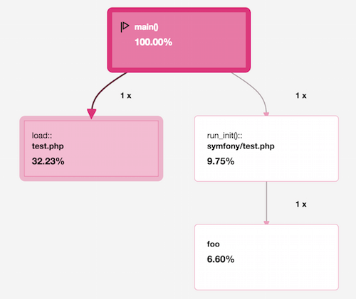
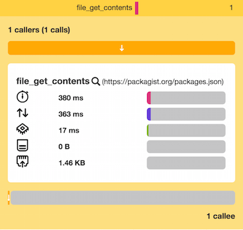
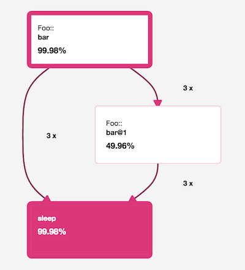
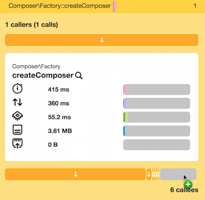
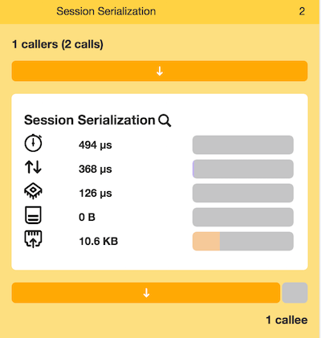

Chapter 9 - Call Graphs Galore
==============================

In the previous chapters, we analyzed some call graphs, but we never fully
explained what they represent and how to read them efficiently. Let's dive into
the wonderful world of call graphs.

Call Graphs
-----------

Blackfire **records the functions called during the execution of a program and
their relationships** as a call graph. A call graph knows nothing about when a
function was called, but it reports the sequence of calls between functions.

In a call graph, **nodes represent functions and edges the calls between them**:

A node that has one or more children is called a **caller** for these child
nodes; a node that has a parent is called a **callee** of this parent node.

.. note::

    When we refer to a "function call" in this chapter, it can be a call to a
    PHP function (``foo()``), a method call on an object (``$foo->bar()``), or
    a static method call on a class (``Foo::bar()``).

To keep data small, Blackfire **does not keep the full-context** of calls (i.e.
the arguments). Therefore, a node aggregates all calls to a function,
regardless of the argument values. This is why each node has a count (the
number of times the function was called) and why nodes can have more than one
parent.

For some specific functions, Blackfire does **keep one argument at most** to
gather useful generic information like SQL queries, HTTP requests, or specific
information like the event name for the Symfony event dispatcher. In that case,
specific nodes are created for each unique argument.

.. note::

    Having only one node for each function call greatly simplifies the
    interpretation. But keep in mind that functions for which we gather an
    argument consist of several nodes (using the search engine helps figure
    that out), like for the ``file_get_contents()`` example above.

When generating a call graph, Blackfire does not cycle through the same node
multiple times for recursive calls. Instead, it creates additional nodes for
each recursive call and suffixes those nodes with ``@n``. This type of graph,
called an **acyclic graph**, is much easier to read and makes calculating
exclusive costs much simpler.

A Blackfire call graph is selective in what it displays. When you profile an
application with many, many function calls, you will not see so many nodes on
the graph. This is because Blackfire **cleans up the data**. Small nodes
(function calls that consume negligible resources) are hidden by default.
However, you will see these minor nodes when you focus the graph on a caller or
a callee, as all parents and children of the focused node are always displayed.

Blackfire also removes nodes that are too small to be optimized. They are
represented in the functions table as a grey bar:

Blackfire also **adds some special nodes** that are not function calls per se
like the main node, garbage collection, and session serialization. These nodes
augment the call graph with useful information that helps us understand PHP's
behavior while executing your code:

.. sidebar:: Data Anonymization

    The call graph data sent to Blackfire's server is thoroughly sanitized and
    never contains sensitive data. Function names do not convey any
    meaningfulness without their associated code, and arguments are anonymized
    by the agent before they are sent to our servers (SQL arguments are
    removed; usernames, passwords, and query arguments are removed from HTTP
    requests, etc).

    If you want to inspect the traffic between your profiled server and
    Blackfire's servers, you can check the transmitted data by using our `free
    and transparent proxy
    <https://github.com/blackfireio/php-sdk/blob/master/bin/blackfire-io-proxy.php>`_.
    Please read the instructions in the script itself.

Extra Features
--------------

Blackfire's user interface has many additional features that make navigating
your call graph a breeze:

* The **SQL queries** and **HTTP requests** are available from the sidebar:

  .. image:: ../../../images/book/callgraph-sql-http-details.png
      :width: 500px
      :align: center

* The **search engine** allows you to search for specific function names. It
  can also be used to display all calls coming from a specific class or
  namespace:

  .. image:: ../../../images/book/callgraph-search-engine.png
      :width: 400px
      :align: center

* In the top left of the call graph, hover on the profile title to reveal all
  its **metadata** (the URL or the command that was profiled but also alerts
  like when was experiencing high load during the profiling session):

  .. image:: ../../../images/book/callgraph-summary.png
      :width: 400px
      :align: center

* An extensive **cache usage** information is accessed from the sidebar:

  .. image:: ../../../images/book/callgraph-cache-information.png

* In the top right corner of the call graph, the sharing icon allows you to
  **share profiles** with anybody (be warned that shared profiles are public
  and anyone can access them; note that for sensitive call graphs, you can also
  collaborate on profiles privately by using Blackfire's environments):

  .. image:: ../../../images/book/callgraph-sharing.png
      :width: 400px
      :align: center

Call Graph Analyzing Methodology
--------------------------------

Looking at a call graph can be overwhelming. Where do you start? What are you
looking for first? When do you stop?

The goal of any profiling session is to find the function calls or the group of
function calls that **consume the most resources** and then be able to analyze
their implementation and find ways to optimize them.

Don't forget one of Blackfire's core tenets:

**Knowing when to stop optimizing is as important as knowing where to start**.

The goal when profiling an application is never to optimize everything. Instead,
Blackfire helps you find areas of your application to optimize that will give
you the best improvements. That's exactly what we have done in the previous
chapters. We were able to significantly optimize two Open-Source projects by
applying some changes that were easy to apply once we knew where to look.

Focusing the Call Graph
~~~~~~~~~~~~~~~~~~~~~~~

All these methodologies help you find the function calls you need to optimize
first. Whatever the methodology, when you find such a call, always focus on the
corresponding node in the Blackfire interface so that you can see more context
in the call graph. You can focus on a node from the call graph or from the
function list by clicking on the magnifying glass:

.. image:: ../../../images/book/bigfoot-magnifying-glass.png
    :width: 500px
    :align: center

The call graph is then centered around the selected function call and all
callers and callees are displayed, even the smaller ones. This view gives you
more context to understand the real behavior of the code.

There are two main approaches to analyzing a call graph: the **function calls
first approach**, and the **call graph top/down approach**. Both methods are
complementary.

.. tip::

    Remember that all methodologies apply to any dimension: call time, I/O
    time, CPU time, memory, and network.

Function Calls First Approach
~~~~~~~~~~~~~~~~~~~~~~~~~~~~~

This method involves looking first at the function table on the left side of
the Blackfire interface.

First, **sort the table by exclusive time** (default sort), and focus on
functions **in the top 25 only**, in this order of importance:

* calls coming from your code;

* calls coming from third-party libraries (you might submit a patch
  upstream quite as we've done in previous chapters).

Then, **sort the table by number of calls** and look for the same functions as
above adding one more type:

* calls coming from PHP built-in functions or C extensions (the number of calls
  is probably the only way to improve their performance).

.. tip::

    Never try to optimize a function with a high call count if its overall cost
    is negligible. This is never worth it.

**This technique works great when there are a few calls that stand out**; These
cases are usually caused by developer mistakes (n + 1 queries, intensive
function calls that could have been cached, large number of calls of a single
function, ...).

Call Graph Top/Down Approach
~~~~~~~~~~~~~~~~~~~~~~~~~~~~

This method involves **following the critical path** on the call graph to
better understand how the code is executed by PHP.

On the call graph, the critical path is composed of all the nodes with a red
border. Start at the ``main`` node, then follow its children by navigating the
call graph with the mouse.

Whenever you encounter several branches, choose the branch that mostly involves
function calls coming from your codebase.

Then, stop when a node looks like it could be optimized (i.e. if you see a
significant drop in exclusive time).

This technique works well when it is not immediately obvious where to focus
first. Also, once you find a node to look at more closely, you already have a
better understanding of the context and what happened before.

.. tip::

    Instead of following the call graph, you can perform the same technique
    directly from the function calls table by sorting it by **inclusive time**.

Checking the Cache Configuration
--------------------------------

Correctly configuring PHP caches is critical for optimal performance: you should
not get to a full cache. Anytime you profile your code, when viewing the profile
data, check the cache information in the sidebar.

RealPath Cache
~~~~~~~~~~~~~~

The ``realpath()`` function returns the absolute path for any given relative
file path. This conversion takes a non-negligible time because it performs some
filesystem calls. That's why PHP caches the results of ``realpath()`` calls and
their associated ``stat()`` calls. The ``realpath_cache_size`` ini setting
defines the size of this cache.

The realpath cache is only used for file paths that exist and is used for most
of PHP filesystem calls. Complex applications involve a lot of file operations,
so this cache size must be increased accordingly.

Interned Strings
~~~~~~~~~~~~~~~~

Interned strings are a nice memory optimization that was added in PHP 5.4.

PHP stores immutable strings (a ``char *``) into a special buffer to be able to
reuse its pointer for all occurrences of the same string. This ``setting`` can
be adjusted using the ``opcache.interned_strings_buffer``.

Conclusion
----------

One last bit of advice. Optimization is often a trade-off of **time versus
memory** and **performance versus code complexity**. Sometimes, it is better to
keep a slower implementation to preserve a simpler and more readable codebase.
Blackfire is just a tool, don't apply a methodology blindly.

Blackfire provides a rich user interface that lets developers navigate through
function calls to efficiently find performance issues.

Profiling should not always be a lonely activity. Teamwork often helps to make
problems search and fixes writing go faster. Blackfire helps achieve
better collaboration through environments, which is the topic for the next
chapter.
