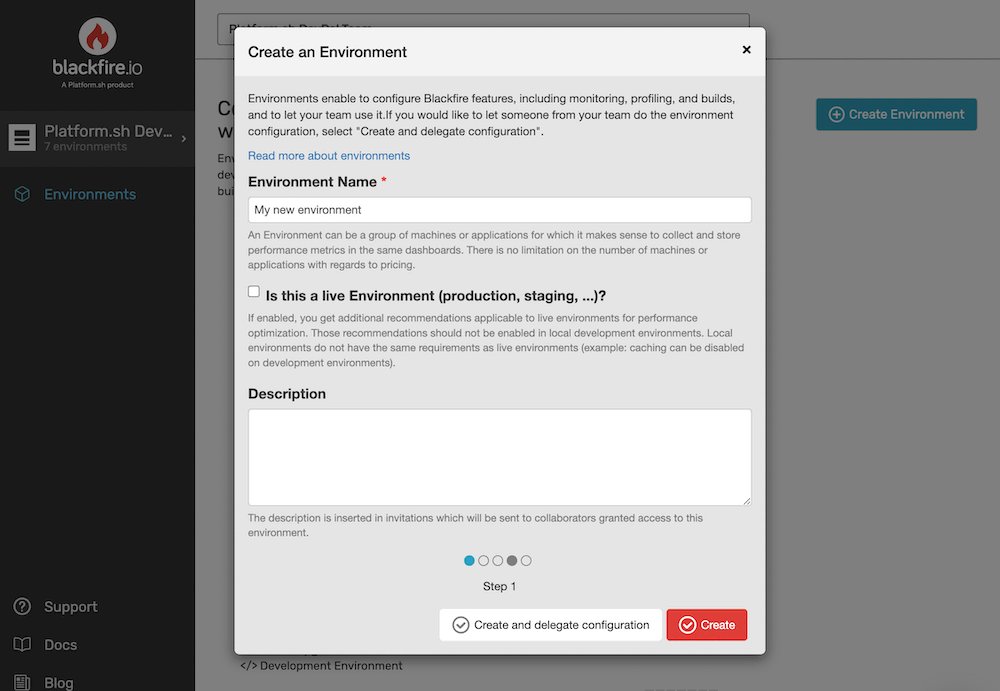
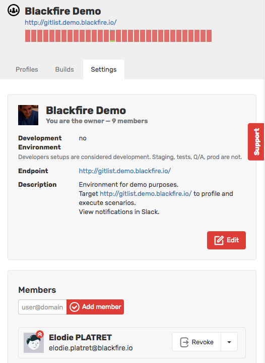
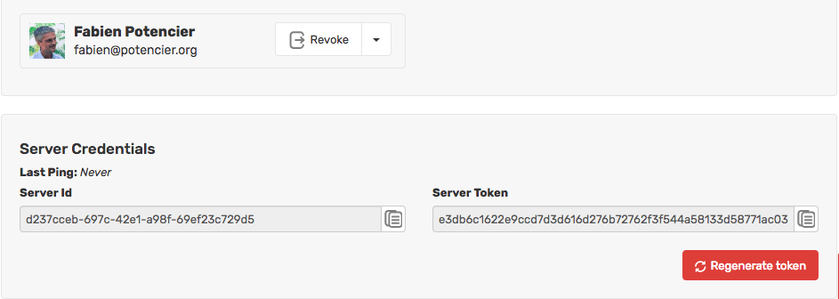

Chapter 10 - Collaborating via Environments
===========================================

When you got started with Blackfire, you used your Blackfire :route:`personal
client and server credentials <my_settings>` to profile local projects. It was
the best way to configure Blackfire on your personal computer.

But what about enabling a team of developers to diagnose problems on production
servers? Or configuring Blackfire on a Continuous Integration server? Blackfire
is not just useful on a development server, but also on testing, staging, and
production servers.

If you were to use your personal server credentials on a shared server, you
would be the only one able to profile projects hosted on it. Another developer
in your team trying to generate a profile would be rejected as their client
credentials would generate a signature that would not match the server
credentials. This is the Blackfire security mechanism that protects your
servers from unauthorized activities.

Fortunately, Blackfire supports another way to configure shared servers.
**Environments** let teams of developers manage the performance of various
servers via common server credentials. **An environment is a workspace** where
generated profiles are only accessible to team members.

.. note::

    Environments are more than just a set of credentials. This feature also
    allows a team to configure workflows and business logic depending on the
    server and app on which you collaborate. You can configure specific
    assertions, test scenarios, scenario triggers, and notifications.
    Environments give you access to SQL queries and outgoing HTTP request
    details, as well as longer data retention.
    Environments also gives you access to quality and security recommendations.
    These topics will be discussed in a later chapter.

Although environments are most useful as part of our Production
offerings, setting up an environment will make it easier to onboard your team
if you decide to upgrade your plan later on.

Why use Environments?
---------------------

A single environment can be used on an unlimited number of servers, projects,
and domain names. What's more, it is possible to use more than one set of
credentials on a single server. So why would anyone ever create more than one
environment?

The main usages for environments are the following:

* **Access control**: Authorize specific groups of users to profile specific
  servers.

* **Profile management**: Isolate profiles under one workspace. Comparing
  profiles coming from development machines (logging and debugging are enabled
  and caching is disabled) and profiles from production servers can lead to
  confusing comparisons and misguided conclusions.

* **Configuration**: Optimize configuration depending on the server usage. In
  production you will want to receive an urgent notification if a performance
  issue is detected, whereas a simple email may be sufficient if the same issue
  is detected in your continuous integration environment. The way you trigger
  performance tests can also be different: for every pull requests for testing
  or on a scheduled basis for production.

One best practice is to **create several environments per project**: one for
testing, one for staging, and one for production. At the end of the day, it is
up to you to decide how to organize your environments depending on your
infrastructure and the way you work.

For development computers, you should use personal server credentials as they
have an exclusive feature: they allow you to profile all environments you have
access to without switching credentials. However, you may want to create a
specific environment for development as well if you are using a project-specific
Vagrant box or Docker images shared by all developers.

Creating Environments
---------------------

Create an environment by clicking on "Create Environment" from the
:route:`My Environments <my_environments>` tab. Give your new environment a
name, a description (describe what it gives access to for instance), and
optionally a canonical URL.

On the environment page, give access to some developers by inviting them via
the "Settings" tab:

Lastly, configure your server with the server credentials from the "Settings"
tab (more on that in the next section):

Configuring Environments
------------------------

The easiest way to set up credentials on your server is to paste them into the
Blackfire agent's configuration file, which is probably what you have done on
your personal computer. It works great for standard setups where a server hosts
only one project and the agent is configured locally.

Server credentials can also be configured in various other ways, depending on
your hosting strategy: you can use them to secure **multiple projects on one
server** or **one project on a farm of servers**. Blackfire supports these use
cases and more, thanks to the following abilities:

* An agent does not have to be installed on the same server as the PHP stack.
  The PHP C extension can communicate with the agent via either a file **or**
  TCP socket. You can install one agent on a dedicated server and connect it to
  all of your web servers;

* Server credentials can also be configured via environment variables. Define
  these environment variables in your web server configuration (i.e. per virtual
  host) or define environment variables in your console when using the Blackfire
  command-line tool;

* Server credentials can be configured in the PHP configuration file
  (``php.ini``), allowing you to set up different credential per PHP-FPM pool.

The `configuration <https://blackfire.io/docs/configuration>`_
chapter in the reference guide describes how this works in practice.

Conclusion
----------

Blackfire environments are a great way to collaborate on profiling activities.
They give you a lot of flexibility in terms of configuration and access
management.

We have mentioned assertions and scenarios in this chapter. It is time to go
beyond profiling. **Blackfire is much more than a profiler**, and the next
chapter will continue our journey with Blackfire assertions.
