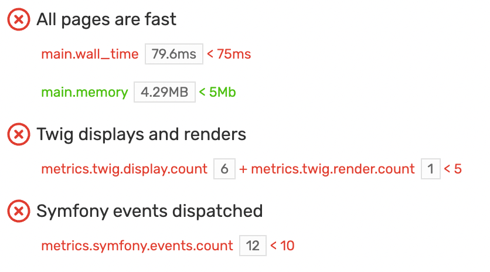
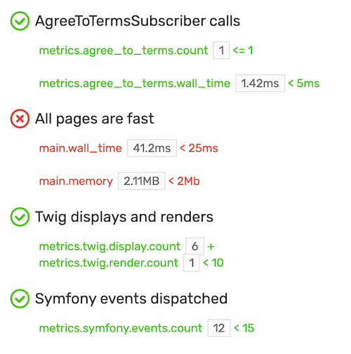
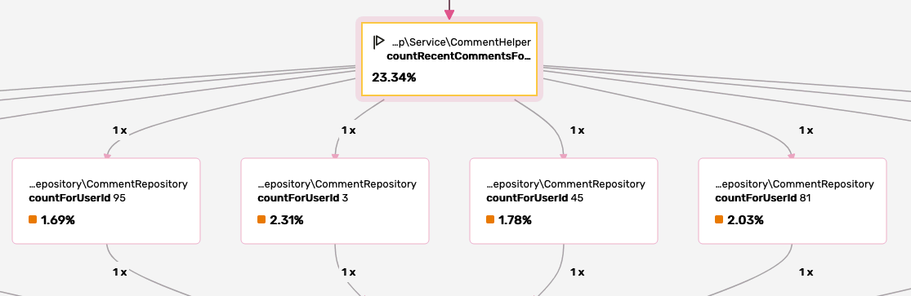
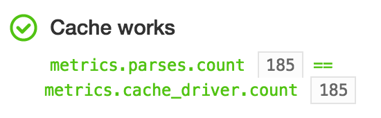

Chapter 11 - Writing Assertions
===============================

This series started by making the case that performance should be considered a
feature of your application. Like any feature, performance should be
well-tested, but how can you write tests on a profile call graph? This is yet
another unique Blackfire feature.

Testing Profiles Main Costs
---------------------------

Remember the first Finding Bigfoot profiles you generated with Blackfire? We
discovered that a sighting page is much slower than the homepage (around 350ms
versus 70ms). Checking that PHP never takes more than 75ms to render a Finding
Bigfoot web page can be expressed with the following **Blackfire assertion**:

.. code-block:: text

    main.wall_time < 75ms

What about making sure memory usage never grows beyond 5Mb? Here you go:

.. code-block:: text

    main.memory < 5Mb

Like xUnit test frameworks, Blackfire groups related assertions in **tests**.
Tests are written in the YAML format and stored in a ``.blackfire.yaml`` file in
your project's root directory or one of its parent:

.. code-block:: yaml

    # .blackfire.yaml
    tests:
        "All pages are fast":
            path: "/.*"
            assertions:
                - main.wall_time < 75ms
                - main.memory < 5Mb

.. note::

    You can use the ``blackfire client:bootstrap-tests`` command to create a
    ``.blackfire.yaml`` skeleton.

You can create a new test by adding an entry in the ``tests`` block. Give it a
name ("All pages are fast") and configure it with a ``path``, the HTTP path
info that must match for the ``assertions`` to be evaluated.

.. note::

    The ``.blackfire.yaml`` file must be stored in your project alongside the
    project code for the same reasons your unit and functional tests are stored
    with the code: Tests must evolve at the same time as the code. When adding
    a new feature or changing existing code, you should also add new Blackfire
    tests or update existing ones. Keeping everything together makes
    incorporating Blackfire into your development workflow much easier.

After creating the ``.blackfire.yaml`` file, generate a new profile for the
`Finding Bigfoot homepage <https://blackfireyaml.book.b7e.io/>`_
and notice the new green tick in the browser profile summary:

Do the same with a `Sighting page <https://blackfireyaml.book.b7e.io/sighting/135>`_
and you should see a red cross. When viewing the associated profile, select the
"Assertions" tab to better understand which assertions failed and why:

Evaluated assertions contain the actual values of all metrics and variables so
that you can know how far away your code is from the expected value. For the
`profile <https://blackfire.io/profiles/c8bba2c7-d6d5-4b7e-8003-11b4d93894cd/graph>`_
above, the expected wall time was 75ms, while the actual wall time was 88ms.

Whenever a profile is generated for a new page or for a page where a bug was
fixed or a new feature added, Blackfire will run all appropriate tests. The red
cross or green tick will immediately tell you if any assertions failed.

To writing assertions on the main profile costs, add a valid dimension name to
the ``main.`` prefix:

.. include-twig:: `dimensions`

Testing Nodes
-------------

Testing the main profile dimensions is a good place to start, but Blackfire
gathers much more data, including function calls and their associated costs.
You can write tests against these statistics as well.

Assertions cannot be written on nodes directly, but via associated metrics. A
**metric** is a name put on a node or a set of nodes that represents their
costs. In assertions, **the value of a metric for a given dimension** can be
used to define the performance expectations of a project.

Blackfire defines metrics for many built-in PHP features, popular PHP
libraries, and the main PHP C extensions. Add the following Twig and Symfony
related tests to your Finding Bigfoot ``.blackfire.yaml`` file:

.. code-block:: yaml

    tests:
        "All pages are fast":
            path: "/.*"
            assertions:
                - main.wall_time < 75ms
                - main.memory < 5Mb

        "Twig displays and renders":
            path: "/.*"
            assertions:
                - metrics.twig.display.count + metrics.twig.render.count < 5

        "Symfony events dispatched":
            path: "/.*"
            assertions:
                - metrics.symfony.events.count < 10

Generating a profile on a sighting page leads to the following results:

Metrics can have a direct relationship with a specific node like the number of
Symfony events dispatched: the ``metrics.symfony.events`` metric contains the
costs of the calls on the ``Symfony\Component\EventDispatcher\EventDispatcher::dispatch()``
method. But sometimes, like for the number of Twig template displays, it can be
an aggregation of nodes:

.. code-block:: yaml

    twig.display:
      label: "Number of Twig templates displayed"
      layer: ~
      matching_calls:
        php:
          - callee: "=twig_include"
            contrib: "count-only"
          - caller: "=Twig_Template::display"
            callee: "^Twig_Template__"
            contrib: "count-only"
          - caller: "=Twig_Template::display"
            callee: "^block_"
            contrib: "count-only"

.. note::

    The format of metric definitions is defined in the `metrics
    <https://docs.blackfire.io/testing-cookbooks/metrics>`_ documentation.

Testing Comparisons
-------------------

Blackfire tests are a great way to make sure that your application satisfies
predefined performance constraints. You can also **check the evolution of the
performance** by writing assertions for profile comparisons.

Assertions on comparisons ensure that an application's performance does not
degrade from one version to the next. And then, when it crosses the threshold
defined in your tests, fixing the problems will be more difficult and
time-consuming.

.. note::

    Comparison assertions are only evaluated :doc:`when running builds </builds-cookbooks/index>`.
    Blackfire Builds are sets of Profiles triggered during automated tests.
    They will be covered in :doc:`chapter 15 <15-unit-tests>`.

For instance, you can limit the increase of memory from one version to the next
with the following assertions:

.. code-block:: text

    # new version should not consume more than 10% more memory
    percent(main.memory) < 10%

    # new version should not consume more than 300kb of memory
    diff(main.memory) < 300kb

.. _final-blackfire-yaml:

Our final ``.blackfire.yaml`` looks like this:

.. code-block:: yaml

    tests:
        "All pages are fast":
            path: "/.*"
            assertions:
                - main.wall_time < 75ms
                - main.memory < 5Mb

        "Twig displays":
            path: "/.*"
            assertions:
                - metrics.twig.display.count + metrics.twig.render.count < 5

        "Symfony events dispatched":
            path: "/.*"
            assertions:
                - metrics.symfony.events.count < 10

        "Memory evolution":
            path: "/.*"
            assertions:
                - percent(main.memory) < 10%
                - diff(main.memory) < 300kb

Testing with Custom Metrics
---------------------------

Blackfire comes with many :ref:`built-in metrics <metrics-built-in-metrics>`,
but you can also create your own.

Finding Bigfoot, as all apps, relies on custom classes that may be either
resources-intensive or hardly optimizable. One possible test could be to check
the number of calls made on those classes. As Blackfire does not come with a
built-in metric for that, let's create one:

.. code-block:: yaml

    metrics:
        agree_to_terms:
            label: AgreeToTermsSubscriber event
            matching_calls:
                php:
                    - callee: '=App\EventSubscriber\AgreeToTermsSubscriber::onRequestEvent'

    tests:
        "AgreeToTermsSubscriber calls":
            path: "/.*"
            assertions:
                - metrics.agree_to_terms.count <= 1
                - metrics.agree_to_terms.wall_time < 5ms

Custom metrics are configured and used in the exact same way as built-in ones.
The ``agree_to_terms`` metric aggregates the costs of all
``App\EventSubscriber\AgreeToTermsSubscriber::onRequestEvent()`` method calls.
The new test asserts that there is no more than 1 call and that it does not take
more than 5ms to execute:

The SQL queries and fetched URLs included in a Blackfire profile come from the
graph as well. These values are arguments to specific function calls.

Custom metrics can also get one argument per function call. It could be
interesting to group calls per the values passed to visualize their impact
on the performance.

Create a new metric whose only goal is to capture the first
argument of the ``App\Repository\CommentRepository::countForUserId`` method:

.. code-block:: yaml

    metrics:
      count_for_user_id:
        label: countForUserId Call Arguments
        matching_calls:
            php:
                - callee:
                    selector: '=App\Repository\CommentRepository::countForUserId'
                    argument:
                        1: "*"

If you generate a new profile, the IDs of the ``User`` are now part of the
graph.

.. note::

    When you configure Blackfire to gather an argument, the related nodes are
    always displayed, even if their consumed resources are insignificant as
    in the above example.

And we have just scratched the surface of what's possible with custom Blackfire
metrics!

.. note::

    The format of metric definitions is defined in the
    `https://docs.blackfire.io/testing-cookbooks/metrics </testing-cookbooks/metrics>`_
    documentation.

Testing CLI Commands
--------------------

Testing CLI commands can be done in the ``.blackfire.yaml`` file as well by
replacing ``path`` with ``command`` in the test definition.

To optimize phpmd a few chapters ago, we made sure that ``restoreFile()`` was
only called twice for each parsed file: once to retrieve the cache for the
class itself and once to retrieve the cache for all its methods. The
performance issue came from the fact that the cache for methods was retrieved
the same number of times as the number of methods in the class instead of just
once.

Let's write a test to check that the number of calls to ``restoreFile()`` to
retrieve the cache for methods is exactly the same as the number of classes in
the project phpmd is working on:

.. code-block:: php
    :emphasize-lines: 18

    metrics:
        parses:
            label: PHParser parses
            matching_calls:
                php:
                    - callee: '=PDepend\Source\Language\PHP\AbstractPHPParser::parse'

        cache_driver:
            label: Restore files
            matching_calls:
                php:
                    - callee:
                        selector: '=PDepend\Util\Cache\Driver\FileCacheDriver::restoreFile'
                        argument: { 1: /methods/ }

    tests:
        "Cache works":
            command: ".*"
            assertions:
                - metrics.parses.count == metrics.cache_driver.count

The first custom metric (``parses``) stores the number of classes to parse and
the second one (``cache_driver``) stores the number of calls to
``restoreFile()``, but only when the argument contains ``methods`` (methods are
cached to files with names that include the string ``methods``). The assertion
is then a matter of checking that the two numbers are equal:

You probably won't write this sort of test very often, but it demonstrates the
simplicity and the expressiveness of Blackfire tests.

Conclusion
----------

Blackfire tests use a rich `expression language
<https://docs.blackfire.io/testing-cookbooks/assertions>`_ that allows
developers to express any kind of assertion. Tests can be used for:

* defining a project performance reference;
* testing code's behavior;
* ensuring that there are no performance regressions.

Finding the right assertions for a project can be tough at first. In the next
chapter we will discuss some best practices that will help you get started on
the right foot.
