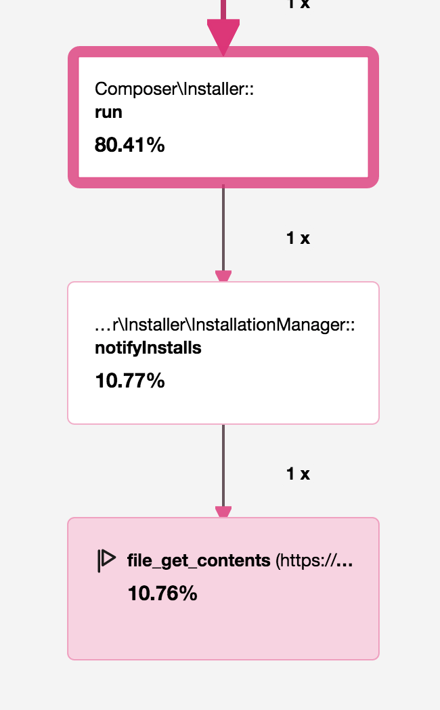

Chapter 13 - Understanding Code Behavior
========================================

Have you ever dreamed of being a fly on the wall when PHP runs your code and
see which functions are executed? Debuggers deliver this experience, but only
on development machines. What about production? Blackfire provides a simple and
low-overhead tool to understand code behavior at runtime in all environments,
including production.

Like any developer, you have already experienced the frustration of trying to
understand how a legacy project works. Even on your very own projects,
complexity added over the years can make any change difficult. Sometimes you
can't even tell if some parts of the code are still used anymore.

The performance optimizations we made on Finding Bigfoot and PHP Mess Detector
were quick to find because we had the right tool. Remember that these are popular
Open-Source projects and that people read this code and fix bugs all the time...
but nobody ever spotted our simple improvements. Blackfire was key to our
success.

Want more real-life examples?

What does Composer do When Running an Update?
---------------------------------------------

Have you ever wondered why it takes so long for a "simple" ``composer update``
to complete? Is it because of the dependency resolution process? Or the
package downloads? Does the cache make any difference? Those questions can be
easily answered with Blackfire.

In an empty directory, create a Composer file with a dependency on Twig:

.. code-block:: json

    {
        "require": {
            "twig/twig": "1.20.0"
        }
    }

.. note::

    Before running Composer, this version of Twig was already cached by
    Composer and its metadata cache was fully warmed as Composer was just run
    on another project.

Let's profile the first Composer update:

.. code-block:: bash

    blackfire run composer up

Blackfire generates a profile with `4 HTTP requests
<https://blackfire.io/profiles/1e57728f-dd0b-4b2a-b076-c1c98f6d9023/graph>`_.

Profile again and the second time, the profile only contains `3 HTTP requests
<https://blackfire.io/profiles/9b6e4413-2028-4d28-bc2f-60c9263136b6/graph>`_.

The first time, the ``vendor/`` directory was empty and Composer installed
Twig. Looking at the parent node of the additional ``file_get_contents()`` call
tells us that Composer notified Packagist of this installation, which generated
a request to ``https://packagist.org/downloads/``:

The second time, the call did not happen as Twig was already installed in the
correct version in the ``vendor/`` directory. This is how Packagist counts the
number of package installations.

The profiles also reveal that more than half of the wall time is spent
downloading files from Packagist, even when there is nothing to do. Take a
closer look at these HTTP requests. Notice that the content of the
``https://packagist.org/packages.json`` URL is always retrieved? This gives
Composer all the information it needs to potentially download other files:

.. code-block:: json

    {
        "notify": "/downloads/%package%",
        "notify-batch": "/downloads/",
        "packages": [],
        "provider-includes": {
            "p/provider-2013$%hash%.json": {
                "sha256": "5eabcb75d94b428ce510270878b2b10a81e00b8afaaf4d5e9896b274ec0fbeaa"
            },
            "p/provider-2014$%hash%.json": {
                "sha256": "9a7a79cfdfd24dac773cf189faa0a6756b33f4352c39e7861ed55cb870e27b32"
            },
            "p/provider-2015-01$%hash%.json": {
                "sha256": "00340913136e82907716efe89d8980d7d3e47b390905f6d72f0ff56eebb9cb66"
            },
            "p/provider-2015-04$%hash%.json": {
                "sha256": "dc1d338b4e059389de2091992417eff634f94835ecb96498aa2259bfabffbc25"
            },
            "p/provider-2015-07$%hash%.json": {
                "sha256": "99a9efb2c3970745412fdef4b55438a77afae24b84e95fa552a2dfcca21495c1"
            },
            "p/provider-2015-10$%hash%.json": {
                "sha256": "113e6db06a47bbe901f6932307011daf9de612ca9de927cd2ff263a34b234263"
            },
            "p/provider-archived$%hash%.json": {
                "sha256": "21bb16829b6e507a79cf2a99773416f62462506f86d2f8a04167454724e08946"
            },
            "p/provider-latest$%hash%.json": {
                "sha256": "29734ba3922c24ce8eb0f9bdfe765b2a4ed346e8e399c9d59c8faf57af2afb03"
            }
        },
        "providers-url": "/p/%package%$%hash%.json",
        "search": "/search.json?q=%query%"
    }

Take some time to analyze the call graph and the function calls, you will
learn a lot about how Composer works.

.. tip::

    Running Composer with the ``-vvv`` flag displays many logs about what
    Composer is doing. This is quite entertaining while waiting for the command
    to complete.

What is the Difference Between Symfony Development and Production Environments?
-------------------------------------------------------------------------------

The Symfony full-stack framework provides an environment feature that lets
developers tweak their project configuration for development, test, or
production environments. In the "dev" environment for instance, logs are
verbose, caches are disabled, and auto-reload of configuration and Twig
templates is enabled. That adds some significant overhead. Can we watch the
different code paths with Blackfire?

As an example, I have profiled the symfony.com website homepage in the
development environment and in the production environment on my local machine.

To better understand the difference between the environments, compare the two
profiles. The comparison makes it very clear that the Symfony production
environment is much faster and consumes less memory than its development
counterpart:

The comparison call graph reveals that some additional function calls are
responsible for the slow-down in the "dev" environment:

* The event dispatcher is wrapped by an instance of
  ``TraceableEventDispatcher``, which records various metrics about triggered
  events:

  .. image:: ../../../images/book/symfony-traceable-event-dispatcher.png
      :width: 400px
      :align: center

  It works by wrapping all listeners:

  .. image:: ../../../images/book/symfony-wrapped-listener.png
      :width: 400px
      :align: center

* The Twig engine is also wrapped by ``TwigTimedEngine`` again to gather
  information about rendered templates:

  .. image:: ../../../images/book/symfony-timed-twig-engine.png
      :width: 400px
      :align: center

The function calls table also gives more hints about the differences:

* The autoloader used in development, ``DebugClassLoader``, is different from
  the one used in production, ``ApcClassLoader``:

  .. image:: ../../../images/book/symfony-autoloader.png
      :width: 400px
      :align: center

  The production autoloader is faster, as you can see by comparing the size of
  the blue bar versus the red one (open the node details to confirm with
  numbers).

Sort the function calls table by the number of calls, and again, learn more:

* Monolog is way more verbose in development than it is in production:

  .. image:: ../../../images/book/symfony-monolog.png
      :width: 400px
      :align: center

In less than 5 minutes, we learned a lot about Symfony internals without having
to look at its code. If you want to learn more about what these classes do, it
is now a matter of reading the source code of the corresponding classes.

Why is Symfony's ``ApacheUrlMatcher`` Slow?
-------------------------------------------

In an attempt to speed up the request routing process, Symfony 2.0 was released
with an ``ApacheUrlMatcher`` class. The basic responsibility of this class was
to generate a block of Apache configuration with a bunch of ``mod_rewrite``
rules. The goal was to make the URL matching process much faster by delegating
the bulk of the work to Apache.

This class has been removed in Symfony 3.0 for several reasons: the first one
is that some features added to the Symfony Routing components were not easy to
convert to ``mod_rewrite`` rules, but more importantly, we realized that this
class actually performed worse than the PHP implementation.

How is that possible? The PHP matcher works by dumping an optimized PHP file so
that we never have to create the expensive route collection object at runtime.
When using the ``ApacheUrlMatcher`` we still needed to create the route
collection object for every request. So, even though the seemingly
time-consuming matching process was already done by Apache, the process as a
whole ended up taking much longer than expected.

The interesting part of this story is that it took us years to find this issue,
and the process of debugging the root cause of the slow down was quite tricky.
Blackfire could have shown us the problem right away.

Conclusion
----------

Blackfire profiles can help understand which parts of your codebase are
executed. Profile comparisons help understand code behavior differences. Try
using Blackfire on your own projects, not to find performance bottlenecks, but
just to get a new perspective on your code. You might discover behaviors you
would not have expected.
