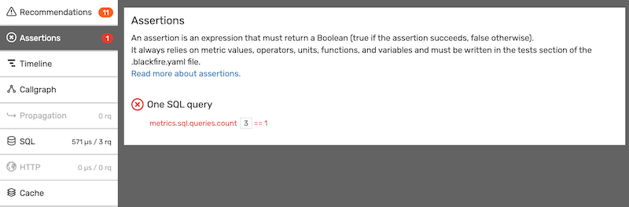

Chapter 15 - Integrating with Unit Tests
========================================

Unit tests rarely come to mind when talking about performance management. This
is for a good reason: tests depending on time lead to transient failures.
Blackfire lets developers write tests on stable metrics that are related to the
root causes of performance issues instead of time. Using such metrics in a unit
test suite is a powerful option.

To make things more concrete, let's write some unit tests for the Finding Bigfoot
``App\Twig\AppExtension::getUserActivityText()`` method we
:doc:`optimized previously <04-first-profile>`. The test suite already has a test
covering the output of the method:

.. code-block:: php

    public function testGetUserActivityText()
    {
        $user = $this->createMock(User::class);
        $activityText = $this->appExtension->getUserActivityText($user);
        $this->assertNotEmpty($activityText);
        $this->assertIsString($activityText);
    }

But how can we test a SQL query is only executed the very first time
``getUserActivityText()`` is called for a specific ``User``?

Have a look at the constructor and ``calculateUserActivityText()`` method
implementation and note the usage of the
``Symfony\Contracts\Cache\CacheInterface`` class:

.. code-block:: php
    :emphasize-lines: 1,2,7,14

    use Symfony\Contracts\Cache\CacheInterface;
    use Symfony\Component\Cache\CacheItem;

    public function __construct(CommentHelper $commentHelper, CacheInterface $cache)
    {
        $this->commentHelper = $commentHelper;
        $this->cache = $cache;
    }

    public function getUserActivityText(User $user): string
    {
        $key = sprintf('user_activity_text_%s', $user->getId());

        return $this->cache->get($key, function (CacheItem $item) use ($user) {
            $item->expiresAfter(3600);

            return $this->calculateUserActivityText($user);
        });
    }

As PHPUnit cannot mock the ``CacheInterface`` instance, we need to find another way:

* We can re-define the class implementing the ``CacheInterface`` (extending the
  real one and wrapping the ``get()`` method) before running any tests and
  register it before Composer's autoloader kicks in. That's rather ugly,
  fragile, and confusing to do it by hand but some mocking libraries can help
  you achieve that.

* Use Blackfire!

Using Blackfire in PHPUnit
--------------------------

Let's see how Blackfire integrates with PHPUnit. The easiest way is to include
the ``Blackfire\Bridge\Phpunit\TestCaseTrait`` trait.

.. code-block:: php

    use Blackfire\Bridge\PhpUnit\TestCaseTrait as BlackfireTrait;
    use PHPUnit\Framework\TestCase;

    class AppExtensionTest extends TestCase
    {
        use BlackfireTrait;
    }

Then, create a PHPUnit test like this one:

.. code-block:: php

    use Blackfire\Profile\Configuration as ProfileConfiguration;

    public function testIsUserActivityTextCached()
    {
        $config = new ProfileConfiguration();
        $config->assert('metrics.sql.queries.count == 1', 'One SQL query');

        $this->assertBlackfire($config, function () {
            $user = $this->createMock(User::class);

            $this->getUserActivityText($user);
            $this->getUserActivityText($user);
            $this->getUserActivityText($user);
        });
    }

The ``assertBlackfire()`` call is where the magic happens:

* It takes a configuration where some Blackfire assertions are defined
  (``metrics.sql.queries.count == 1``);

* It instruments the code in the anonymous function before running it;

* It converts the Blackfire assertions to PHPUnit ones so that errors and
  failures are injected into PHPUnit's report, as any other assertion.

.. caution::

    Be sure to add this test **before** any other tests; if not, the cache
    could be already warmed and the test would fail.

Debugging Failures and Errors
-----------------------------

If the test fails, PHPUnit displays a nice error message with all the
information you need to debug it:

.. code-block:: text
    :emphasize-lines: 12,14

    F.

    Time: 3.03 seconds, Memory: 15.00Mb

    There was 1 failure:

    1) App\Tests\Twig\AppExtensionTest::testIsUserActivityTextCached
    Failed asserting that Blackfire tests pass.
    1 tests failures out of 1.

        failed: One SQL query
        - metrics.sql.queries.count == 1

    More information at https://blackfire.io/profiles/b58d2c0c-5870-42bd-ad7d-5392bd30b966/graph?settings%5BtabPane%5D=assertions.

    /var/www/html/vendor/blackfire/php-sdk/src/Blackfire/Bridge/PhpUnit/TestConstraint.php:60
    /var/www/html/vendor/blackfire/php-sdk/src/Blackfire/Bridge/PhpUnit/TestConstraint71.php:19
    /var/www/html/vendor/blackfire/php-sdk/src/Blackfire/Bridge/PhpUnit/TestCaseTrait.php:53
    /var/www/html/tests/Twig/AppExtensionTest.php:36

    FAILURES!
    Tests: 2, Assertions: 1, Failures: 1.

If cache is commented out, the assertion fails as 3 processes are run. The call
graph URL points to the profile where you can debug problems more easily.

If the assertion has a syntax error, the profile "Assertions" tab helps you
understand the problem:

Defining your own Metrics
-------------------------

This test was easy to write because we were able to use a built-in metric, but
this is not always the case. Luckily, it is possible to :ref:`create custom
metrics with the PHP SDK <php-sdk-custom-metrics>`:

.. code-block:: php

    use Blackfire\Profile\Configuration as ProfileConfiguration;
    use Blackfire\Profile\Metric;

    $config = new ProfileConfiguration();

    $config->defineMetric(new Metric( 'user_activity_text', '=App\Twig\AppExtension::getUserActivityText'));
    $config->assert('metrics.sql.queries.count == 1', 'One SQL query');

Conclusion
----------

Read our `PHPUnit integration documentation
<https://docs.blackfire.io/php/integrations/phpunit>`_ for more tips on how to
leverage Blackfire in PHPUnit test suites.

**Blackfire lets you test your code's behavior without the need for mocks**.
This is a very useful technique when you need to test the behavior of a
third-party library you cannot easily modify. With Blackfire there is no need
to change third-party code or write an ugly hack. Simple define custom metrics
and write assertions against them.

Using Blackfire in a PHPUnit test has one great side-effect: your performance
tests automatically benefit from your continuous integration setup. Automation
is key for continuously managing performance, and this is the topic for the next
few chapters.
