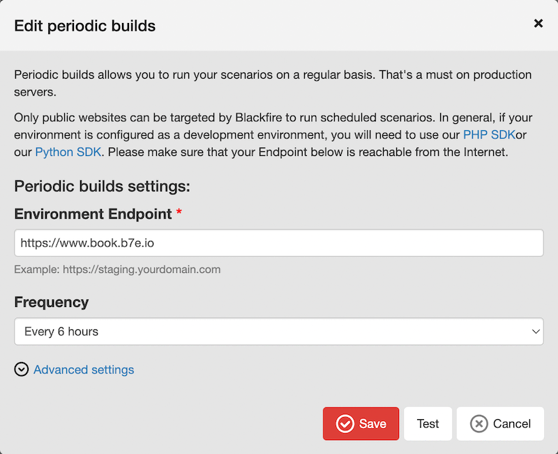
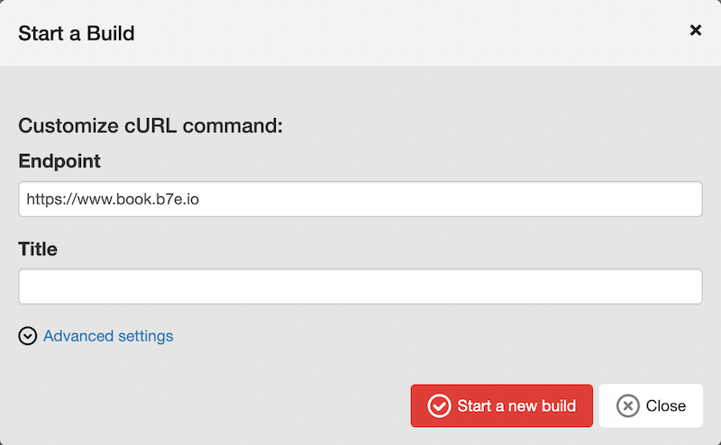
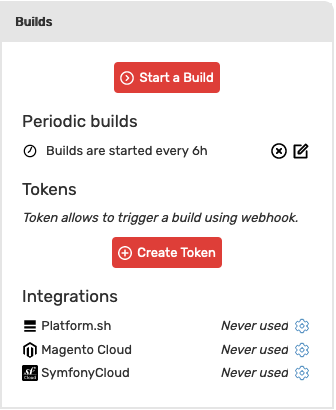
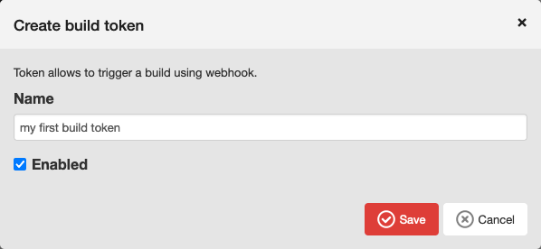
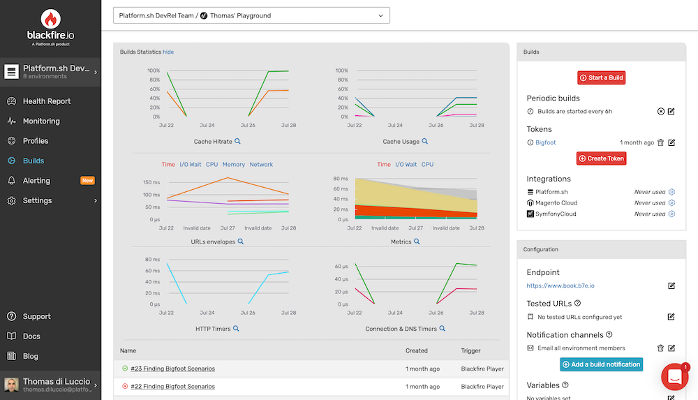
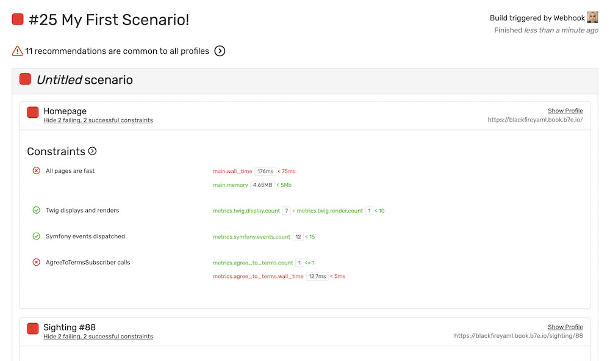
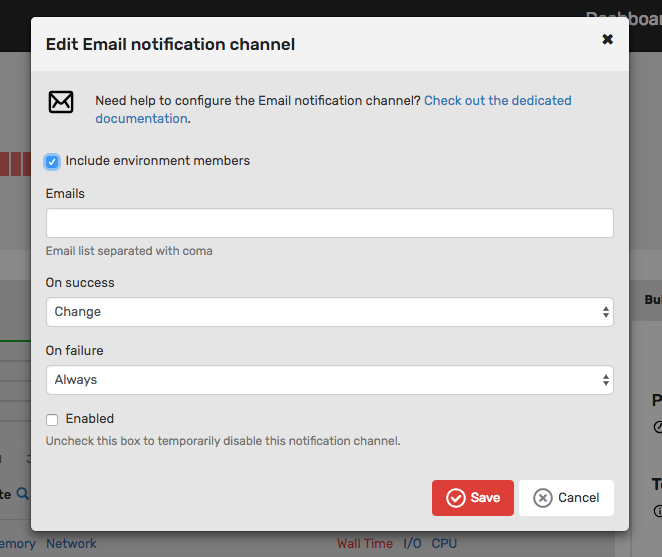

Chapter 16 - Performance Automation
===================================

Do you know why most developers don't manage the performance of their
applications? Many will tell you they don't have the time, but the real reason
is probably that they don't have the right tools. Blackfire fills this gap.
Being able to profile applications in development and diagnose problems in
production is great, but if the process is manual, developers will stop
doing it after a while.

**Automation is key to continuously manage application performance**.

Automation is also key to avoid performance regressions in production.
Blackfire provides a feature that helps developers trigger performance tests on
an application and be alerted whenever a problem occurs.

Writing Scenarios
-----------------

Manually triggering profiles on individual URLs like we did previously works
well on development machines, but it does not scale well for production
monitoring.

Blackfire scenarios let you run a set of profiles on your application's main
URLs or API endpoints. Scenarios are defined in ``.blackfire.yaml`` under the
``scenarios`` section.

Finding Bigfoot scenarios could look like the following:

.. code-block:: yaml

    scenarios: |
        #!blackfire-player
        name "Bigfoot Sightings Scenarios"

        scenario
            visit url("/")
                name "Homepage"

            visit url("/sighting/88")
                name "Sighting #88"

            visit url("/sighting/135")
                name "Sighting #135"

            visit url("/about")
                name "About page"

            visit url("/login")
                name "Login page"

            visit url('/login')
                name 'Failed login attempt'
                method 'POST'
                # Default samples for POST requests is 1 without warmup.
                # Here we explicitely use 10 samples aggregation with a warmup request
                # since this POST request with no payload is idempotently safe.
                samples 10
                warmup true

In the example, all scenarios, but the last one, trigger profiles on HTTP
``GET`` requests. For each one of them, Blackfire warms up the URL by hitting
it a few times before generating a profile out of several iterations.

The "Failed login attempt" scenario is more interesting as it requests a
``POST`` request, but a safe one. Without any parameters passed to the request,
we end up in the state after the request is processed.

By default, scenarios for non-GET requests have no warmup and profiles are
generated from only one iteration. But as this "Failed login attempt" is
*idempotent*, the scenario is explicitly configured to enable warmup (``warmup:
true``) and to generate 10 requests (``samples: 10``) for the profile.

.. note::

    Blackfire scenarios have more options as described in the `scenarios
    documentation <https://blackfire.io/docs/builds-cookbooks/scenarios>`_.

Triggering Scenarios
--------------------

Now that the Finding Bigfoot scenarios are defined, we need a way to trigger
them. Blackfire has `several ways to trigger them
<https://blackfire.io/docs/builds-cookbooks/index>`_, but the
most simple one is to use a **periodic build**.

Periodic Builds
~~~~~~~~~~~~~~~

Select your :route:`Environment <my_environments>`, and select the "Builds"
entry on the left menu to access the ``Builds`` section. Then, click the
"Enable periodic builds" button. By default, Blackfire will launch a new
build every 6 hours. But you can fine-tune those settings. Click the "Edit"
icon.

By default, Blackfire will run builds on the endpoint you defined when you
created the environment, but you can change that. However, periodic builds can
target a single endpoint. You'll need to create multiple environments if you
want to periodic run builds on multiple endpoints.

Webhook
~~~~~~~

.. note::

    The Production Edition of Blackfire offers all `ways to trigger them
    <https://blackfire.io/docs/builds-cookbooks/index>`_, such
    as the webhook.

Go to the ``Builds`` section of your environment and click the "Start
a build" button:

Then enter the endpoint (``https://www.book.b7e.io/``),
trigger the build by submitting the form, and wait for the profiles to finish.

Alternatively, you can also trigger a build
:doc:`using a Webhook </builds-cookbooks/builds-webhook>`.

You can create Build Tokens from your Environment Builds dashboard. In the
right panel, click the ``Create Token`` button:

Then give the Token a name. Note that you can also enable/disable it with the
help of the ``Enabled`` checkbox.

You can now trigger by running this command in a console:

.. code-block:: bash
    :zerocopy:

    curl -i -X POST https://blackfire.io/api/v2/builds/env/ENV-UUID/webhook \
    --user 'TOKEN' \
    -d 'endpoint=https://www.book.b7e.io/' \
    -d 'title=My First Scenario!'

.. note::

    To use the command above, replace the ``ENV-UUID`` placeholder with the
    UUID of one of your Blackfire environments and the ``TOKEN`` with the token
    you generated.

If the trigger fired correctly, the JSON output should contain "A new build has
been started". Go to the ``Builds`` section of your environment and select the
newest build:

Build Report
------------

With one simple request, we were able to automatically generate 6 profiles in
parallel for the main Finding Bigfoot URLs.

The build report displays all profile results, highlights failed scenarios, and
provides details for any failed assertions:

As expected, some scenarios fail. Next execute the scenarios on the ``blackfireyaml``
branch (from the web or from the console), where our performance patches have
been applied:

.. code-block:: bash
    :zerocopy:

    curl -i -X POST https://blackfire.io/api/v2/builds/env/ENV-UUID/webhook \
    --user 'TOKEN' \
    -d 'endpoint=https://blackfireyaml.book.b7e.io/' \
    -d 'title=Scenario on the blackfire-yaml branch'

The results are definitely better, but not as good as we could have hoped. Have
a closer look and you will realize that some pages are slower than expected.
This is the time to dig into the root causes and try to find more optimizations.

.. note::

    Remember that the main benefits of storing scenarios in a
    ``.blackfire.yaml`` file alongside your code is to make them specific to
    your current work: a pull request, a branch, a specific version of your
    code, etc. Whenever you add a new feature, don't forget to update the
    scenarios.

Being Notified
--------------

Webhooks are a great way to integrate Blackfire into any tool. Then, once
your checks are automated, you will need a way to be alerted when performance
degrades.

Blackfire notification channels alert you when a build fails or when a
project's status changes. Blackfire comes with many `built-in notification
channels <https://blackfire.io/docs/builds-cookbooks/notification-channels>`_,
but the simplest one is the **email notification channel**.

On the dashboard Builds view, add an email notification channel.
Configure the email notification channel to receive an email whenever there is a
failure or when the build status changes:

Conclusion
----------

In development, update your application scenarios whenever you make significant
changes.

Configure your test environment to run the scenarios via the webhook and use
the email notification channel to receive a notification whenever a build fails.

For production, configure the Blackfire "Periodic builds" to automatically
profile your application on a periodic basis and use the `Slack
<https://blackfire.io/docs/integrations/notifiers/slack>`_ or `Microsoft
Teams <https://blackfire.io/docs/integrations/notifiers/microsoft-teams>`_
notification channel to get fast feedback.

But there is more. Builds are also available in the SDK, which opens the door to
dynamically building scenarios. The SDK is the best way to leverage Blackfire
powerful features, and in the next chapter we will study some advanced usages.
