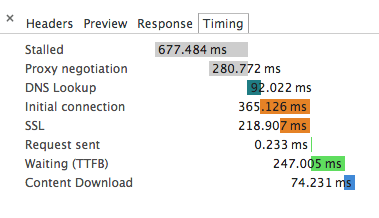
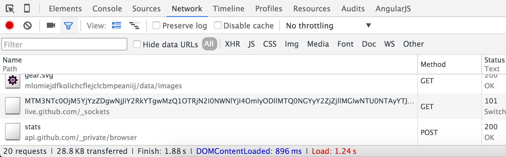
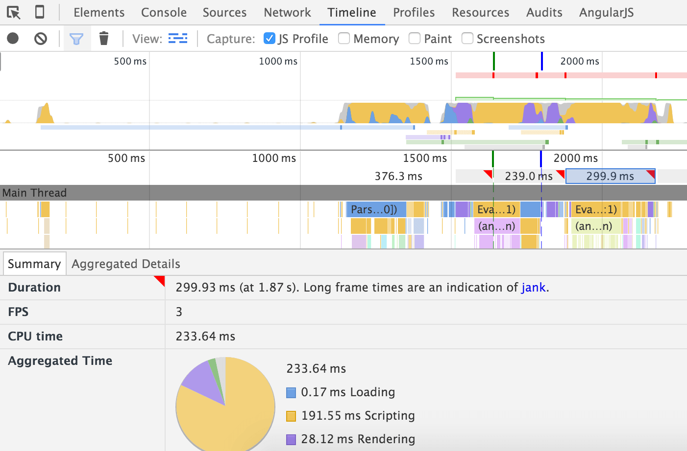
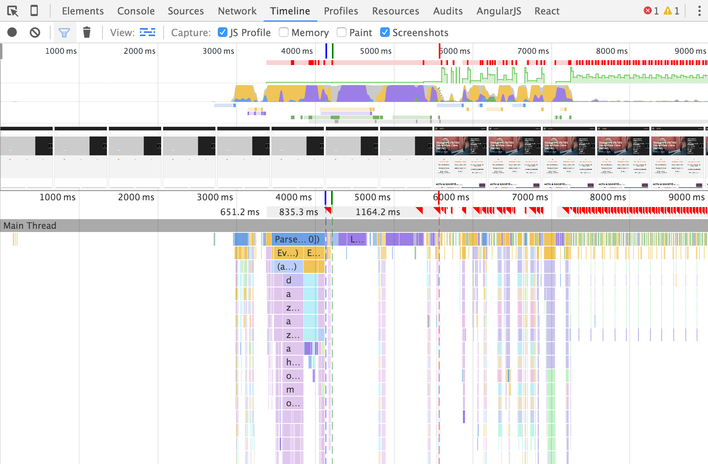
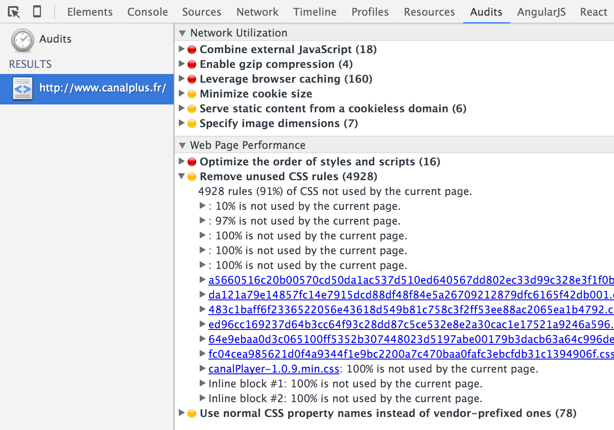

Chapter 21 - Profiling the Frontend
===================================

Before end-users interact with your website in a browser, they need to wait for
a number of things to happen: initialization (DNS resolution, TCP connection,
proxy, and SSL negotiation), server rendering, data transfer, and page
rendering in the browser.

Blackfire helps you improve the performance of server rendering, but what about
the other parts of the equation?

If you set aside server rendering time, most of the time a user spends waiting
for a page to load is spent in the browser. There are so many things to do
before the page is fully usable by the end user: first and foremost, a web
page is composed of many resources besides the main contents that the browser
has to resolve and load (JavaScripts and stylesheets). Then it needs to build
the DOM tree from the HTML and execute any needed JavaScript. Last but not
least, extensions that you installed in the browser can have an impact as well.

.. note::

    Websites and many mobile applications rely on the same underlying
    technologies like HTTP, DNS, SSL, etc. But for mobile applications, the
    latency, the bandwidth, and the limited amount of resources on phones
    make everything more challenging. `Speed matters, even on mobile — and
    perhaps especially on mobile
    <https://www.soasta.com/blog/mobile-web-performance-monitoring-conversion-rate/>`_.

Improving server performance is made simpler as you know everything about your
infrastructure: the number of servers, their CPU, memory, bandwidth, location,
and more. Client performance is much harder as users can have very different
setups: location, bandwidth, computer power, internet connectivity, etc. These
constraints all influence a user's experience and they are all out of your
control.

This chapter is a quick overview of the tools you can use to understand and
improve your application's frontend performance.

HTTP
----

Improving the time it takes for a webpage to be usable by a user starts with
HTTP optimizations. A quick overview is given by `Google's timeline
<https://developers.google.com/web/tools/chrome-devtools/profile/network-performance/resource-loading#resource-network-timing>`_:

If you want to learn more about how a browser handles HTTP and possible
optimizations, read `Page Weight Doesn't Matter
<https://www.speedshop.co/2015/11/05/page-weight-doesnt-matter.html>`_.

The Google Chrome Network tab also summarizes HTTP interactions with the user
quite nicely:

.. note::

    The "`High-Performance browser network
    <https://hpbn.co/>`_" book is
    a great resource for an in-depth analysis of network performance.

HTML and JavaScript
-------------------

A browser renders a page in three basic stages: when it finishes retrieving the
web contents from the server, when the interface starts to be understandable by
the user (most elements are displayed), and when the user can fully interact
with the page (all stylesheets and JavaScripts have been loaded and evaluated).

To get a quick overview of the browser performance of your application, use
`Google PageSpeed Insights
<https://developers.google.com/speed/pagespeed/insights>`_. This tool does
indeed give you great insights.

.. tip::

    The `W3C Navigation Timing <https://www.w3.org/TR/navigation-timing/>`_
    recommendation allows you to "access timing information related to
    navigation and elements" programmatically from JavaScript.

When the Google Chrome Team introduced the RAIL model, Paul Irish started with
`this great advice
<https://www.smashingmagazine.com/2015/10/rail-user-centric-model-performance/>`_:

    There's no shortage of performance advice, is there? The elephant in the
    room is the fact that it's challenging to interpret: Everything comes with
    caveats and disclaimers, and sometimes one piece of advice can seem to
    actively contradict another. Phrases like "The DOM is slow" or "Always use
    CSS animations" make for great headlines, but the truth is often far more
    nuanced.

RAIL is a model that helps you avoid performance issues by setting general
performance goals. RAIL stands for:

* **Response** (user interface): Tap to paint in less than 100ms;
* **Animation**: Layout rendering should take less than 16ms per frame;
* **Idle**: Use idle time to compute some work in chunks of 50ms;
* **Load**: The page should be fully loaded in less than 1000ms.

.. note::

    If you want to dive more in RAIL, watch the "`Dev Tools: State of the
    Union <https://www.jqueryuk.com/2015/videos/devtools-state-of-the-union>`_"
    talk.

Let's see how these goals can be observed and improved.

R for Response
~~~~~~~~~~~~~~

When a user interacts with a page by clicking a button or submitting a form,
you can either load a new page or asynchronously load data to render a React
component or populate an Angular scope.

For any interface change, 100ms is the performance goal you should target after
the user triggers it from the interface. If not, you should use a loader, a
progress bar, or anything that will help the user understand that the action
has been taken into account.

A for Animation
~~~~~~~~~~~~~~~

Animations are exceptionally smooth for end users at 60 frames per second. That
gives you 16ms per frame.

16ms is even too much according to this `article
<https://developers.google.com/web/fundamentals/performance/rendering/>`_:

    Each of those frames has a budget of just over 16ms (1 second / 60 =
    16.66ms). In reality, however, the browser has housekeeping work to do, so
    all of your work needs to be completed inside 10ms. When you fail to meet
    this budget the frame rate drops, and the content judders on screen. This
    is often referred to as **jank**, and it negatively impacts the user's
    experience.

You can spot janks in your pages by having a look at the "Timeline" tab of the
Google Chrome developer toolbar; janks are reported with a red corner:

I for Idle
~~~~~~~~~~

To avoid blocking the user interface with JavaScript, you should try to split
computational tasks into small chunks and take advantage of the `Page
Visibility API
<https://developer.mozilla.org/en-US/docs/Web/API/Page_Visibility_API>`_ to
defer processing until when the user is idle.

Each of these chunks of idle-time work should not take more than 50ms to
complete. If you have a larger task that is difficult to optimize into 50ms
chunks, consider delegating this work to a **web-worker**. Executing JavaScript
in a web-worker is like creating a new independent thread outside the page event
loop. Communication with this thread happens through a messaging API. Read the
`Mozilla Web Worker documentation
<https://developer.mozilla.org/en-US/docs/Web/API/Web_Workers_API/Using_web_workers>`_
to learn more about this technique.

.. note::

     You can also read this very nice tutorial explaining how to build a
     `Pokemon application
     <https://www.pocketjavascript.com/blog/2015/11/23/introducing-pokedex-org>`_.

Another important consideration when writing JavaScript is function calls that
result in a browser flush of all pending changes. When creating DOM nodes,
updating DOM node classes, or even when adding CSS properties, the requested
changes are queued waiting for an upcoming refresh of the interface. Knowing
which `function calls trigger an early flush
<https://gist.github.com/paulirish/5d52fb081b3570c81e3a>`_ can help.

L for Load
~~~~~~~~~~

Google Chrome timeline is a great tool that you can use to record a page
display process as a series of screenshots:

If you want to test your website from a different location than yours, or with
another browser, use `webpagetest.org <https://www.webpagetest.org/>`_. This tool
provides a lot of metrics to help you better understand what is happening
during browsing load time and let you compare different selections of
locations, browsers, etc.

Using a profiler also helps. All major browsers like Google Chrome and Firefox
provide profiling tools. Trigger a JavaScript profile using the "Profile" tab of
your browser developer tools.

.. sidebar:: Using Profiling Tools in your Code

    The Google Chrome Profiler can be programmatically used thanks to the
    `console API
    <https://developer.chrome.com/devtools/docs/console-api#consoleprofilelabel>`_.

    Inline this JavaScript snippet at the very bottom of your HTML ``<head>``
    to profile all JavaScript until the window load event:

    .. code-block:: javascript

        console.profile('load');
        window.onload = function(e){
            console.profileEnd('load');
        }

    For more information on how to build your own tools on top of the
    Chrome Remote debugging protocol, read `Pauk Irish
    <https://github.com/paulirish/automated-chrome-profiling>`_ article.

Stylesheets
-----------

Stylesheets are probably one of the most difficult parts of a website to
optimize. Here is a quick overview of some optimization techniques:

* **Remove unused CSS rules**: CSS rules accumulate over time; you add new ones
  but rarely remove obsolete ones. Also, if you are using a CSS framework like
  Bootstrap or Foundation, you are probably not using more than 30% of all
  their features. A tool like `Uncss <https://github.com/giakki/uncss>`_ can
  help you remove unnecessary CSS rules.

* **Optimize the CSS critical path**: Inlining CSS for anything above-the-fold
  makes rendering faster, anything else can be loaded asynchronously; this is
  what a tool like `Critical <https://github.com/addyosmani/critical>`_ does.

* **Minify and Compress your files**.

* **Analyze Stylesheets complexity**: `Parker
  <https://github.com/katiefenn/parker>`_ is a tool that helps you measure CSS
  complexity. Complexity also comes from small things like slightly different
  colors used throughout your code, something that `Colorguard
  <https://github.com/SlexAxton/css-colorguard>`_ detects and helps resolve.

Google Chrome developer tools provide an "Audit" tab that helps diagnose some
CSS issues:

To test your optimizations, use automated tools like `PhantomCSS
<https://github.com/Huddle/PhantomCSS>`_, `huxley
<https://github.com/facebookarchive/huxley>`_, `Wraith
<https://github.com/BBC-News/wraith>`_, or `Needle
<https://github.com/bfirsh/needle>`_.

.. note::

    Also `watch <https://www.youtube.com/watch?v=FEs2jgZBaQA>`_ Addy Osmani's
    `presentation
    <https://speakerdeck.com/addyosmani/css-performance-tooling>`_ on CSS
    performance tooling.

The Future
----------

You should start looking at two interesting technologies that could help making
your application blazing fast: Google AMP and the Service Workers API.

**Google AMP** for accelerated mobile pages is a project that should provide a
way to write `web applications in HTML/JS using components
<https://www.ampproject.org/docs/get_started/create_page.html>`_ that will be
rendered fast. You can test the technology on the `project website
<https://www.ampproject.org>`_.

**Service Worker API** is a standard `JavaScript API
<https://developer.mozilla.org/en-US/docs/Web/API/Service_Worker_API>`_ that
brings the power of native applications to the web. It acts as a proxy between
web applications, the browser, and the network. It provides a way to handle
offline usages of web applications, server push notifications, and background
synchronization.

.. note::

    This blog post is an interesting read about `instant loading web page using
    the application shell architecture and service workers
    <https://medium.com/google-developers/instant-loading-web-apps-with-an-application-shell-architecture-7c0c2f10c73>`_.

Automating Frontend Performance
-------------------------------

Like for unit tests, you need to keep an eye on the frontend performance in an
automated way. There are quite a few tools that you can use:

* `WebPageTest <https://github.com/marcelduran/webpagetest-api>`_: Provides a
  console tool to automate tests you can run on webpagetest.org;

* `Grunt Perf Budget <https://github.com/tkadlec/grunt-perfbudget>`_: Enforces
  your performance budget, built on top of WebPageTest;

* `PageSpeedInsight <https://github.com/addyosmani/psi>`_: Wraps Google Page
  Speed Insight in a console tool;

* `Phantomas <https://github.com/macbre/phantomas>`_: Generates performance
  metrics using PhantomJS.

Conclusion
----------

Remember that a website is only usable by your end user once the interface is
understandable by the user and all blocking processes are finished.

One last piece of advice from `Addy Osmani
<https://www.youtube.com/watch?v=FEs2jgZBaQA>`_:

    When you want to be fast, you have to give up the thing slowing you down.
