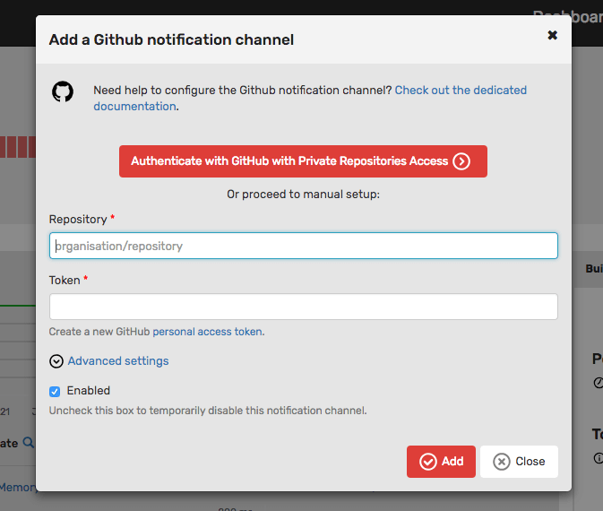
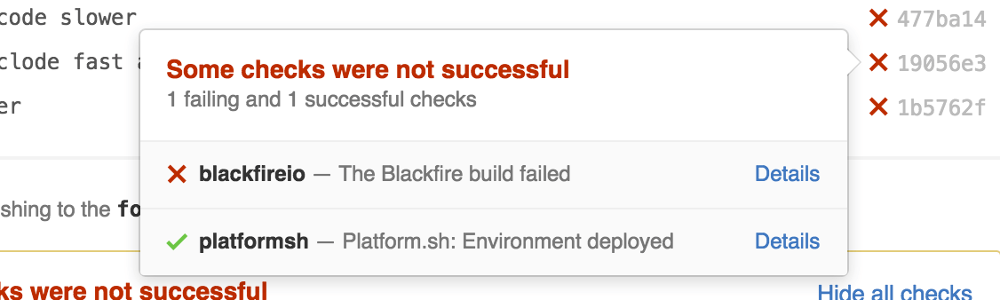

Chapter 23 - Continuous Integration
===================================

Continuously deploying code is the holy grail for any project. It starts with
having confidence that changes to be deployed do not contain regressions in
terms of features and performance.

The best way to avoid performance regressions is to integrate Blackfire into
your continuous integration workflow. This chapter describes how you can
achieve that.

Triggering Blackfire Scenarios
------------------------------

The easiest way to integrate Blackfire into your continuous integration and
deployment workflow is to run the Blackfire scenarios you have defined in
``.blackfire.yaml`` each time you deploy your code to testing, staging, and
production. Blackfire will run tests on your pre-defined key HTTP endpoints and
the build result will turn red if you are over-budget.

Whatever the tool you are using, you can automate the trigger thanks to the
webhook as seen in a previous chapter:

.. code-block:: bash

    curl -X POST https://blackfire.io/api/v2/builds/env/ENV-UUID/webhook \
        --user "CLIENT-ID:CLIENT-TOKEN" \
        -d "endpoint=http://symfony.com/" \
        -d "title=Deploy v1.0.0"

If you are using Git tags to deploy on various environments, you can parametrize
the title with the right tag name thanks to this small shell script:

.. code-block:: bash
    :emphasize-lines: 1,6

    LAST_TAG=`git for-each-ref --format='%(*committerdate:raw)%(committerdate:raw) %(refname:short)' refs/tags | sort -n -r | awk '{ print $3; }' | head -n 1`

    curl -X POST https://blackfire.io/api/v2/builds/env/ENV-UUID/webhook \
        --user "CLIENT-ID:CLIENT-TOKEN" \
        -d "endpoint=http://symfony.com/" \
        -d "title=Deploy $LAST_TAG"

In addition to checking for performance regressions, you can also check the
performance evolution between two deployments. Blackfire allows such tests via
assertions if you use the ``diff()`` or ``percent()`` functions.

The webhook does not run comparison tests unless you trigger them explicitly by
providing two additional parameters: ``external_id``, the reference for the
current build and ``external_parent_id``, the reference for the previous related
build. The values of these settings are free-form but they need to be unique
identifiers for builds they refer to. If you are using Git, it is recommended to
use the sha1s of the related tag commits.

When Blackfire receives a payload containing an ``external_parent_id`` setting, it
looks for a previous build that matches the value and runs the comparison tests
between the current profiles and the ones in the build it just found.

With the help of some simple shell commands, you can create a generic webhook
that works for any deploy:

.. code-block:: bash
    :emphasize-lines: 1-3,8-10

    LAST_TAG=`git for-each-ref --format='%(*committerdate:raw)%(committerdate:raw) %(refname:short)' refs/tags | sort -n -r | awk '{ print $3; }' | head -n 1`
    LAST_TAG_COMMIT=`git for-each-ref --format='%(*committerdate:raw)%(committerdate:raw) %(refname:short) %(*objectname) %(objectname)' refs/tags | sort -n -r | awk '{ print $4; }' | head -n 1`
    PREVIOUS_TAG_COMMIT=`git for-each-ref --format='%(*committerdate:raw)%(committerdate:raw) %(refname:short) %(*objectname) %(objectname)' refs/tags | sort -n -r | awk '{ print $4; }' | head -n 2 | sed '1,1d'`

    curl -X POST https://blackfire.io/api/v2/builds/env/ENV-UUID/webhook \
        --user "CLIENT-ID:CLIENT-TOKEN" \
        -d "endpoint=http://symfony.com/" \
        -d "title=Deploy $LAST_TAG"
        -d "external_id=$LAST_TAG_COMMIT"
        -d "external_parent_id=$PREVIOUS_TAG_COMMIT"

.. note::

    This technique works for integration tools like Jenkins or Travis, and for
    deployment tools like Capistrano, Chef, Puppet, or Ansible.

Using the PHP SDK and Running Unit Tests
----------------------------------------

You can do the same configuration when creating a build with the PHP SDK:

.. code-block:: php

    $build = $blackfire->startBuild('env_name_or_uuid', array(
        'title' => 'Deploy '.$LAST_TAG,
    ));

    $scenario = $blackfire->startScenario($build, array(
        'external_id' => $LAST_TAG_COMMIT,
        'external_parent_id' => $PREVIOUS_TAG_COMMIT,
    ));

Having this support in the PHP SDK means that you can configure your Blackfire
unit tests to benefit from comparison tests.

This is a unique feature: for the first time, tests can **check the evolution
of key metrics between two runs**. This is something you cannot do with
traditional test libraries.

.. note::

    The Guzzle integration benefits from the same feature as it uses the PHP
    SDK.

Using the Player
----------------

Going one step further, you can use Blackfire Player to run complex scenarios
for your website or API whenever you deploy. Setting the external id and the
external parent id is possible via environment variables:

.. code-block:: bash
    :emphasize-lines: 1,2

    BLACKFIRE_EXTERNAL_ID=$LAST_TAG_COMMIT \
    BLACKFIRE_EXTERNAL_PARENT_ID=$PREVIOUS_TAG_COMMIT \
    blackfire-player run tests.bkf -vvv --blackfire-env=ENV-UUID

Testing Pull Requests
---------------------

We have seen how to use Git tags to configure the Blackfire webhook and unlock
comparison tests between deploys. This technique can also be used to compare two
arbitrary sha1s. This is exactly what you need in order to test a GitHub pull
request.

If you are a GitHub user, Blackfire can automatically change the status of your
pull requests. You need to configure the GitHub notification channel for your
Blackfire environment:

Enter the ``Repository`` name (like ``FriendsOfPhp/Sami``) and a valid
``Token`` that you can generate from `GitHub
<https://github.com/settings/tokens/new>`_.

Then, whenever you want to associate a build with a pull request, set the
``external_id`` to the sha1 of the last commit of the pull request. From there,
everything is automated and Blackfire will send the build result as a commit
status associated with the pull request:

.. note::

    If you are a **Platform.sh** user, follow the `Platform.sh instructions
    <https://blackfire.io/docs/integrations/paas/platformsh>`_ to tightly
    integrate Platform.sh auto-deployment of pull requests, automatic Blackfire
    scenarios triggers, and GitHub statuses on pull requests.

    If you are a **Adobe Commerce Cloud** user, follow the `Adobe Commerce Cloud
    instructions <https://blackfire.io/docs/php/integrations/magento>`_
    to tightly integrate Adobe Commerce Cloud auto-deployment of pull requests,
    automatic Blackfire scenarios triggers, and GitHub statuses on pull
    requests.

Conclusion
----------

Blackfire is not a standalone tool. It integrates seamlessly with the tools you
are already using on a day-to-day basis. Continuous performance management can
be a click of the mouse away.
