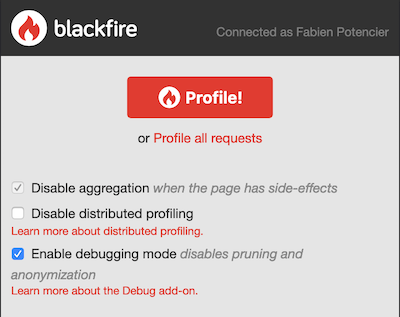

Debugging Code [addon: Debug]
=============================

Blackfire is built for code performance optimization. Hooking deep into the
language engine, it enables developers to know exactly which code is executed,
when, and how much resources it consumes. This opens doors to more than
performance optimization: **debugging code**.

By default, Blackfire :doc:`prunes </reference-guide/glossary>` the least
significant calls in the profiled code, and anonymizes SQL queries and HTTP
calls (arguments, usernames, passwords, ...) before data is sent to our
servers (see our :ref:`privacy and confidentiality documentation
<blackfire-data-privacy>`).

But the data we remove for profiling and privacy are potentially highly
valuable during a debug session. The **Debug add-on** lets developers disable
pruning and anonymization for specific requests.

To disable pruning and anonymization, check the *Enable debugging
mode* box in the browser extension, or use the ``--debug`` option if creating
profiles with ``blackfire curl`` or ``blackfire run``.

Profiles generated with deactivated pruning and anonymization show:

* All function/method calls executed in the profiled code;

* SQL arguments in the SQL queries list, instead of question marks.

.. note::
    :class: warning

    As per :route:`our terms of use <view_tos>` please ensure that you never
    send any personal or sensitive information to Blackfire while profiling non
    anonymized requests.

Additional notes:

* There is a known limitation for prepared SQL statements; arguments are never
  collected and only columns names are;

* This feature does not affect/add more data on the :doc:`timeline
  </profiling-cookbooks/understanding-timelines>`; it only does on
  :doc:`call-graphs </profiling-cookbooks/understanding-call-graphs>`;

* Using this feature automatically disables profiles aggregation, which means
  that only one sample of each request is profiled.
