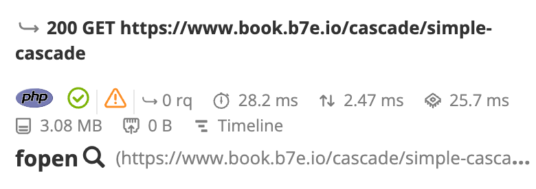

Distributed Profiling [level: Production]
=========================================

.. _distributed-profiling:

Blackfire **Distributed Profiling** is a feature that makes it possible to
**profile any service your application interacts with**, the most common
being other HTTP applications such as micro-services.

When profiling with Blackfire, all eligible HTTP (and/or CLI) services
involved with your main application are also profiled and generate
**Sub-Profiles**.

Requirements
------------

Distributed profiling is enabled by default.

The main technical requirements are the following:

* The probe must be enabled on all the services you want to trigger
  sub-profiles from;

* :ref:`Blackfire HTTP headers must be preserved <reverse-proxies-headers>`
  on the services your application calls.

.. note::

    A profile can be propagated to applications written in all languages
    supported by Blackfire.

    For example, a profile of a CLI application written in Go can be
    propagated to an HTTP application written in PHP, and to another one
    written in Python.

    .. code-block:: bash

        Go app (CLI)
        ├── PHP app (HTTP)
        │   └── Go app (CLI)
        └── Python app (HTTP)

How Does It Work?
-----------------

**Profiles and sub-profiles are linked with parent/child identifiers**.  These
identifiers are either automatically generated by the probe, or in your code
using the SDK.

Each profile is passed on to the agent and processed independently.
Once they are sent to Blackfire servers, they are linked together as a
hierarchy of calls.

.. note::

    You may use different Blackfire agents. These agents may be on different
    infrastructures, as long as the requirements are fulfilled.

    Agents may even use different credentials, and can thus be linked to
    different :doc:`Blackfire environments </reference-guide/environments>`.
    The only requirement, in this case, is that the user who is profiling has
    access to the Blackfire environments which are tied to the different agents.

Experience Distributed Profiling
--------------------------------

To discover distributed profiling, you can use the `book.b7e.io/cascade
<https://www.book.b7e.io/cascade/>`_ application. It makes recursive HTTP calls
that you can freely profile using the CLI.

.. code-block:: bash
    :zerocopy:

    blackfire curl https://www.book.b7e.io/cascade/

.. _on-demand-distributed-profile-processing:

On-demand Distributed Profile Processing
----------------------------------------

The first 5 sub-profiles are processed in priority. The eventual remaining ones
are throttled, and their process can be manually requested.

.. _analyzing-distributed-profiles:

Analyzing Distributed Profiles
------------------------------

In the Blackfire user interface, the `generated profile <https://app.blackfire.io/profiles/d6619a74-fdae-42e2-8824-3d0820d6b85a/graph>`_
and its sub-profiles are gathered within the same view. This allows you to
navigate from one profiled service to another. It also shows you dependencies
between profiled services.

To locate a node that a sub-request is originated from, click on the magnifying
glass icon next to the caller function name (``fopen()`` in the screenshot
below).

All the assertions and recommendations for each profiled request are also
gathered in the same view. This enables the identification of bottlenecks,
optimization possibilities, and which service is impacted.

Generating Sub-Profiles by Language
-----------------------------------

* :ref:`Sub-Profiles generation in PHP <sub-profiles-php>`;

* :ref:`Sub-Profiles generation in Python <sub-profiles-python>`.
