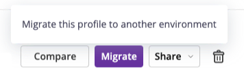

Migrating Profiles
==================

You can move profiles from one :doc:`environment </reference-guide/environments>`
to another, for instance to gather profiles taken from a personal sandbox
environment into a team environment.

Migrating a Profile
-------------------

From the Profiles page, click the **Migrate** call to action on the profile you
want to move, then select the destination environment.

Profiles Made with the Personal Agent
-------------------------------------

The Personal Agent is sunset and the :ref:`Sandbox environment
<sandbox-environment>` replaces it. Profiles generated with the Personal Agent
must be moved to the Sandbox environment provided to you. Use the batch
migration to move them in a single operation.
