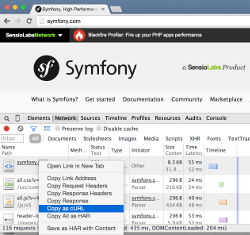
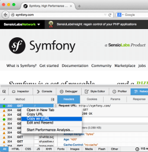

Profiling HTTP Requests with a Browser
======================================

Using a browser is the easiest way to profile **web applications**.

To get started, check that you have Blackfire :doc:`installed
</up-and-running/installation>` correctly on the server hosting the website you
want to profile and install the :doc:`Firefox </integrations/browsers/firefox>`
extension or the :doc:`Google Chrome </integrations/browsers/chrome>` one.

.. tip::

    If you need more flexibility, like profiling APIs, ``POST`` requests, or
    adding specific HTTP headers, use the :doc:`Blackfire CLI
    </profiling-cookbooks/profiling-http-via-cli>` instead.

Profiling
---------

To profile a web application from Firefox or Google Chrome:

* Log in on :route:`Blackfire.io <session_login>`;

  .. image:: ../images/companion-unauth.png

* Browse to the URL you want to profile;

* Open the extension by clicking on its icon in the browser toolbar;

  .. image:: ../images/companion-auth.png

* Click on the "Profile" button;

* After a few seconds, click on "View Call Graph" or "View Timeline".

  .. image:: ../images/companion-toolbar.png

Copy-As-cURL in your Browser
----------------------------

Did you know that browsers can give you the cURL arguments and options like
HTTP headers to use for any web page you browse? Including Ajax requests?

This feature is known as "copy-as-cUrl". The result can be used directly with
the :doc:`Blackfire CLI </profiling-cookbooks/profiling-http-via-cli>` to profile
requests from the command line and to automate profiling in scripts:

Profiling all Requests
----------------------

If you want to profile all pages from a session, open the extension and click
on the *Profile all requests* link, then click on the *Record!* button.
Blackfire will then profile all requests including POST requests, Ajax
requests, and API calls.

A pop-over window will open at the bottom right of your browser window, where
all profiled requests will be listed. Stop the session by clicking on the
*Stop* button.

All profiled requests will be available on your :route:`dashboard
<dashboard>`.

Limitations on 304 HTTP Responses
---------------------------------

The browser extensions are not able to profile 304 HTTP responses as some Web
Servers remove custom headers such as the ones added by Blackfire to operate
correctly. To avoid 304 HTTP responses, the browser extensions remove any
conditional headers from requests; if you want to profile 304 responses, use
the Blackfire CLI ``curl`` command instead.
