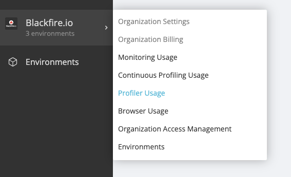
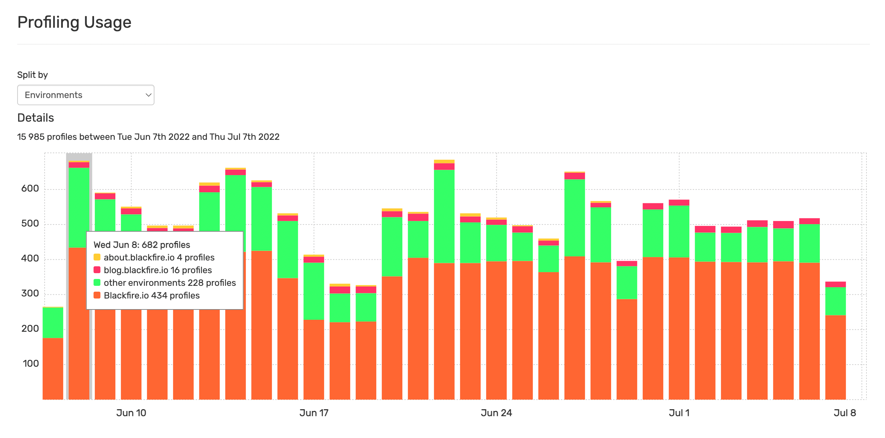
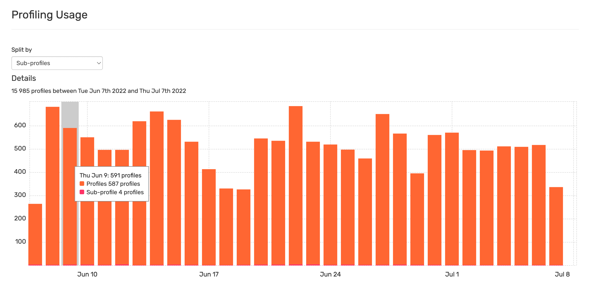
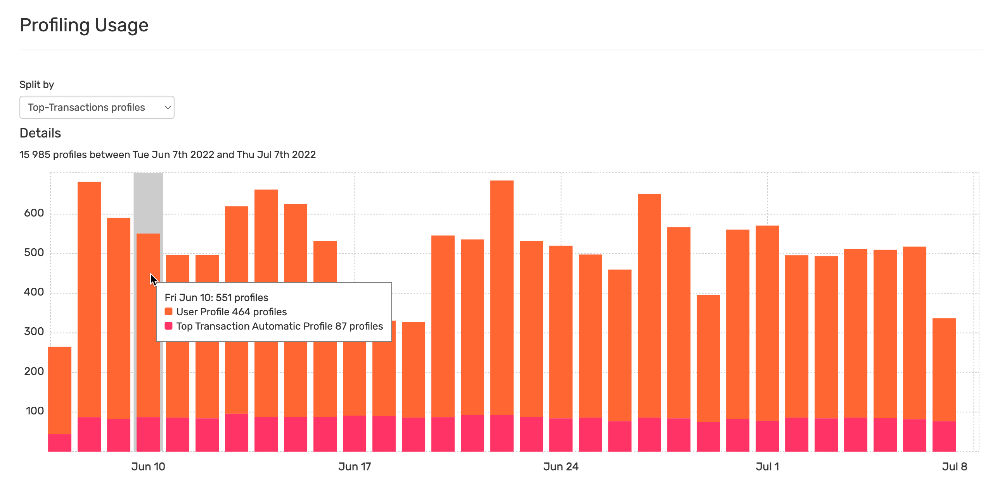
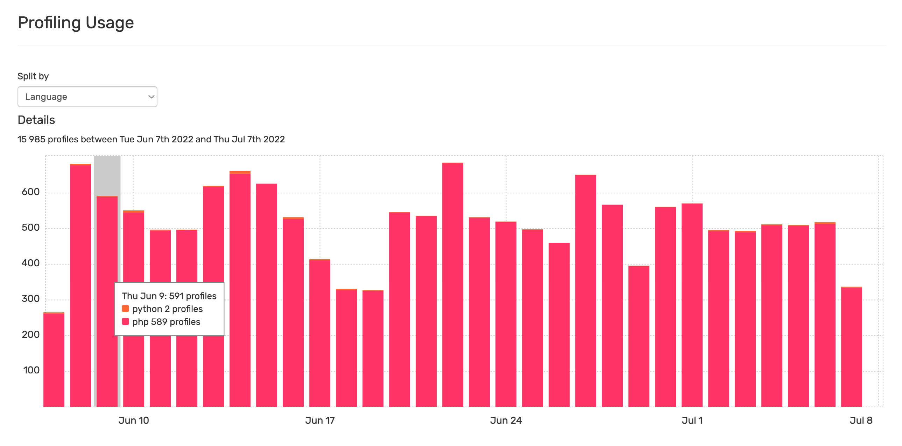
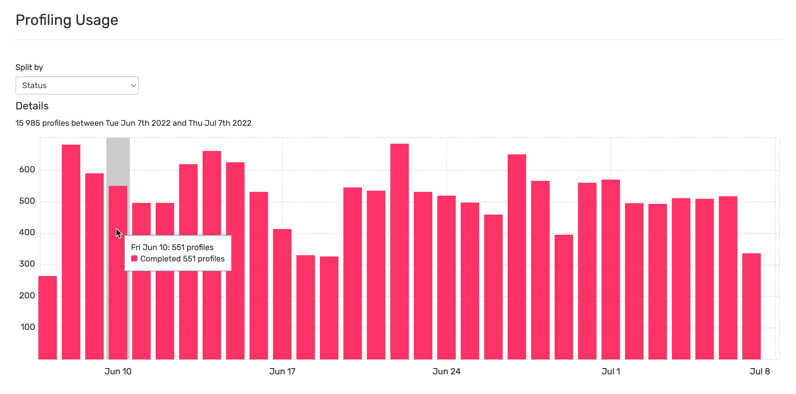

Profiling Usage
===============

Detailed information on the Profiles made can be found under the Organization
Profiling Usage menu:

Multiple aggregated views are provided allowing a full view of the Profiling Usage.

Breakdown per Environment
-------------------------

This view shows the number of profiles made in environments you have access to.

The profiles made in the organization's other environments are gathered within
the "Other environments" entry.

Profiles vs Sub-Profiles
------------------------

A sub-profile is a regular profile that is linked to the main profile or to one or
several other sub-profiles. Sub-profiles are part of :ref:`the Distributed Profiling
feature <distributed-profiling>`.

Manual Profiling vs Automatic Profiling
---------------------------------------

This view shows the number of Profiles manually triggered versus the ones
:doc:`automatically triggered </monitoring-cookbooks/automatic-profiling>` by
Blackfire Monitoring.

Breakdown per language
----------------------

Breakdown per status
--------------------

This view shows the number of Completed Profiles vs the ones being processed or
on error.

