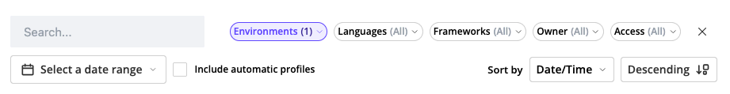

Searching Profiles
==================

The profile search makes it easier to find, sort, and share your profiling
results.

Filtering and Sorting Profiles
------------------------------

Use the search bar and filter menus at the top of the Profiles page to narrow
down your results:

- **Search**: Enter any keyword, such as a URL or profile name
- **Environments**: Filter profiles by :doc:`Blackfire environment </reference-guide/environments>`
- **Languages**: Narrow results to a specific language (PHP, Python)
- **Frameworks**: Filter by the detected framework
- **Owner**: Display only the profiles created by specific users.
- **Access**: Filter by access level (private, or publicly shared profiles).
- **Date Range**: Limit results to profiles generated within a specific time window.

You can also sort profiles by:

- **Date/Time**
- **Wall Time**
- **I/O Wait time**
- **CPU**
- **Memory**
- **Network**
- **SQL Queries count**
- **HTTP Requests count**

Choose between ascending or descending order depending on your needs.

Sharing Search Queries
----------------------

As you search, the URL automatically updates. You can copy and share it with
your teammates to reproduce the same search view and collaborate more easily.
