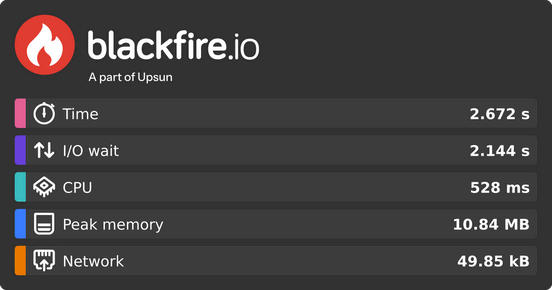

Sharing Profiles
================

Sharing Performance Summaries
-----------------------------

From any profile view, click Share your performance to generate a visual
summary of your profile's key metrics.

This summary can be:

- **Shared on social media** (LinkedIn, X, WhatsApp, Facebook, Email)
- **Copied as an image** to include in reports, chat threads, or blog posts

Public Sharing
--------------

You can also make a profile public to share it with anyone. Public profiles:

- Are accessible via a public link
- Benefit from **unlimited retention**
- Can be embedded in blogs or article

Publicly sharing profiles makes them accessible to search engines. Only share
content you're comfortable making public.

oEmbed
------

Blackfire provides an `oEmbed <https://oembed.com/>`_ endpoint to ease the
integration of Profile graphs on blogs and social media websites.

.. note::

    oEmbed is a format for allowing an embedded representation of a URL on
    third party sites. The simple API allows a website to display embedded
    content (such as photos or videos) when a user posts a link to that
    resource, without having to parse the resource directly.

Any public profile or comparison can be integrated using an oEmbed consumer on
:route:`Blackfire endpoint <oembed_service>` or using the automatic discovery
using the ``<link>`` tags in the graph HTML.

WordPress Configuration
-----------------------

To ease sharing Blackfire public profiles on WordPress version 4.4+, paste
this snippet in the ``functions.php`` file of your theme:

.. code-block:: php

    wp_oembed_add_provider('https://blackfire.io/profiles/*', 'https://blackfire.io/oembed');
