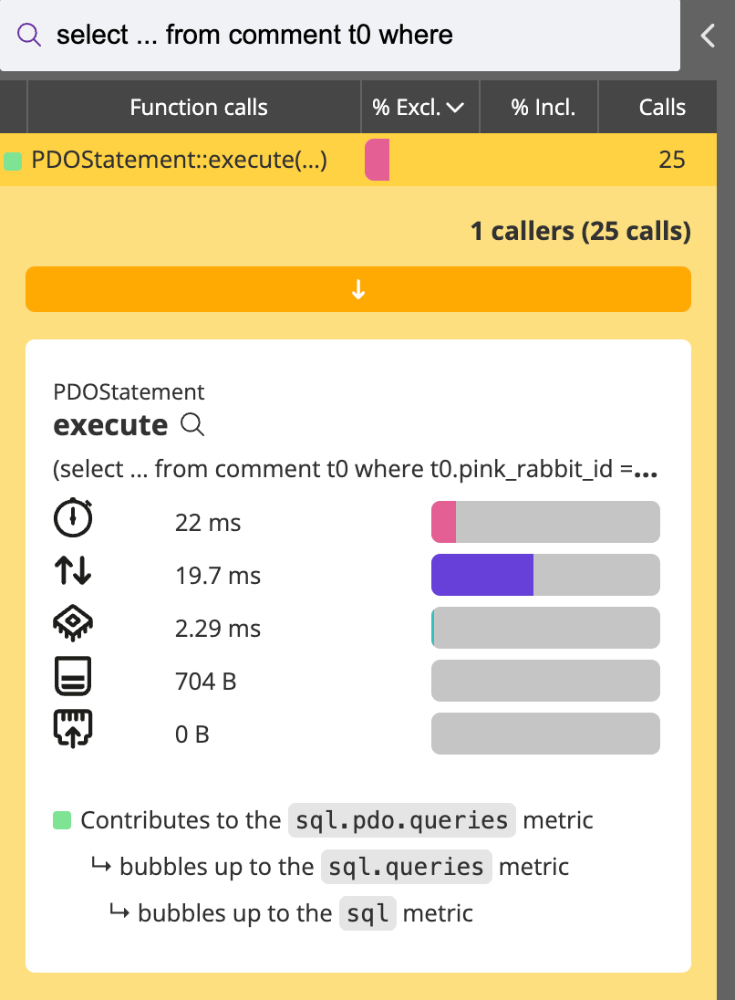

Tips and tricks
===============

.. include-twig:: `youtube-iframe`
    :title: introduction-to-blackfire
    :src: https://www.youtube-nocookie.com/embed/DsOXNhouCeA?rel=0&showinfo=0&modestbranding=1&autoplay=0
    :width: 700px
    :height: 394px

The Blackfire profile lists all the HTTP requests and SQL queries performed by
the profiled script. These are displayed in custom tabs along with more in-depth
information.

A lesser-known feature is that those requests and queries are also searchable in
the call graph views. The search bar can be used to search for a function name
or a specific namespace, as well as SQL queries, HTTP requests, and event metrics.

Clicking the function name opens a pane with more information about it.

Clicking the magnifying glass displays a new version of the call graph centered
on this function.

This is highly valuable for identifying functions responsible for certain service
calls or contributing to specific metrics and then locating them in the codebase.
