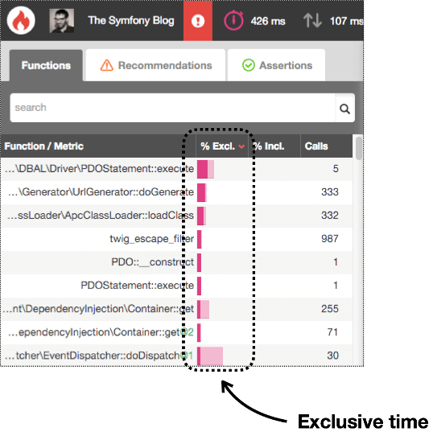

Understanding Call Graphs
=========================

After profiling your web application, script, or command console, Blackfire
shows you the URL where you can analyze the profile. In this article, you'll
learn how to use the Blackfire interface to detect the problems of your
application.

.. note::
    :class: doc-cta

    This section describes how to read the call-graph of a profile. You can
    also visualize a profile as a
    :doc:`timeline </profiling-cookbooks/understanding-timelines>`.

Understanding Blackfire Interface
---------------------------------

The main Blackfire interface is divided into three sections:

* **Toolbar**: displays a summary of the main profile information and provides
  access to common actions, such as selecting the metric to display
  (time, memory, CPU time, etc.);

* **Call Graph**: displays the executed code in a visual diagram where each
  node corresponds to a function or method and their relations show the code
  flow;

* **Function/Method List**: displays the full list of executed functions and/or
  methods and their main profile information (exclusive/inclusive time,
  function calls, etc.).

Analyzing Hot Paths
-------------------

Hot Paths are the parts of your application that were most active during the
profile. These could be the parts that consumed more memory, took more CPU time,
or both.

Blackfire displays **call graph** nodes using a color code where red denotes
hot path nodes. The more intense this red color is, the more important this
node is in the hot path.

In some applications, hot paths are perfectly valid because they perform an
intensive task. However, for most applications, a hot path is the synonym of a
performance bottleneck. That's why you should **always start by analyzing the
hot paths** and checking out if those application parts should be that active.

After analyzing the call graph diagram, proceed to review the **Function/Method
List** data. Check out the **exclusive time** (how long does it take to execute
a function/method without considering the time spent on other functions/methods
called by it) and the **inclusive time** (the total time spent executing a
function/method, including any external call).

Instead of focusing on the absolute values of the exclusive/inclusive time,
consider their values as a percentage of the total execution time. That way you
can find functions/methods which consume a disproportionate amount of resources.

Beyond the Hot Paths
--------------------

By default, only nodes around the hot paths are displayed in the call graph.
When working on some methods/functions that are not on the hot paths, you can
ask blackfire to display more nodes that were otherwise hidden. To do so, click
on the magnifying glass that is displayed near function names in the call graph.
Alternatively, you can also search for a specific function by using the search
field on top of the functions list, click on the result you're looking for and
click again on the magnifying glass that is displayed near the function name in
the toolbox that appears.

Note that part of the data preprocessing done by Blackfire involves removing
(*aka.* pruning) function calls that take less than 1% of the global costs on all
dimensions (time, cpu, memory, etc.). This is done to reduce the size of the
profiles and to provide a responsive UI. You won't be able to find these removed
nodes in the call graph nor in the functions list.

Proxy nodes
-----------

Some code patterns and some frameworks make extensive use of single caller and
single callee relationships, resulting in very long call graph paths. To a
larger extent, we can define a category of nodes as "proxy" nodes. Those nodes
are less significant as they are used to call in heavier/more relevant business
logic. Showing them separately is making noise.

To simplify the call graph view, Blackfire groups together adjacent
proxy nodes. There is no loss of information, as all of them will always be
available in the functions/methods list, as well as in a clustered node on the
graph, containing all adjacent proxy nodes, plus the initial caller.

.. _understanding-blackfire-overhead:

Understanding Blackfire Overhead
--------------------------------

Profiling with Blackfire is on-demand. This means that Blackfire adds **no overhead**
for your end users, which makes it **safe to use in production**. But it adds an
unavoidable overhead for allowed users that explicitly trigger a profile.

When profiling is enabled, Blackfire has to enable e.g. timing measurements and
other performance metrics gathering. Even though the Blackfire probe is designed
for maximum performance, thus lowest overhead, you will sometimes see some pages
that take longer to generate when Blackfire is enabled.

This overhead depends mostly on the number of function calls made in your code.
It is higher for function calls that do SQL queries or whose arguments are
collected by the probe (e.g. to get the name of Symfony events).

You should take this into account when analyzing profiles.

Detecting Malfunctioning Code
-----------------------------

Apart from detecting hot paths, Blackfire is also very useful to detect
malfunctioning code. More often than not, your application executes more code
than what is strictly necessary. Perhaps you added some intensive instruction
inside a "for" loop, or initialized heavy services that are not actually used,
or inadvertently instantiated a heavy class repeated times.

The **Function/Method List** data includes a column called **Calls**, which is
the number of times that a particular function/method was called. Reorder the
table by this column and check out if there is any disparate value.

Call Graph Navigation and Keyboard Shortcuts
--------------------------------------------

Press  |keyleft| |keytop| |keyright| |keybottom| to move the call graph.

.. |keyleft| raw:: html

    <kbd>←</kbd>

.. |keytop| raw:: html

    <kbd>↑</kbd>

.. |keyright| raw:: html

    <kbd>→</kbd>

.. |keybottom| raw:: html

    <kbd>↓</kbd>

Press |keyplus| or |keyminus| to zoom in or out.

.. |keyplus| raw:: html

    <kbd>+</kbd>

.. |keyminus| raw:: html

    <kbd>-</kbd>
