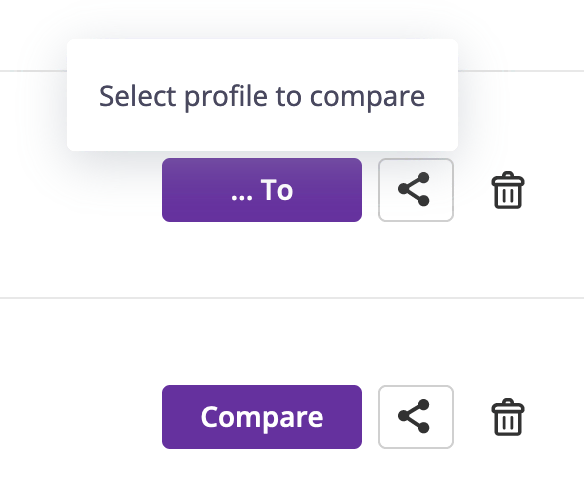
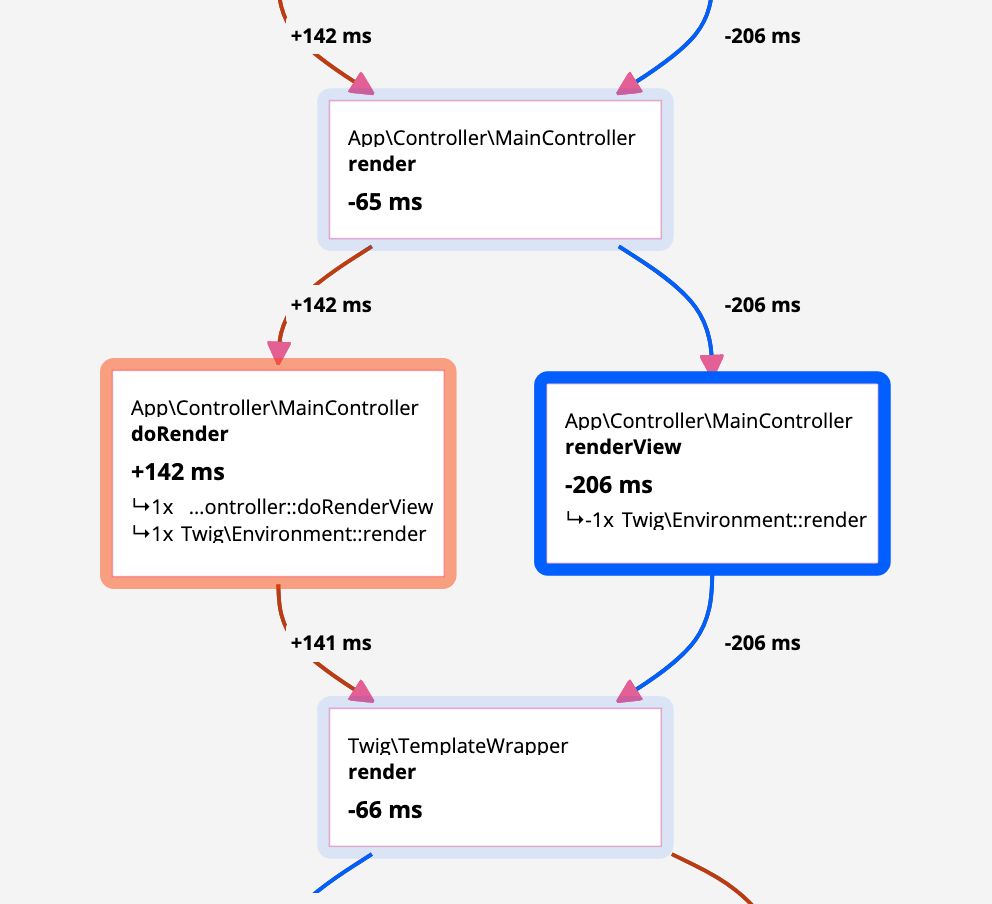
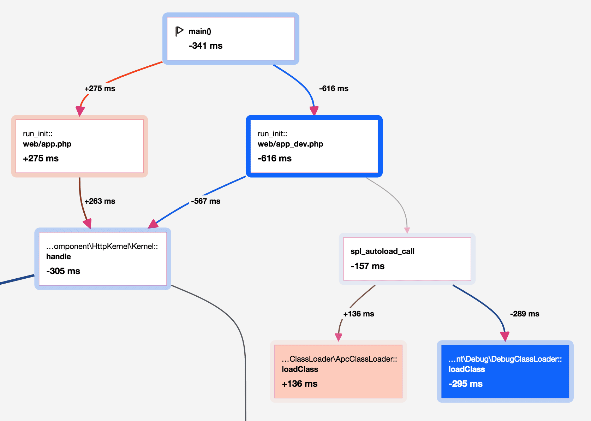
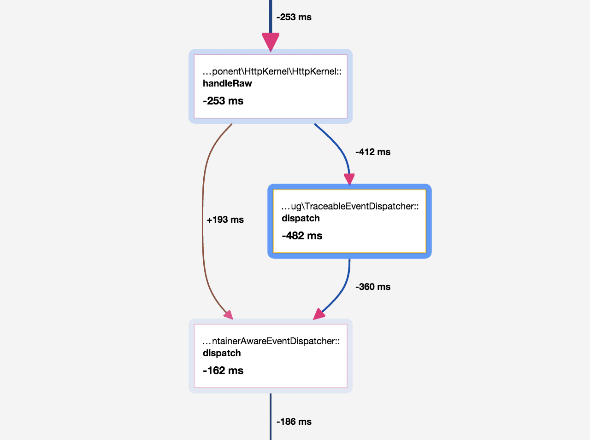

Understanding Comparisons
=========================

.. include-twig:: `youtube-iframe`
    :title: introduction-to-blackfire
    :src: https://www.youtube-nocookie.com/embed/XCft8cHB_0Q?rel=0&showinfo=0&modestbranding=1&autoplay=0
    :width: 700px
    :height: 394px

One of Blackfire Profiler's key features is the ability to compare profiles.
This helps users understand the differences between two versions of the same
endpoint or the discrepancies between samples taken days apart.

Knowing if changes in the code base or the application configuration have
introduced side effects on other parts of the code while working on a new feature
is really helpful—anticipating the consequences of changes is even better.

Comparing two Profiles
----------------------

Comparisons can be initiated from the `profile list <https://app.blackfire.io/my/profiles>`_.
A compare button on the right-hand side of each profile allows you to select
the source and the destination of this comparison.

The graph is a superposition of all calls from the two original graphs.
The number displayed in a node is the performance gain or loss for the node
itself, including all its children.

Shared Nodes
------------

When a node is present in both profiles, it is displayed as a single node on
the graph (**shared nodes**).

The background color tells you if the node is faster in profile B (blue) or
slower (red).

The number displayed in a node is the performance gain or loss; it is the
gain/loss for the node itself including all its children.

Single Nodes
------------

When the path between two shared nodes is different, the nodes for profile A
path are displayed on the **left side** of the graph and on the **right side**
for profile B (each side can be empty).

**The background color and the number are not relevant.**

Performance Changes
-------------------

Performance changes only make sense for shared nodes; calculating the gain or
loss between two shared nodes is as simple as subtracting their numbers.

When a portion of the graph is different for profile A and B, the performance
gain or loss can be calculated by subtracting the number of the first shared
node before the split and the first shared node after the split.

Let's take some examples:

On this graph, the code from the B profile is faster than the code from the A
profile as the ``main()`` node displays a ``-341ms``.

On this graph, there is a function call that is only present on profile A. The
performance improvement of this call removal is ``-91ms`` (``-253ms - -162ms``).
