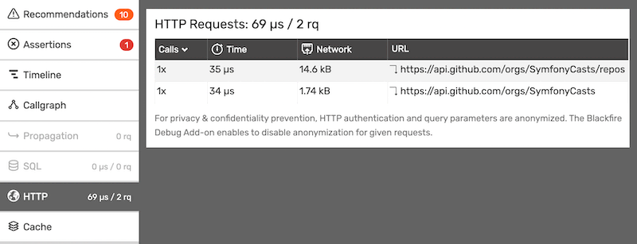
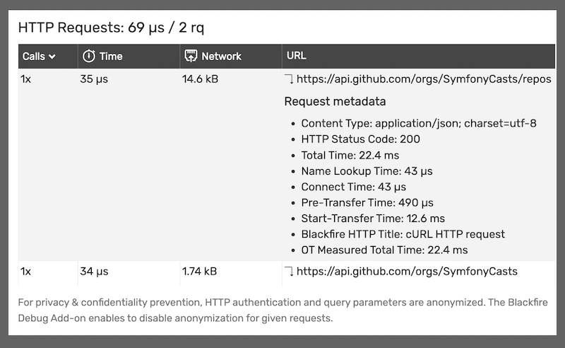
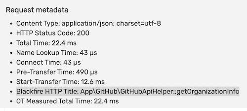
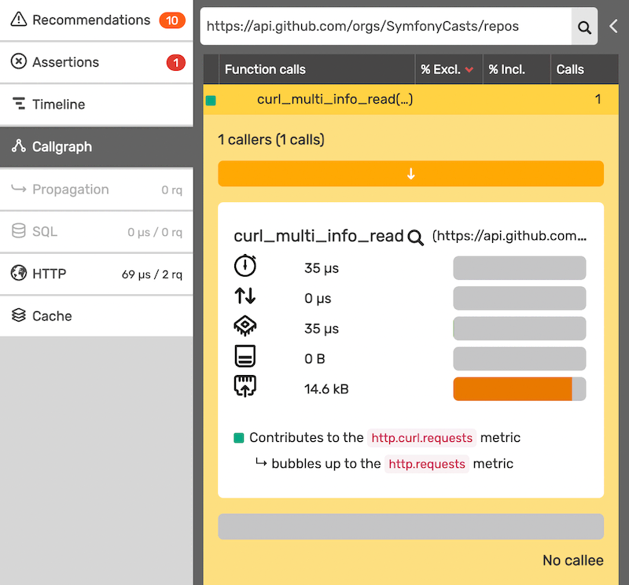

Understanding HTTP Requests
===========================

The HTTP tab of a profile contains a list of all the HTTP requests the profiled
script made.

The list contains:

* the number of calls made to that URL;

* the related wall-time;

* and the network consumption.

The displayed wall-time refers to the function gathering information on the
query. For instance, it could be ``curl_multi_info_read`` for a cURL query.

Request Metadata
----------------

The Request Metadata are displayed by clicking on the URL in the list.

The Metadata may contain:

* the request Content-Type;

* the HTTP Status Code;

* the Total Time: time from the request start until the end of the transfer. When
  a redirect is followed, the time from each request is added together;

* a breakdown of the Total Time:

  * Domain Name lookup time: time from the request start until the name
    resolving was completed;

  * Connect Time: time from the request start until the connection to the remote
    host (or proxy) was completed. When a redirect is followed, the time from
    each request is added together;

  * Pre-Transfert Time: time from the request start until the file transfer is
    about to begin. When a redirect is followed, the time from each request is
    added together;

  * Start-Transfert Time: time from the request start until the first byte is
    received. When a redirect is followed, the time from each request is
    added together;

* an eventual title for that request;

* and the Open Telemetry Measured Total Time.

Naming an HTTP request
----------------------

The *Blackfire HTTP Title* field of the HTTP Request Metadata can be defined by
adding the ``X-Blackfire-HTTP-Query-Title`` header to the request.

This title can provide a context easing the understanding of the profiles of
applications heavily relying on external HTTP requests.

Locating an HTTP request
------------------------

The function call that initiated a specific HTTP request can be located by
searching the URL in :doc:`callgraph </profiling-cookbooks/understanding-call-graphs>`
search bar.

