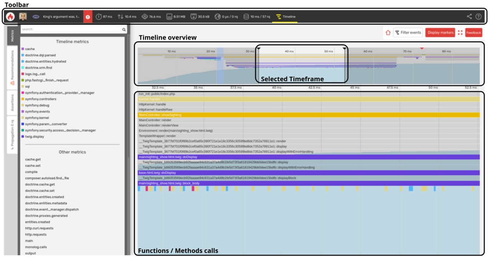

Understanding Timelines [level: Development/Production]
=======================================================

.. note::
    :class: doc-cta

    This section describes how to read the timeline of a profile. You can also
    visualize a profile as a
    :doc:`call graph </profiling-cookbooks/understanding-call-graphs>`.

The timeline representation of a profile is a great way to analyze the
wall-clock time of the most important function calls, which are represented as
**event blocks**.

Understanding the Timeline Interface
------------------------------------

The timeline interface is divided into three sections:

* **Toolbar**: displays a summary of the main profile information and provides
  access to :doc:`call-graph </profiling-cookbooks/understanding-call-graphs>`
  views for available dimensions, as well as SQL and HTTP queries lists;

* **Timeline overview**: enables to navigate in the profile data and zoom in on
   specific parts;

* **Timeline**: displays the list of executed functions and/or
  methods. The callers are on top and the callees below. The blue wave represents
  the cumulative memory consumption.

It is possible to zoom in and focus on a **specific timeframe** of the
timeline. This may be helpful to drill down on specific function calls.

Like for the call-graph, Blackfire filters unimportant calls to only display
the most significant ones. Blackfire also automatically understands which
libraries you are using and groups similar calls as metrics that show up in
the left pane.

* Hovering on a metric emphasizes related blocks and displays resource
  consumption information about them;

* Hovering on a block displays more information about resource consumption.

.. image:: ../images/first-profile/blackfire-timeline.png

Memory Consumption
------------------

The global memory usage is displayed in the navigation panel as a light blue
graph. It represents the growing *peak memory envelope*. A sudden increase can
give you a hint on which function calls consume more memory.

.. note::

    On PHP profiles, the memory graph is an *always-growing-graph*. As it
    represents the peak memory, you can never see it decreasing, even if you
    manually clear your application memory.

.. _timeline-threshold:

Timeline Threshold
------------------

The ``threshold`` timeline metric highlights one or several event blocks in the
Timeline view. It is designed to draw your attention to something that Blackfire
considers *significant*.

The Threshold Value
~~~~~~~~~~~~~~~~~~~

The timeline threshold is a value computed when a profile is triggered.
When you ask for a profile with a Blackfire client, e.g. with :doc:`Blackfire
browser extension </integrations/browsers/index>`, it first fires a **pre-flight
request** that will not be profiled. The duration of this request is taken as a
reference to calculate the threshold value.

**The threshold value is calculated as 1% of the duration of the pre-flight
request**.

This value is displayed in the metadata panel of your profile that you can
view by hovering on your profile name.

This value is a reference for Blackfire to detect *significant events* for you.

Significant Events
~~~~~~~~~~~~~~~~~~

Considering the threshold value, significant events are function calls that are
worth paying attention to. An event is usually considered significant when its
*exclusive wall-time* exceeds the threshold value.

Custom Metrics [level: Development/Production]
----------------------------------------------

The timeline only displays relevant metrics that are configured and curated by
the Blackfire team.

But you can also add more information by :ref:`creating your custom metrics
ready for the timeline <custom-metrics-timeline>`.

.. _timeline-markers:

Markers
-------

Markers allow you to visualize cue-points you explicitly define in your code.

There are 2 ways to add markers in the Timeline View:

1. By adding an instruction in your code;

2. :ref:`By defining a metric <timeline-markers-metric>`.

Adding a Marker From Your Code
~~~~~~~~~~~~~~~~~~~~~~~~~~~~~~

**PHP**

.. code-block:: php

    \BlackfireProbe::addMarker('My Marker Name');

**Python**

.. code-block:: python

    from blackfire import probe
    probe.add_marker('My Marker Name')

.. note::

    Adding these instructions is production safe. When no profile
    is requested, this function call operates as a *no-op* instruction.

Timeline Navigation and Keyboard Shortcuts
~~~~~~~~~~~~~~~~~~~~~~~~~~~~~~~~~~~~~~~~~~

Click and hold on the timeline overview to select a timeframe to be displayed.

Grab the top part of the timeline overview to slide the timeframe.

Scroll up or down while holding the |keyshift| key to widen or narrow the
displayed part of the timeline.

.. |keyshift| raw:: html

    <kbd>shift</kbd>

Double click on a function call to zoom in on the related timeframe.
